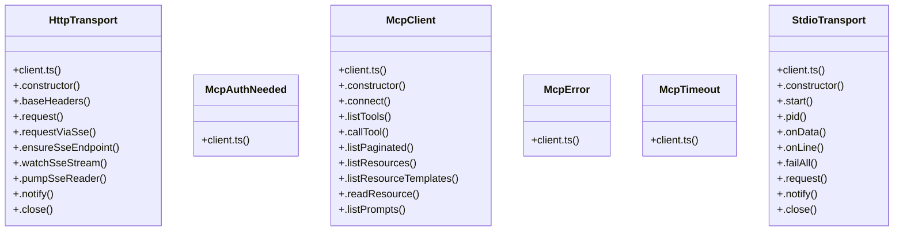

# Auth Configuration

> 135 nodes · cohesion 0.02

## Key Concepts

- [media.test.ts](file:///C:/Users/Bhavin/Videos/WEB%20dev/Opensource%20porjects/Atom/tests/media.test.ts#L1) (40 connections)
- [cli.tsx](file:///C:/Users/Bhavin/Videos/WEB%20dev/Opensource%20porjects/Atom/src/cli.tsx#L1) (31 connections)
- [media.ts](file:///C:/Users/Bhavin/Videos/WEB%20dev/Opensource%20porjects/Atom/src/media.ts#L1) (28 connections)
- [readTool()](file:///C:/Users/Bhavin/Videos/WEB%20dev/Opensource%20porjects/Atom/src/tools/filesystem.ts#L40) (20 connections)
- [client.ts](file:///C:/Users/Bhavin/Videos/WEB%20dev/Opensource%20porjects/Atom/src/mcp/client.ts#L1) (18 connections)
- [.request()](file:///C:/Users/Bhavin/Videos/WEB%20dev/Opensource%20porjects/Atom/src/mcp/client.ts#L308) (13 connections)
- [McpClient](file:///C:/Users/Bhavin/Videos/WEB%20dev/Opensource%20porjects/Atom/src/mcp/client.ts#L760) (12 connections)
- [isRecord()](file:///C:/Users/Bhavin/Videos/WEB%20dev/Opensource%20porjects/Atom/src/mcp/client.ts#L30) (11 connections)
- [HttpTransport](file:///C:/Users/Bhavin/Videos/WEB%20dev/Opensource%20porjects/Atom/src/mcp/client.ts#L279) (10 connections)
- [StdioTransport](file:///C:/Users/Bhavin/Videos/WEB%20dev/Opensource%20porjects/Atom/src/mcp/client.ts#L57) (10 connections)
- [.watchSseStream()](file:///C:/Users/Bhavin/Videos/WEB%20dev/Opensource%20porjects/Atom/src/mcp/client.ts#L598) (8 connections)
- [.listPaginated()](file:///C:/Users/Bhavin/Videos/WEB%20dev/Opensource%20porjects/Atom/src/mcp/client.ts#L820) (8 connections)
- [.read()](file:///C:/Users/Bhavin/Videos/WEB%20dev/Opensource%20porjects/Atom/tests/terminal-resize.test.tsx#L42) (8 connections)
- [.pumpSseReader()](file:///C:/Users/Bhavin/Videos/WEB%20dev/Opensource%20porjects/Atom/src/mcp/client.ts#L624) (6 connections)
- [.requestViaSse()](file:///C:/Users/Bhavin/Videos/WEB%20dev/Opensource%20porjects/Atom/src/mcp/client.ts#L415) (6 connections)
- [.close()](file:///C:/Users/Bhavin/Videos/WEB%20dev/Opensource%20porjects/Atom/src/mcp/client.ts#L871) (6 connections)
- [.listTools()](file:///C:/Users/Bhavin/Videos/WEB%20dev/Opensource%20porjects/Atom/src/mcp/client.ts#L776) (5 connections)
- [saveMedia()](file:///C:/Users/Bhavin/Videos/WEB%20dev/Opensource%20porjects/Atom/src/media.ts#L169) (5 connections)
- [readBodyCapped()](file:///C:/Users/Bhavin/Videos/WEB%20dev/Opensource%20porjects/Atom/src/tools/web.ts#L70) (5 connections)
- [.baseHeaders()](file:///C:/Users/Bhavin/Videos/WEB%20dev/Opensource%20porjects/Atom/src/mcp/client.ts#L298) (4 connections)
- [.callTool()](file:///C:/Users/Bhavin/Videos/WEB%20dev/Opensource%20porjects/Atom/src/mcp/client.ts#L804) (4 connections)
- [.getPrompt()](file:///C:/Users/Bhavin/Videos/WEB%20dev/Opensource%20porjects/Atom/src/mcp/client.ts#L863) (4 connections)
- [.onLine()](file:///C:/Users/Bhavin/Videos/WEB%20dev/Opensource%20porjects/Atom/src/mcp/client.ts#L141) (4 connections)
- [mediaDir()](file:///C:/Users/Bhavin/Videos/WEB%20dev/Opensource%20porjects/Atom/src/media.ts#L161) (4 connections)
- [readScanBody()](file:///C:/Users/Bhavin/Videos/WEB%20dev/Opensource%20porjects/Atom/src/tools/search.ts#L402) (4 connections)
- *... and 110 more nodes in this community*

## Class Diagram

## Relationships

- No strong cross-community connections detected

## Source Files

- [C:\Users\Bhavin\Videos\WEB dev\Opensource porjects\Atom\src\cli.tsx](file:///C:/Users/Bhavin/Videos/WEB%20dev/Opensource%20porjects/Atom/src/cli.tsx)
- [C:\Users\Bhavin\Videos\WEB dev\Opensource porjects\Atom\src\mcp\client.ts](file:///C:/Users/Bhavin/Videos/WEB%20dev/Opensource%20porjects/Atom/src/mcp/client.ts)
- [C:\Users\Bhavin\Videos\WEB dev\Opensource porjects\Atom\src\media.ts](file:///C:/Users/Bhavin/Videos/WEB%20dev/Opensource%20porjects/Atom/src/media.ts)
- [C:\Users\Bhavin\Videos\WEB dev\Opensource porjects\Atom\src\tools\filesystem.ts](file:///C:/Users/Bhavin/Videos/WEB%20dev/Opensource%20porjects/Atom/src/tools/filesystem.ts)
- [C:\Users\Bhavin\Videos\WEB dev\Opensource porjects\Atom\src\tools\search.ts](file:///C:/Users/Bhavin/Videos/WEB%20dev/Opensource%20porjects/Atom/src/tools/search.ts)
- [C:\Users\Bhavin\Videos\WEB dev\Opensource porjects\Atom\src\tools\web.ts](file:///C:/Users/Bhavin/Videos/WEB%20dev/Opensource%20porjects/Atom/src/tools/web.ts)
- [C:\Users\Bhavin\Videos\WEB dev\Opensource porjects\Atom\src\web\ui\app.js](file:///C:/Users/Bhavin/Videos/WEB%20dev/Opensource%20porjects/Atom/src/web/ui/app.js)
- [C:\Users\Bhavin\Videos\WEB dev\Opensource porjects\Atom\tests\media.test.ts](file:///C:/Users/Bhavin/Videos/WEB%20dev/Opensource%20porjects/Atom/tests/media.test.ts)
- [C:\Users\Bhavin\Videos\WEB dev\Opensource porjects\Atom\tests\policy.test.ts](file:///C:/Users/Bhavin/Videos/WEB%20dev/Opensource%20porjects/Atom/tests/policy.test.ts)
- [C:\Users\Bhavin\Videos\WEB dev\Opensource porjects\Atom\tests\terminal-resize.test.tsx](file:///C:/Users/Bhavin/Videos/WEB%20dev/Opensource%20porjects/Atom/tests/terminal-resize.test.tsx)

## Audit Trail

- EXTRACTED: 358 (84%)
- INFERRED: 69 (16%)
- AMBIGUOUS: 0 (0%)

---

*Part of the graphify knowledge wiki. See [[index]] to navigate.*