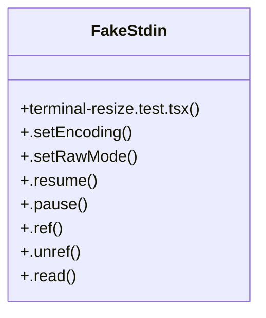

# Batch Job Engine

> 378 nodes · cohesion 0.01

## Key Concepts

- [todo-store.ts](file:///C:/Users/Bhavin/Videos/WEB%20dev/Opensource%20porjects/Atom/src/todo-store.ts#L1) (45 connections)
- [dir-cache.ts](file:///C:/Users/Bhavin/Videos/WEB%20dev/Opensource%20porjects/Atom/src/tools/dir-cache.ts#L1) (41 connections)
- [search.ts](file:///C:/Users/Bhavin/Videos/WEB%20dev/Opensource%20porjects/Atom/src/tools/search.ts#L1) (41 connections)
- [resolve](file:///C:/Users/Bhavin/Videos/WEB%20dev/Opensource%20porjects/Atom/tests/policy.test.ts#L221) (38 connections)
- [keys](file:///C:/Users/Bhavin/Videos/WEB%20dev/Opensource%20porjects/Atom/tests/dock-live.test.tsx#L171) (35 connections)
- [agent-loop-phase1.test.ts](file:///C:/Users/Bhavin/Videos/WEB%20dev/Opensource%20porjects/Atom/tests/agent-loop-phase1.test.ts#L1) (34 connections)
- [session-todos.test.ts](file:///C:/Users/Bhavin/Videos/WEB%20dev/Opensource%20porjects/Atom/tests/session-todos.test.ts#L1) (33 connections)
- [shell.ts](file:///C:/Users/Bhavin/Videos/WEB%20dev/Opensource%20porjects/Atom/src/tools/shell.ts#L1) (29 connections)
- [fast-list.test.ts](file:///C:/Users/Bhavin/Videos/WEB%20dev/Opensource%20porjects/Atom/tests/fast-list.test.ts#L1) (27 connections)
- [ripgrep.ts](file:///C:/Users/Bhavin/Videos/WEB%20dev/Opensource%20porjects/Atom/src/tools/ripgrep.ts#L1) (24 connections)
- [read-cache.ts](file:///C:/Users/Bhavin/Videos/WEB%20dev/Opensource%20porjects/Atom/src/tools/read-cache.ts#L1) (23 connections)
- [shared.ts](file:///C:/Users/Bhavin/Videos/WEB%20dev/Opensource%20porjects/Atom/src/tools/shared.ts#L1) (23 connections)
- [grepTool()](file:///C:/Users/Bhavin/Videos/WEB%20dev/Opensource%20porjects/Atom/src/tools/search.ts#L570) (23 connections)
- [memory-ceilings.test.tsx](file:///C:/Users/Bhavin/Videos/WEB%20dev/Opensource%20porjects/Atom/tests/memory-ceilings.test.tsx#L1) (21 connections)
- [read-cache.test.ts](file:///C:/Users/Bhavin/Videos/WEB%20dev/Opensource%20porjects/Atom/tests/read-cache.test.ts#L1) (20 connections)
- [filesystem.ts](file:///C:/Users/Bhavin/Videos/WEB%20dev/Opensource%20porjects/Atom/src/tools/filesystem.ts#L1) (19 connections)
- [todo-shared.ts](file:///C:/Users/Bhavin/Videos/WEB%20dev/Opensource%20porjects/Atom/src/todo-shared.ts#L1) (18 connections)
- [loop-soak.test.ts](file:///C:/Users/Bhavin/Videos/WEB%20dev/Opensource%20porjects/Atom/tests/loop-soak.test.ts#L1) (18 connections)
- [executeBuiltinTool()](file:///C:/Users/Bhavin/Videos/WEB%20dev/Opensource%20porjects/Atom/src/tools/registry.ts#L725) (18 connections)
- [ripgrep.test.ts](file:///C:/Users/Bhavin/Videos/WEB%20dev/Opensource%20porjects/Atom/tests/ripgrep.test.ts#L1) (16 connections)
- [invalidCall()](file:///C:/Users/Bhavin/Videos/WEB%20dev/Opensource%20porjects/Atom/src/tools/shared.ts#L21) (16 connections)
- [globTool()](file:///C:/Users/Bhavin/Videos/WEB%20dev/Opensource%20porjects/Atom/src/tools/search.ts#L761) (15 connections)
- [err](file:///C:/Users/Bhavin/Videos/WEB%20dev/Opensource%20porjects/Atom/tests/tool-inspector.test.tsx#L135) (15 connections)
- [editTool()](file:///C:/Users/Bhavin/Videos/WEB%20dev/Opensource%20porjects/Atom/src/tools/filesystem.ts#L320) (13 connections)
- [stat](file:///C:/Users/Bhavin/Videos/WEB%20dev/Opensource%20porjects/Atom/tests/agent-loop-phase1.test.ts#L240) (12 connections)
- *... and 353 more nodes in this community*

## Class Diagram

## Relationships

- No strong cross-community connections detected

## Source Files

- [C:\Users\Bhavin\Videos\WEB dev\Opensource porjects\Atom\src\policy.ts](file:///C:/Users/Bhavin/Videos/WEB%20dev/Opensource%20porjects/Atom/src/policy.ts)
- [C:\Users\Bhavin\Videos\WEB dev\Opensource porjects\Atom\src\todo-shared.ts](file:///C:/Users/Bhavin/Videos/WEB%20dev/Opensource%20porjects/Atom/src/todo-shared.ts)
- [C:\Users\Bhavin\Videos\WEB dev\Opensource porjects\Atom\src\todo-store.ts](file:///C:/Users/Bhavin/Videos/WEB%20dev/Opensource%20porjects/Atom/src/todo-store.ts)
- [C:\Users\Bhavin\Videos\WEB dev\Opensource porjects\Atom\src\todos.ts](file:///C:/Users/Bhavin/Videos/WEB%20dev/Opensource%20porjects/Atom/src/todos.ts)
- [C:\Users\Bhavin\Videos\WEB dev\Opensource porjects\Atom\src\tools\dir-cache.ts](file:///C:/Users/Bhavin/Videos/WEB%20dev/Opensource%20porjects/Atom/src/tools/dir-cache.ts)
- [C:\Users\Bhavin\Videos\WEB dev\Opensource porjects\Atom\src\tools\filesystem.ts](file:///C:/Users/Bhavin/Videos/WEB%20dev/Opensource%20porjects/Atom/src/tools/filesystem.ts)
- [C:\Users\Bhavin\Videos\WEB dev\Opensource porjects\Atom\src\tools\fingerprints.ts](file:///C:/Users/Bhavin/Videos/WEB%20dev/Opensource%20porjects/Atom/src/tools/fingerprints.ts)
- [C:\Users\Bhavin\Videos\WEB dev\Opensource porjects\Atom\src\tools\overflow.ts](file:///C:/Users/Bhavin/Videos/WEB%20dev/Opensource%20porjects/Atom/src/tools/overflow.ts)
- [C:\Users\Bhavin\Videos\WEB dev\Opensource porjects\Atom\src\tools\read-cache.ts](file:///C:/Users/Bhavin/Videos/WEB%20dev/Opensource%20porjects/Atom/src/tools/read-cache.ts)
- [C:\Users\Bhavin\Videos\WEB dev\Opensource porjects\Atom\src\tools\registry.ts](file:///C:/Users/Bhavin/Videos/WEB%20dev/Opensource%20porjects/Atom/src/tools/registry.ts)
- [C:\Users\Bhavin\Videos\WEB dev\Opensource porjects\Atom\src\tools\ripgrep.ts](file:///C:/Users/Bhavin/Videos/WEB%20dev/Opensource%20porjects/Atom/src/tools/ripgrep.ts)
- [C:\Users\Bhavin\Videos\WEB dev\Opensource porjects\Atom\src\tools\search.ts](file:///C:/Users/Bhavin/Videos/WEB%20dev/Opensource%20porjects/Atom/src/tools/search.ts)
- [C:\Users\Bhavin\Videos\WEB dev\Opensource porjects\Atom\src\tools\shared.ts](file:///C:/Users/Bhavin/Videos/WEB%20dev/Opensource%20porjects/Atom/src/tools/shared.ts)
- [C:\Users\Bhavin\Videos\WEB dev\Opensource porjects\Atom\src\tools\shell.ts](file:///C:/Users/Bhavin/Videos/WEB%20dev/Opensource%20porjects/Atom/src/tools/shell.ts)
- [C:\Users\Bhavin\Videos\WEB dev\Opensource porjects\Atom\src\tools\todo.ts](file:///C:/Users/Bhavin/Videos/WEB%20dev/Opensource%20porjects/Atom/src/tools/todo.ts)
- [C:\Users\Bhavin\Videos\WEB dev\Opensource porjects\Atom\src\tools\web.ts](file:///C:/Users/Bhavin/Videos/WEB%20dev/Opensource%20porjects/Atom/src/tools/web.ts)
- [C:\Users\Bhavin\Videos\WEB dev\Opensource porjects\Atom\src\ui\markdown.tsx](file:///C:/Users/Bhavin/Videos/WEB%20dev/Opensource%20porjects/Atom/src/ui/markdown.tsx)
- [C:\Users\Bhavin\Videos\WEB dev\Opensource porjects\Atom\src\ui\mentions.ts](file:///C:/Users/Bhavin/Videos/WEB%20dev/Opensource%20porjects/Atom/src/ui/mentions.ts)
- [C:\Users\Bhavin\Videos\WEB dev\Opensource porjects\Atom\src\web\ui\app.js](file:///C:/Users/Bhavin/Videos/WEB%20dev/Opensource%20porjects/Atom/src/web/ui/app.js)
- [C:\Users\Bhavin\Videos\WEB dev\Opensource porjects\Atom\tests\agent-loop-phase1.test.ts](file:///C:/Users/Bhavin/Videos/WEB%20dev/Opensource%20porjects/Atom/tests/agent-loop-phase1.test.ts)

## Audit Trail

- EXTRACTED: 1050 (74%)
- INFERRED: 365 (26%)
- AMBIGUOUS: 0 (0%)

---

*Part of the graphify knowledge wiki. See [[index]] to navigate.*