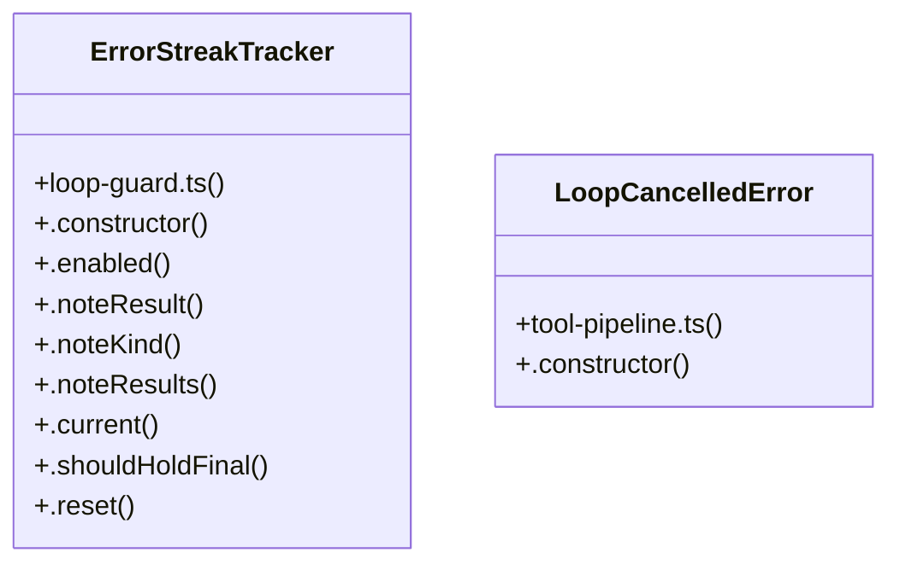

# Batch Job Engine

> 490 nodes · cohesion 0.01

## Key Concepts

- [goal.ts](file:///C:/Users/Bhavin/Videos/WEB%20dev/Opensource%20porjects/Atom/src/goal.ts#L1) (96 connections)
- [registry.ts](file:///C:/Users/Bhavin/Videos/WEB%20dev/Opensource%20porjects/Atom/src/tools/registry.ts#L1) (62 connections)
- [diff.test.tsx](file:///C:/Users/Bhavin/Videos/WEB%20dev/Opensource%20porjects/Atom/tests/diff.test.tsx#L1) (36 connections)
- [runLoopWithChat()](file:///C:/Users/Bhavin/Videos/WEB%20dev/Opensource%20porjects/Atom/src/agent/loop.ts#L190) (35 connections)
- [registry-intercepted.test.ts](file:///C:/Users/Bhavin/Videos/WEB%20dev/Opensource%20porjects/Atom/tests/registry-intercepted.test.ts#L1) (29 connections)
- [tool-pipeline.ts](file:///C:/Users/Bhavin/Videos/WEB%20dev/Opensource%20porjects/Atom/src/agent/tool-pipeline.ts#L1) (27 connections)
- [goal-evaluator.test.ts](file:///C:/Users/Bhavin/Videos/WEB%20dev/Opensource%20porjects/Atom/tests/goal-evaluator.test.ts#L1) (26 connections)
- [loop.ts](file:///C:/Users/Bhavin/Videos/WEB%20dev/Opensource%20porjects/Atom/src/agent/loop.ts#L1) (25 connections)
- [parallel-writes.test.ts](file:///C:/Users/Bhavin/Videos/WEB%20dev/Opensource%20porjects/Atom/tests/parallel-writes.test.ts#L1) (24 connections)
- [goal-disposition.test.ts](file:///C:/Users/Bhavin/Videos/WEB%20dev/Opensource%20porjects/Atom/tests/goal-disposition.test.ts#L1) (23 connections)
- [validateToolArgs()](file:///C:/Users/Bhavin/Videos/WEB%20dev/Opensource%20porjects/Atom/src/tools/registry.ts#L336) (22 connections)
- [gates.ts](file:///C:/Users/Bhavin/Videos/WEB%20dev/Opensource%20porjects/Atom/src/agent/gates.ts#L1) (20 connections)
- [goal-completion.test.ts](file:///C:/Users/Bhavin/Videos/WEB%20dev/Opensource%20porjects/Atom/tests/goal-completion.test.ts#L1) (20 connections)
- [goal-progress.test.ts](file:///C:/Users/Bhavin/Videos/WEB%20dev/Opensource%20porjects/Atom/tests/goal-progress.test.ts#L1) (19 connections)
- [types.ts](file:///C:/Users/Bhavin/Videos/WEB%20dev/Opensource%20porjects/Atom/src/agent/types.ts#L1) (18 connections)
- [parallel-pipeline-parity.test.ts](file:///C:/Users/Bhavin/Videos/WEB%20dev/Opensource%20porjects/Atom/tests/parallel-pipeline-parity.test.ts#L1) (18 connections)
- [executeBuiltinTool()](file:///C:/Users/Bhavin/Videos/WEB%20dev/Opensource%20porjects/Atom/src/tools/registry.ts#L725) (18 connections)
- [runGoalCommand()](file:///C:/Users/Bhavin/Videos/WEB%20dev/Opensource%20porjects/Atom/src/App.tsx#L5552) (17 connections)
- [scheduler.ts](file:///C:/Users/Bhavin/Videos/WEB%20dev/Opensource%20porjects/Atom/src/scheduler.ts#L1) (17 connections)
- [executeTool()](file:///C:/Users/Bhavin/Videos/WEB%20dev/Opensource%20porjects/Atom/src/tools/registry.ts#L615) (17 connections)
- [invalidCall()](file:///C:/Users/Bhavin/Videos/WEB%20dev/Opensource%20porjects/Atom/src/tools/shared.ts#L21) (16 connections)
- [goal-lifecycle-registry.test.ts](file:///C:/Users/Bhavin/Videos/WEB%20dev/Opensource%20porjects/Atom/tests/goal-lifecycle-registry.test.ts#L1) (15 connections)
- [goal-stuck-regressions.test.ts](file:///C:/Users/Bhavin/Videos/WEB%20dev/Opensource%20porjects/Atom/tests/goal-stuck-regressions.test.ts#L1) (15 connections)
- [tool-pipeline.test.ts](file:///C:/Users/Bhavin/Videos/WEB%20dev/Opensource%20porjects/Atom/tests/tool-pipeline.test.ts#L1) (15 connections)
- [intercept.ts](file:///C:/Users/Bhavin/Videos/WEB%20dev/Opensource%20porjects/Atom/src/tools/intercept.ts#L1) (14 connections)
- *... and 465 more nodes in this community*

## Class Diagram

```mermaid
classDiagram
    class ErrorStreakTracker {
        +loop-guard.ts()
        +.constructor()
        +.enabled()
        +.noteResult()
        +.noteKind()
        +.noteResults()
        +.current()
        +.shouldHoldFinal()
        +.reset()
    }
    class LoopCancelledError {
        +tool-pipeline.ts()
        +.constructor()
    }
```

## Relationships

- [[CLI Progress Feedback]] (2 shared connections)

## Source Files

- [C:\Users\Bhavin\Videos\WEB dev\Opensource porjects\Atom\src\App.tsx](file:///C:/Users/Bhavin/Videos/WEB%20dev/Opensource%20porjects/Atom/src/App.tsx)
- [C:\Users\Bhavin\Videos\WEB dev\Opensource porjects\Atom\src\agent\gates.ts](file:///C:/Users/Bhavin/Videos/WEB%20dev/Opensource%20porjects/Atom/src/agent/gates.ts)
- [C:\Users\Bhavin\Videos\WEB dev\Opensource porjects\Atom\src\agent\goal-evaluator.ts](file:///C:/Users/Bhavin/Videos/WEB%20dev/Opensource%20porjects/Atom/src/agent/goal-evaluator.ts)
- [C:\Users\Bhavin\Videos\WEB dev\Opensource porjects\Atom\src\agent\loop-guard.ts](file:///C:/Users/Bhavin/Videos/WEB%20dev/Opensource%20porjects/Atom/src/agent/loop-guard.ts)
- [C:\Users\Bhavin\Videos\WEB dev\Opensource porjects\Atom\src\agent\loop.ts](file:///C:/Users/Bhavin/Videos/WEB%20dev/Opensource%20porjects/Atom/src/agent/loop.ts)
- [C:\Users\Bhavin\Videos\WEB dev\Opensource porjects\Atom\src\agent\normalize.ts](file:///C:/Users/Bhavin/Videos/WEB%20dev/Opensource%20porjects/Atom/src/agent/normalize.ts)
- [C:\Users\Bhavin\Videos\WEB dev\Opensource porjects\Atom\src\agent\tool-pipeline.ts](file:///C:/Users/Bhavin/Videos/WEB%20dev/Opensource%20porjects/Atom/src/agent/tool-pipeline.ts)
- [C:\Users\Bhavin\Videos\WEB dev\Opensource porjects\Atom\src\agent\tool-result.ts](file:///C:/Users/Bhavin/Videos/WEB%20dev/Opensource%20porjects/Atom/src/agent/tool-result.ts)
- [C:\Users\Bhavin\Videos\WEB dev\Opensource porjects\Atom\src\agent\turn-events.ts](file:///C:/Users/Bhavin/Videos/WEB%20dev/Opensource%20porjects/Atom/src/agent/turn-events.ts)
- [C:\Users\Bhavin\Videos\WEB dev\Opensource porjects\Atom\src\agent\types.ts](file:///C:/Users/Bhavin/Videos/WEB%20dev/Opensource%20porjects/Atom/src/agent/types.ts)
- [C:\Users\Bhavin\Videos\WEB dev\Opensource porjects\Atom\src\goal.ts](file:///C:/Users/Bhavin/Videos/WEB%20dev/Opensource%20porjects/Atom/src/goal.ts)
- [C:\Users\Bhavin\Videos\WEB dev\Opensource porjects\Atom\src\mcp\manager.ts](file:///C:/Users/Bhavin/Videos/WEB%20dev/Opensource%20porjects/Atom/src/mcp/manager.ts)
- [C:\Users\Bhavin\Videos\WEB dev\Opensource porjects\Atom\src\scheduler.ts](file:///C:/Users/Bhavin/Videos/WEB%20dev/Opensource%20porjects/Atom/src/scheduler.ts)
- [C:\Users\Bhavin\Videos\WEB dev\Opensource porjects\Atom\src\todo-shared.ts](file:///C:/Users/Bhavin/Videos/WEB%20dev/Opensource%20porjects/Atom/src/todo-shared.ts)
- [C:\Users\Bhavin\Videos\WEB dev\Opensource porjects\Atom\src\todo-store.ts](file:///C:/Users/Bhavin/Videos/WEB%20dev/Opensource%20porjects/Atom/src/todo-store.ts)
- [C:\Users\Bhavin\Videos\WEB dev\Opensource porjects\Atom\src\tools\custom.ts](file:///C:/Users/Bhavin/Videos/WEB%20dev/Opensource%20porjects/Atom/src/tools/custom.ts)
- [C:\Users\Bhavin\Videos\WEB dev\Opensource porjects\Atom\src\tools\intercept.ts](file:///C:/Users/Bhavin/Videos/WEB%20dev/Opensource%20porjects/Atom/src/tools/intercept.ts)
- [C:\Users\Bhavin\Videos\WEB dev\Opensource porjects\Atom\src\tools\overrides.ts](file:///C:/Users/Bhavin/Videos/WEB%20dev/Opensource%20porjects/Atom/src/tools/overrides.ts)
- [C:\Users\Bhavin\Videos\WEB dev\Opensource porjects\Atom\src\tools\registry.ts](file:///C:/Users/Bhavin/Videos/WEB%20dev/Opensource%20porjects/Atom/src/tools/registry.ts)
- [C:\Users\Bhavin\Videos\WEB dev\Opensource porjects\Atom\src\tools\shared.ts](file:///C:/Users/Bhavin/Videos/WEB%20dev/Opensource%20porjects/Atom/src/tools/shared.ts)

## Audit Trail

- EXTRACTED: 1297 (79%)
- INFERRED: 337 (21%)
- AMBIGUOUS: 0 (0%)

---

*Part of the graphify knowledge wiki. See [[index]] to navigate.*