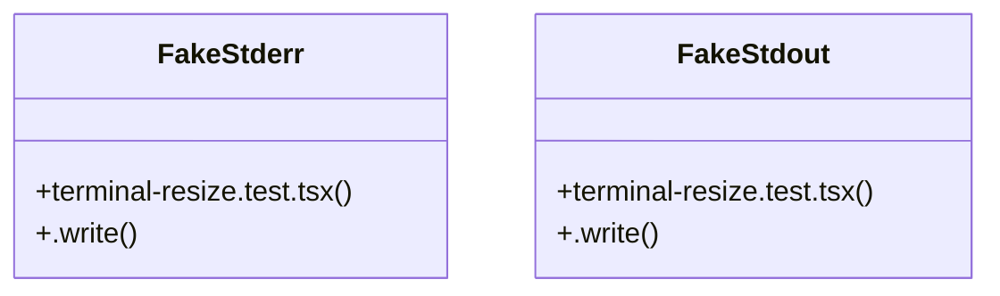

# CLI Progress Feedback

> 683 nodes · cohesion 0.00

## Key Concepts

- [react](file:///C:/Users/Bhavin/Videos/WEB%20dev/Opensource%20porjects/Atom/package.json#L44) (133 connections)
- [ink-testing-library](file:///C:/Users/Bhavin/Videos/WEB%20dev/Opensource%20porjects/Atom/package.json#L49) (97 connections)
- [theme.ts](file:///C:/Users/Bhavin/Videos/WEB%20dev/Opensource%20porjects/Atom/src/ui/theme.ts#L1) (43 connections)
- [ink](file:///C:/Users/Bhavin/Videos/WEB%20dev/Opensource%20porjects/Atom/package.json#L43) (37 connections)
- [layout.ts](file:///C:/Users/Bhavin/Videos/WEB%20dev/Opensource%20porjects/Atom/src/ui/layout.ts#L1) (30 connections)
- [render](file:///C:/Users/Bhavin/Videos/WEB%20dev/Opensource%20porjects/Atom/src/ui/transcript.tsx#L372) (30 connections)
- [ToolCall.tsx](file:///C:/Users/Bhavin/Videos/WEB%20dev/Opensource%20porjects/Atom/src/ui/components/ToolCall.tsx#L1) (29 connections)
- [side-by-side.test.tsx](file:///C:/Users/Bhavin/Videos/WEB%20dev/Opensource%20porjects/Atom/tests/side-by-side.test.tsx#L1) (29 connections)
- [diff-view.tsx](file:///C:/Users/Bhavin/Videos/WEB%20dev/Opensource%20porjects/Atom/src/ui/diff-view.tsx#L1) (26 connections)
- [side-by-side.tsx](file:///C:/Users/Bhavin/Videos/WEB%20dev/Opensource%20porjects/Atom/src/ui/side-by-side.tsx#L1) (26 connections)
- [tool-inspector.test.tsx](file:///C:/Users/Bhavin/Videos/WEB%20dev/Opensource%20porjects/Atom/tests/tool-inspector.test.tsx#L1) (24 connections)
- [tool-inspector.tsx](file:///C:/Users/Bhavin/Videos/WEB%20dev/Opensource%20porjects/Atom/src/ui/tool-inspector.tsx#L1) (22 connections)
- [transcript.tsx](file:///C:/Users/Bhavin/Videos/WEB%20dev/Opensource%20porjects/Atom/src/ui/transcript.tsx#L1) (22 connections)
- [approval.test.tsx](file:///C:/Users/Bhavin/Videos/WEB%20dev/Opensource%20porjects/Atom/tests/approval.test.tsx#L1) (19 connections)
- [errors.test.tsx](file:///C:/Users/Bhavin/Videos/WEB%20dev/Opensource%20porjects/Atom/tests/errors.test.tsx#L1) (19 connections)
- [todo-panel.tsx](file:///C:/Users/Bhavin/Videos/WEB%20dev/Opensource%20porjects/Atom/src/ui/todo-panel.tsx#L1) (18 connections)
- [ThinkingBlock.tsx](file:///C:/Users/Bhavin/Videos/WEB%20dev/Opensource%20porjects/Atom/src/ui/components/ThinkingBlock.tsx#L1) (17 connections)
- [diff-frame-width.test.tsx](file:///C:/Users/Bhavin/Videos/WEB%20dev/Opensource%20porjects/Atom/tests/diff-frame-width.test.tsx#L1) (17 connections)
- [input.tsx](file:///C:/Users/Bhavin/Videos/WEB%20dev/Opensource%20porjects/Atom/src/ui/input.tsx#L1) (16 connections)
- [markdown.test.tsx](file:///C:/Users/Bhavin/Videos/WEB%20dev/Opensource%20porjects/Atom/tests/markdown.test.tsx#L1) (16 connections)
- [narrow-terminal.test.tsx](file:///C:/Users/Bhavin/Videos/WEB%20dev/Opensource%20porjects/Atom/tests/narrow-terminal.test.tsx#L1) (16 connections)
- [render-stability.test.tsx](file:///C:/Users/Bhavin/Videos/WEB%20dev/Opensource%20porjects/Atom/tests/render-stability.test.tsx#L1) (16 connections)
- [modals.tsx](file:///C:/Users/Bhavin/Videos/WEB%20dev/Opensource%20porjects/Atom/src/ui/modals.tsx#L1) (15 connections)
- [ember.test.tsx](file:///C:/Users/Bhavin/Videos/WEB%20dev/Opensource%20porjects/Atom/tests/ember.test.tsx#L1) (15 connections)
- [status-bar.test.tsx](file:///C:/Users/Bhavin/Videos/WEB%20dev/Opensource%20porjects/Atom/tests/status-bar.test.tsx#L1) (15 connections)
- *... and 658 more nodes in this community*

## Class Diagram

## Relationships

- [[Batch Job Engine]] (132 shared connections)

## Source Files

- [C:\Users\Bhavin\Videos\WEB dev\Opensource porjects\Atom\src\ui\activity.ts](file:///C:/Users/Bhavin/Videos/WEB%20dev/Opensource%20porjects/Atom/src/ui/activity.ts)
- [C:\Users\Bhavin\Videos\WEB dev\Opensource porjects\Atom\src\ui\components\Activity.tsx](file:///C:/Users/Bhavin/Videos/WEB%20dev/Opensource%20porjects/Atom/src/ui/components/Activity.tsx)
- [C:\Users\Bhavin\Videos\WEB dev\Opensource porjects\Atom\src\ui\components\AppShell.tsx](file:///C:/Users/Bhavin/Videos/WEB%20dev/Opensource%20porjects/Atom/src/ui/components/AppShell.tsx)
- [C:\Users\Bhavin\Videos\WEB dev\Opensource porjects\Atom\src\ui\components\CommandPalette.tsx](file:///C:/Users/Bhavin/Videos/WEB%20dev/Opensource%20porjects/Atom/src/ui/components/CommandPalette.tsx)
- [C:\Users\Bhavin\Videos\WEB dev\Opensource porjects\Atom\src\ui\components\Composer.tsx](file:///C:/Users/Bhavin/Videos/WEB%20dev/Opensource%20porjects/Atom/src/ui/components/Composer.tsx)
- [C:\Users\Bhavin\Videos\WEB dev\Opensource porjects\Atom\src\ui\components\Conversation.tsx](file:///C:/Users/Bhavin/Videos/WEB%20dev/Opensource%20porjects/Atom/src/ui/components/Conversation.tsx)
- [C:\Users\Bhavin\Videos\WEB dev\Opensource porjects\Atom\src\ui\components\Dock.tsx](file:///C:/Users/Bhavin/Videos/WEB%20dev/Opensource%20porjects/Atom/src/ui/components/Dock.tsx)
- [C:\Users\Bhavin\Videos\WEB dev\Opensource porjects\Atom\src\ui\components\ErrorMessage.tsx](file:///C:/Users/Bhavin/Videos/WEB%20dev/Opensource%20porjects/Atom/src/ui/components/ErrorMessage.tsx)
- [C:\Users\Bhavin\Videos\WEB dev\Opensource porjects\Atom\src\ui\components\Markdown.tsx](file:///C:/Users/Bhavin/Videos/WEB%20dev/Opensource%20porjects/Atom/src/ui/components/Markdown.tsx)
- [C:\Users\Bhavin\Videos\WEB dev\Opensource porjects\Atom\src\ui\components\Message.tsx](file:///C:/Users/Bhavin/Videos/WEB%20dev/Opensource%20porjects/Atom/src/ui/components/Message.tsx)
- [C:\Users\Bhavin\Videos\WEB dev\Opensource porjects\Atom\src\ui\components\Modal.tsx](file:///C:/Users/Bhavin/Videos/WEB%20dev/Opensource%20porjects/Atom/src/ui/components/Modal.tsx)
- [C:\Users\Bhavin\Videos\WEB dev\Opensource porjects\Atom\src\ui\components\PermissionPrompt.tsx](file:///C:/Users/Bhavin/Videos/WEB%20dev/Opensource%20porjects/Atom/src/ui/components/PermissionPrompt.tsx)
- [C:\Users\Bhavin\Videos\WEB dev\Opensource porjects\Atom\src\ui\components\ThinkingBlock.tsx](file:///C:/Users/Bhavin/Videos/WEB%20dev/Opensource%20porjects/Atom/src/ui/components/ThinkingBlock.tsx)
- [C:\Users\Bhavin\Videos\WEB dev\Opensource porjects\Atom\src\ui\components\ToolCall.tsx](file:///C:/Users/Bhavin/Videos/WEB%20dev/Opensource%20porjects/Atom/src/ui/components/ToolCall.tsx)
- [C:\Users\Bhavin\Videos\WEB dev\Opensource porjects\Atom\src\ui\diff-panel.tsx](file:///C:/Users/Bhavin/Videos/WEB%20dev/Opensource%20porjects/Atom/src/ui/diff-panel.tsx)
- [C:\Users\Bhavin\Videos\WEB dev\Opensource porjects\Atom\src\ui\diff-view.tsx](file:///C:/Users/Bhavin/Videos/WEB%20dev/Opensource%20porjects/Atom/src/ui/diff-view.tsx)
- [C:\Users\Bhavin\Videos\WEB dev\Opensource porjects\Atom\src\ui\diff.ts](file:///C:/Users/Bhavin/Videos/WEB%20dev/Opensource%20porjects/Atom/src/ui/diff.ts)
- [C:\Users\Bhavin\Videos\WEB dev\Opensource porjects\Atom\src\ui\input.tsx](file:///C:/Users/Bhavin/Videos/WEB%20dev/Opensource%20porjects/Atom/src/ui/input.tsx)
- [C:\Users\Bhavin\Videos\WEB dev\Opensource porjects\Atom\src\ui\layout.ts](file:///C:/Users/Bhavin/Videos/WEB%20dev/Opensource%20porjects/Atom/src/ui/layout.ts)
- [C:\Users\Bhavin\Videos\WEB dev\Opensource porjects\Atom\src\ui\modals.tsx](file:///C:/Users/Bhavin/Videos/WEB%20dev/Opensource%20porjects/Atom/src/ui/modals.tsx)

## Audit Trail

- EXTRACTED: 1809 (95%)
- INFERRED: 95 (5%)
- AMBIGUOUS: 0 (0%)

---

*Part of the graphify knowledge wiki. See [[index]] to navigate.*