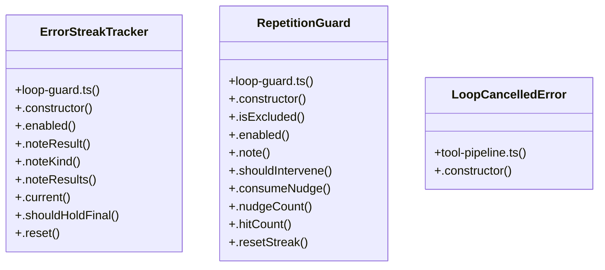

# Code Submission Review

> 267 nodes · cohesion 0.01

## Key Concepts

- [runLoopWithChat()](file:///C:/Users/Bhavin/Videos/WEB%20dev/Opensource%20porjects/Atom/src/agent/loop.ts#L190) (35 connections)
- [registry-intercepted.test.ts](file:///C:/Users/Bhavin/Videos/WEB%20dev/Opensource%20porjects/Atom/tests/registry-intercepted.test.ts#L1) (29 connections)
- [tool-pipeline.ts](file:///C:/Users/Bhavin/Videos/WEB%20dev/Opensource%20porjects/Atom/src/agent/tool-pipeline.ts#L1) (27 connections)
- [loop.ts](file:///C:/Users/Bhavin/Videos/WEB%20dev/Opensource%20porjects/Atom/src/agent/loop.ts#L1) (25 connections)
- [parallel-writes.test.ts](file:///C:/Users/Bhavin/Videos/WEB%20dev/Opensource%20porjects/Atom/tests/parallel-writes.test.ts#L1) (24 connections)
- [loop-turn-events.test.ts](file:///C:/Users/Bhavin/Videos/WEB%20dev/Opensource%20porjects/Atom/tests/loop-turn-events.test.ts#L1) (23 connections)
- [gates.ts](file:///C:/Users/Bhavin/Videos/WEB%20dev/Opensource%20porjects/Atom/src/agent/gates.ts#L1) (20 connections)
- [goal-completion.test.ts](file:///C:/Users/Bhavin/Videos/WEB%20dev/Opensource%20porjects/Atom/tests/goal-completion.test.ts#L1) (20 connections)
- [types.ts](file:///C:/Users/Bhavin/Videos/WEB%20dev/Opensource%20porjects/Atom/src/agent/types.ts#L1) (18 connections)
- [parallel-pipeline-parity.test.ts](file:///C:/Users/Bhavin/Videos/WEB%20dev/Opensource%20porjects/Atom/tests/parallel-pipeline-parity.test.ts#L1) (18 connections)
- [scheduler.ts](file:///C:/Users/Bhavin/Videos/WEB%20dev/Opensource%20porjects/Atom/src/scheduler.ts#L1) (17 connections)
- [goal-lifecycle-registry.test.ts](file:///C:/Users/Bhavin/Videos/WEB%20dev/Opensource%20porjects/Atom/tests/goal-lifecycle-registry.test.ts#L1) (15 connections)
- [goal-stuck-regressions.test.ts](file:///C:/Users/Bhavin/Videos/WEB%20dev/Opensource%20porjects/Atom/tests/goal-stuck-regressions.test.ts#L1) (15 connections)
- [tool-pipeline.test.ts](file:///C:/Users/Bhavin/Videos/WEB%20dev/Opensource%20porjects/Atom/tests/tool-pipeline.test.ts#L1) (15 connections)
- [intercept.ts](file:///C:/Users/Bhavin/Videos/WEB%20dev/Opensource%20porjects/Atom/src/tools/intercept.ts#L1) (14 connections)
- [normalize.ts](file:///C:/Users/Bhavin/Videos/WEB%20dev/Opensource%20porjects/Atom/src/agent/normalize.ts#L1) (13 connections)
- [runStagesWithDecision()](file:///C:/Users/Bhavin/Videos/WEB%20dev/Opensource%20porjects/Atom/src/agent/tool-pipeline.ts#L471) (13 connections)
- [loop-guard.ts](file:///C:/Users/Bhavin/Videos/WEB%20dev/Opensource%20porjects/Atom/src/agent/loop-guard.ts#L1) (11 connections)
- [loop-guard.test.ts](file:///C:/Users/Bhavin/Videos/WEB%20dev/Opensource%20porjects/Atom/tests/loop-guard.test.ts#L1) (10 connections)
- [tool-normalize.test.ts](file:///C:/Users/Bhavin/Videos/WEB%20dev/Opensource%20porjects/Atom/tests/tool-normalize.test.ts#L1) (10 connections)
- [RepetitionGuard](file:///C:/Users/Bhavin/Videos/WEB%20dev/Opensource%20porjects/Atom/src/agent/loop-guard.ts#L50) (10 connections)
- [toolNames()](file:///C:/Users/Bhavin/Videos/WEB%20dev/Opensource%20porjects/Atom/src/tools/registry.ts#L172) (10 connections)
- [stop-policy.test.ts](file:///C:/Users/Bhavin/Videos/WEB%20dev/Opensource%20porjects/Atom/tests/stop-policy.test.ts#L1) (9 connections)
- [ErrorStreakTracker](file:///C:/Users/Bhavin/Videos/WEB%20dev/Opensource%20porjects/Atom/src/agent/loop-guard.ts#L175) (9 connections)
- [isCancelError()](file:///C:/Users/Bhavin/Videos/WEB%20dev/Opensource%20porjects/Atom/src/agent/tool-pipeline.ts#L94) (9 connections)
- *... and 242 more nodes in this community*

## Class Diagram

## Relationships

- No strong cross-community connections detected

## Source Files

- [C:\Users\Bhavin\Videos\WEB dev\Opensource porjects\Atom\src\agent\gates.ts](file:///C:/Users/Bhavin/Videos/WEB%20dev/Opensource%20porjects/Atom/src/agent/gates.ts)
- [C:\Users\Bhavin\Videos\WEB dev\Opensource porjects\Atom\src\agent\loop-guard.ts](file:///C:/Users/Bhavin/Videos/WEB%20dev/Opensource%20porjects/Atom/src/agent/loop-guard.ts)
- [C:\Users\Bhavin\Videos\WEB dev\Opensource porjects\Atom\src\agent\loop.ts](file:///C:/Users/Bhavin/Videos/WEB%20dev/Opensource%20porjects/Atom/src/agent/loop.ts)
- [C:\Users\Bhavin\Videos\WEB dev\Opensource porjects\Atom\src\agent\normalize.ts](file:///C:/Users/Bhavin/Videos/WEB%20dev/Opensource%20porjects/Atom/src/agent/normalize.ts)
- [C:\Users\Bhavin\Videos\WEB dev\Opensource porjects\Atom\src\agent\tool-pipeline.ts](file:///C:/Users/Bhavin/Videos/WEB%20dev/Opensource%20porjects/Atom/src/agent/tool-pipeline.ts)
- [C:\Users\Bhavin\Videos\WEB dev\Opensource porjects\Atom\src\agent\tool-result.ts](file:///C:/Users/Bhavin/Videos/WEB%20dev/Opensource%20porjects/Atom/src/agent/tool-result.ts)
- [C:\Users\Bhavin\Videos\WEB dev\Opensource porjects\Atom\src\agent\turn-events.ts](file:///C:/Users/Bhavin/Videos/WEB%20dev/Opensource%20porjects/Atom/src/agent/turn-events.ts)
- [C:\Users\Bhavin\Videos\WEB dev\Opensource porjects\Atom\src\agent\types.ts](file:///C:/Users/Bhavin/Videos/WEB%20dev/Opensource%20porjects/Atom/src/agent/types.ts)
- [C:\Users\Bhavin\Videos\WEB dev\Opensource porjects\Atom\src\goal.ts](file:///C:/Users/Bhavin/Videos/WEB%20dev/Opensource%20porjects/Atom/src/goal.ts)
- [C:\Users\Bhavin\Videos\WEB dev\Opensource porjects\Atom\src\scheduler.ts](file:///C:/Users/Bhavin/Videos/WEB%20dev/Opensource%20porjects/Atom/src/scheduler.ts)
- [C:\Users\Bhavin\Videos\WEB dev\Opensource porjects\Atom\src\tools\intercept.ts](file:///C:/Users/Bhavin/Videos/WEB%20dev/Opensource%20porjects/Atom/src/tools/intercept.ts)
- [C:\Users\Bhavin\Videos\WEB dev\Opensource porjects\Atom\src\tools\registry.ts](file:///C:/Users/Bhavin/Videos/WEB%20dev/Opensource%20porjects/Atom/src/tools/registry.ts)
- [C:\Users\Bhavin\Videos\WEB dev\Opensource porjects\Atom\src\zen.ts](file:///C:/Users/Bhavin/Videos/WEB%20dev/Opensource%20porjects/Atom/src/zen.ts)
- [C:\Users\Bhavin\Videos\WEB dev\Opensource porjects\Atom\tests\goal-completion.test.ts](file:///C:/Users/Bhavin/Videos/WEB%20dev/Opensource%20porjects/Atom/tests/goal-completion.test.ts)
- [C:\Users\Bhavin\Videos\WEB dev\Opensource porjects\Atom\tests\goal-lifecycle-registry.test.ts](file:///C:/Users/Bhavin/Videos/WEB%20dev/Opensource%20porjects/Atom/tests/goal-lifecycle-registry.test.ts)
- [C:\Users\Bhavin\Videos\WEB dev\Opensource porjects\Atom\tests\goal-stuck-regressions.test.ts](file:///C:/Users/Bhavin/Videos/WEB%20dev/Opensource%20porjects/Atom/tests/goal-stuck-regressions.test.ts)
- [C:\Users\Bhavin\Videos\WEB dev\Opensource porjects\Atom\tests\loop-guard.test.ts](file:///C:/Users/Bhavin/Videos/WEB%20dev/Opensource%20porjects/Atom/tests/loop-guard.test.ts)
- [C:\Users\Bhavin\Videos\WEB dev\Opensource porjects\Atom\tests\loop-turn-events.test.ts](file:///C:/Users/Bhavin/Videos/WEB%20dev/Opensource%20porjects/Atom/tests/loop-turn-events.test.ts)
- [C:\Users\Bhavin\Videos\WEB dev\Opensource porjects\Atom\tests\parallel-pipeline-parity.test.ts](file:///C:/Users/Bhavin/Videos/WEB%20dev/Opensource%20porjects/Atom/tests/parallel-pipeline-parity.test.ts)
- [C:\Users\Bhavin\Videos\WEB dev\Opensource porjects\Atom\tests\parallel-writes.test.ts](file:///C:/Users/Bhavin/Videos/WEB%20dev/Opensource%20porjects/Atom/tests/parallel-writes.test.ts)

## Audit Trail

- EXTRACTED: 700 (85%)
- INFERRED: 121 (15%)
- AMBIGUOUS: 0 (0%)

---

*Part of the graphify knowledge wiki. See [[index]] to navigate.*