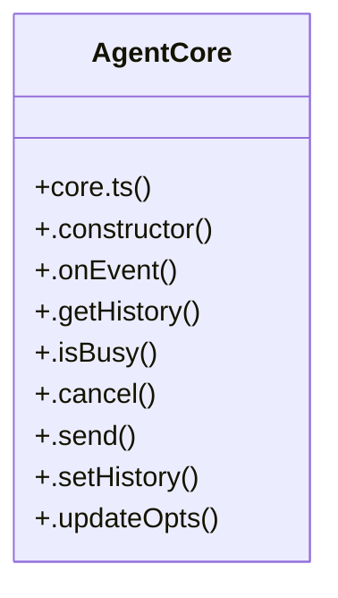

# Community 14

> 176 nodes · cohesion 0.01

## Key Concepts

- [core-usage-tick.test.tsx](file:///C:/Users/Bhavin/Videos/WEB%20dev/Opensource%20porjects/Atom/tests/core-usage-tick.test.tsx#L1) (32 connections)
- [stream-sequence.test.tsx](file:///C:/Users/Bhavin/Videos/WEB%20dev/Opensource%20porjects/Atom/tests/stream-sequence.test.tsx#L1) (31 connections)
- [core-transcript.test.tsx](file:///C:/Users/Bhavin/Videos/WEB%20dev/Opensource%20porjects/Atom/tests/core-transcript.test.tsx#L1) (26 connections)
- [step-blocks.test.tsx](file:///C:/Users/Bhavin/Videos/WEB%20dev/Opensource%20porjects/Atom/tests/step-blocks.test.tsx#L1) (26 connections)
- [footer-cluster.test.tsx](file:///C:/Users/Bhavin/Videos/WEB%20dev/Opensource%20porjects/Atom/tests/footer-cluster.test.tsx#L1) (23 connections)
- [step-block-commit.test.tsx](file:///C:/Users/Bhavin/Videos/WEB%20dev/Opensource%20porjects/Atom/tests/step-block-commit.test.tsx#L1) (23 connections)
- [step-blocks.ts](file:///C:/Users/Bhavin/Videos/WEB%20dev/Opensource%20porjects/Atom/src/ui/step-blocks.ts#L1) (17 connections)
- [core.ts](file:///C:/Users/Bhavin/Videos/WEB%20dev/Opensource%20porjects/Atom/src/agent/core.ts#L1) (14 connections)
- [reduceAgentEvent()](file:///C:/Users/Bhavin/Videos/WEB%20dev/Opensource%20porjects/Atom/src/ui/agent-adapter.ts#L53) (13 connections)
- [stream-store.ts](file:///C:/Users/Bhavin/Videos/WEB%20dev/Opensource%20porjects/Atom/src/ui/stream-store.ts#L1) (13 connections)
- [agent-adapter.ts](file:///C:/Users/Bhavin/Videos/WEB%20dev/Opensource%20porjects/Atom/src/ui/agent-adapter.ts#L1) (11 connections)
- [events.ts](file:///C:/Users/Bhavin/Videos/WEB%20dev/Opensource%20porjects/Atom/src/agent/events.ts#L1) (9 connections)
- [AgentCore](file:///C:/Users/Bhavin/Videos/WEB%20dev/Opensource%20porjects/Atom/src/agent/core.ts#L50) (9 connections)
- [stream-store.test.ts](file:///C:/Users/Bhavin/Videos/WEB%20dev/Opensource%20porjects/Atom/tests/stream-store.test.ts#L1) (7 connections)
- [StepBlockList.tsx](file:///C:/Users/Bhavin/Videos/WEB%20dev/Opensource%20porjects/Atom/src/ui/components/StepBlockList.tsx#L1) (6 connections)
- [applyStepDelta()](file:///C:/Users/Bhavin/Videos/WEB%20dev/Opensource%20porjects/Atom/src/ui/step-blocks.ts#L148) (5 connections)
- [live-host.tsx](file:///C:/Users/Bhavin/Videos/WEB%20dev/Opensource%20porjects/Atom/src/ui/live-host.tsx#L1) (4 connections)
- [commitLiveBlockTurns()](file:///C:/Users/Bhavin/Videos/WEB%20dev/Opensource%20porjects/Atom/src/ui/step-blocks.ts#L228) (4 connections)
- [startToolBlock()](file:///C:/Users/Bhavin/Videos/WEB%20dev/Opensource%20porjects/Atom/src/ui/step-blocks.ts#L87) (4 connections)
- [sse()](file:///C:/Users/Bhavin/Videos/WEB%20dev/Opensource%20porjects/Atom/tests/stream-sequence.test.tsx#L20) (4 connections)
- [commitStepBlocks()](file:///C:/Users/Bhavin/Videos/WEB%20dev/Opensource%20porjects/Atom/src/ui/step-blocks.ts#L192) (3 connections)
- [nextBlockOrder()](file:///C:/Users/Bhavin/Videos/WEB%20dev/Opensource%20porjects/Atom/src/ui/step-blocks.ts#L57) (3 connections)
- [stepIdFor()](file:///C:/Users/Bhavin/Videos/WEB%20dev/Opensource%20porjects/Atom/src/ui/step-blocks.ts#L50) (3 connections)
- [cleanEnv()](file:///C:/Users/Bhavin/Videos/WEB%20dev/Opensource%20porjects/Atom/tests/core-transcript.test.tsx#L25) (2 connections)
- [waitForFrame()](file:///C:/Users/Bhavin/Videos/WEB%20dev/Opensource%20porjects/Atom/tests/core-transcript.test.tsx#L78) (2 connections)
- *... and 151 more nodes in this community*

## Class Diagram

## Relationships

- [[CLI Progress Feedback]] (15 shared connections)

## Source Files

- [C:\Users\Bhavin\Videos\WEB dev\Opensource porjects\Atom\src\agent\core.ts](file:///C:/Users/Bhavin/Videos/WEB%20dev/Opensource%20porjects/Atom/src/agent/core.ts)
- [C:\Users\Bhavin\Videos\WEB dev\Opensource porjects\Atom\src\agent\events.ts](file:///C:/Users/Bhavin/Videos/WEB%20dev/Opensource%20porjects/Atom/src/agent/events.ts)
- [C:\Users\Bhavin\Videos\WEB dev\Opensource porjects\Atom\src\ui\agent-adapter.ts](file:///C:/Users/Bhavin/Videos/WEB%20dev/Opensource%20porjects/Atom/src/ui/agent-adapter.ts)
- [C:\Users\Bhavin\Videos\WEB dev\Opensource porjects\Atom\src\ui\components\StepBlockList.tsx](file:///C:/Users/Bhavin/Videos/WEB%20dev/Opensource%20porjects/Atom/src/ui/components/StepBlockList.tsx)
- [C:\Users\Bhavin\Videos\WEB dev\Opensource porjects\Atom\src\ui\live-host.tsx](file:///C:/Users/Bhavin/Videos/WEB%20dev/Opensource%20porjects/Atom/src/ui/live-host.tsx)
- [C:\Users\Bhavin\Videos\WEB dev\Opensource porjects\Atom\src\ui\step-blocks.ts](file:///C:/Users/Bhavin/Videos/WEB%20dev/Opensource%20porjects/Atom/src/ui/step-blocks.ts)
- [C:\Users\Bhavin\Videos\WEB dev\Opensource porjects\Atom\src\ui\stream-store.ts](file:///C:/Users/Bhavin/Videos/WEB%20dev/Opensource%20porjects/Atom/src/ui/stream-store.ts)
- [C:\Users\Bhavin\Videos\WEB dev\Opensource porjects\Atom\tests\core-transcript.test.tsx](file:///C:/Users/Bhavin/Videos/WEB%20dev/Opensource%20porjects/Atom/tests/core-transcript.test.tsx)
- [C:\Users\Bhavin\Videos\WEB dev\Opensource porjects\Atom\tests\core-usage-tick.test.tsx](file:///C:/Users/Bhavin/Videos/WEB%20dev/Opensource%20porjects/Atom/tests/core-usage-tick.test.tsx)
- [C:\Users\Bhavin\Videos\WEB dev\Opensource porjects\Atom\tests\footer-cluster.test.tsx](file:///C:/Users/Bhavin/Videos/WEB%20dev/Opensource%20porjects/Atom/tests/footer-cluster.test.tsx)
- [C:\Users\Bhavin\Videos\WEB dev\Opensource porjects\Atom\tests\step-block-commit.test.tsx](file:///C:/Users/Bhavin/Videos/WEB%20dev/Opensource%20porjects/Atom/tests/step-block-commit.test.tsx)
- [C:\Users\Bhavin\Videos\WEB dev\Opensource porjects\Atom\tests\step-blocks.test.tsx](file:///C:/Users/Bhavin/Videos/WEB%20dev/Opensource%20porjects/Atom/tests/step-blocks.test.tsx)
- [C:\Users\Bhavin\Videos\WEB dev\Opensource porjects\Atom\tests\stream-sequence.test.tsx](file:///C:/Users/Bhavin/Videos/WEB%20dev/Opensource%20porjects/Atom/tests/stream-sequence.test.tsx)
- [C:\Users\Bhavin\Videos\WEB dev\Opensource porjects\Atom\tests\stream-store.test.ts](file:///C:/Users/Bhavin/Videos/WEB%20dev/Opensource%20porjects/Atom/tests/stream-store.test.ts)

## Audit Trail

- EXTRACTED: 428 (94%)
- INFERRED: 28 (6%)
- AMBIGUOUS: 0 (0%)

---

*Part of the graphify knowledge wiki. See [[index]] to navigate.*