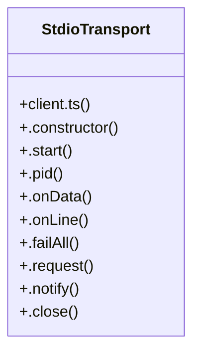

# Community 18

> 127 nodes · cohesion 0.02

## Key Concepts

- [goal-pause-resume.test.tsx](file:///C:/Users/Bhavin/Videos/WEB%20dev/Opensource%20porjects/Atom/tests/goal-pause-resume.test.tsx#L1) (39 connections)
- [rename.test.tsx](file:///C:/Users/Bhavin/Videos/WEB%20dev/Opensource%20porjects/Atom/tests/rename.test.tsx#L1) (30 connections)
- [plan-mode.test.tsx](file:///C:/Users/Bhavin/Videos/WEB%20dev/Opensource%20porjects/Atom/tests/plan-mode.test.tsx#L1) (22 connections)
- [provider-flow.test.tsx](file:///C:/Users/Bhavin/Videos/WEB%20dev/Opensource%20porjects/Atom/tests/provider-flow.test.tsx#L1) (22 connections)
- [.write()](file:///C:/Users/Bhavin/Videos/WEB%20dev/Opensource%20porjects/Atom/tests/terminal-resize.test.tsx#L48) (14 connections)
- [goal.test.tsx](file:///C:/Users/Bhavin/Videos/WEB%20dev/Opensource%20porjects/Atom/tests/goal.test.tsx#L1) (11 connections)
- [StdioTransport](file:///C:/Users/Bhavin/Videos/WEB%20dev/Opensource%20porjects/Atom/src/mcp/client.ts#L57) (10 connections)
- [.onLine()](file:///C:/Users/Bhavin/Videos/WEB%20dev/Opensource%20porjects/Atom/src/mcp/client.ts#L141) (4 connections)
- [waitFor()](file:///C:/Users/Bhavin/Videos/WEB%20dev/Opensource%20porjects/Atom/tests/goal-pause-resume.test.tsx#L86) (4 connections)
- [waitFor()](file:///C:/Users/Bhavin/Videos/WEB%20dev/Opensource%20porjects/Atom/tests/rename.test.tsx#L68) (4 connections)
- [.failAll()](file:///C:/Users/Bhavin/Videos/WEB%20dev/Opensource%20porjects/Atom/src/mcp/client.ts#L174) (3 connections)
- [.onData()](file:///C:/Users/Bhavin/Videos/WEB%20dev/Opensource%20porjects/Atom/src/mcp/client.ts#L125) (3 connections)
- [enterPlan()](file:///C:/Users/Bhavin/Videos/WEB%20dev/Opensource%20porjects/Atom/tests/plan-mode.test.tsx#L80) (3 connections)
- [waitForFrame()](file:///C:/Users/Bhavin/Videos/WEB%20dev/Opensource%20porjects/Atom/tests/plan-mode.test.tsx#L52) (3 connections)
- [openProviderPicker()](file:///C:/Users/Bhavin/Videos/WEB%20dev/Opensource%20porjects/Atom/tests/provider-flow.test.tsx#L106) (3 connections)
- [waitForFrame()](file:///C:/Users/Bhavin/Videos/WEB%20dev/Opensource%20porjects/Atom/tests/provider-flow.test.tsx#L49) (3 connections)
- [.close()](file:///C:/Users/Bhavin/Videos/WEB%20dev/Opensource%20porjects/Atom/src/mcp/client.ts#L225) (2 connections)
- [.notify()](file:///C:/Users/Bhavin/Videos/WEB%20dev/Opensource%20porjects/Atom/src/mcp/client.ts#L214) (2 connections)
- [submit()](file:///C:/Users/Bhavin/Videos/WEB%20dev/Opensource%20porjects/Atom/tests/goal-pause-resume.test.tsx#L109) (2 connections)
- [waitForActive()](file:///C:/Users/Bhavin/Videos/WEB%20dev/Opensource%20porjects/Atom/tests/goal-pause-resume.test.tsx#L136) (2 connections)
- [waitForFrame()](file:///C:/Users/Bhavin/Videos/WEB%20dev/Opensource%20porjects/Atom/tests/goal-pause-resume.test.tsx#L68) (2 connections)
- [submitLine()](file:///C:/Users/Bhavin/Videos/WEB%20dev/Opensource%20porjects/Atom/tests/goal.test.tsx#L51) (2 connections)
- [waitForFrame()](file:///C:/Users/Bhavin/Videos/WEB%20dev/Opensource%20porjects/Atom/tests/goal.test.tsx#L23) (2 connections)
- [frame()](file:///C:/Users/Bhavin/Videos/WEB%20dev/Opensource%20porjects/Atom/tests/mcp.test.ts#L1206) (2 connections)
- [cleanEnv()](file:///C:/Users/Bhavin/Videos/WEB%20dev/Opensource%20porjects/Atom/tests/provider-flow.test.tsx#L18) (2 connections)
- *... and 102 more nodes in this community*

## Class Diagram

## Relationships

- [[CLI Progress Feedback]] (9 shared connections)

## Source Files

- [C:\Users\Bhavin\Videos\WEB dev\Opensource porjects\Atom\src\mcp\client.ts](file:///C:/Users/Bhavin/Videos/WEB%20dev/Opensource%20porjects/Atom/src/mcp/client.ts)
- [C:\Users\Bhavin\Videos\WEB dev\Opensource porjects\Atom\tests\goal-pause-resume.test.tsx](file:///C:/Users/Bhavin/Videos/WEB%20dev/Opensource%20porjects/Atom/tests/goal-pause-resume.test.tsx)
- [C:\Users\Bhavin\Videos\WEB dev\Opensource porjects\Atom\tests\goal.test.tsx](file:///C:/Users/Bhavin/Videos/WEB%20dev/Opensource%20porjects/Atom/tests/goal.test.tsx)
- [C:\Users\Bhavin\Videos\WEB dev\Opensource porjects\Atom\tests\mcp.test.ts](file:///C:/Users/Bhavin/Videos/WEB%20dev/Opensource%20porjects/Atom/tests/mcp.test.ts)
- [C:\Users\Bhavin\Videos\WEB dev\Opensource porjects\Atom\tests\plan-mode.test.tsx](file:///C:/Users/Bhavin/Videos/WEB%20dev/Opensource%20porjects/Atom/tests/plan-mode.test.tsx)
- [C:\Users\Bhavin\Videos\WEB dev\Opensource porjects\Atom\tests\provider-flow.test.tsx](file:///C:/Users/Bhavin/Videos/WEB%20dev/Opensource%20porjects/Atom/tests/provider-flow.test.tsx)
- [C:\Users\Bhavin\Videos\WEB dev\Opensource porjects\Atom\tests\rename.test.tsx](file:///C:/Users/Bhavin/Videos/WEB%20dev/Opensource%20porjects/Atom/tests/rename.test.tsx)
- [C:\Users\Bhavin\Videos\WEB dev\Opensource porjects\Atom\tests\session-lifecycle.test.tsx](file:///C:/Users/Bhavin/Videos/WEB%20dev/Opensource%20porjects/Atom/tests/session-lifecycle.test.tsx)
- [C:\Users\Bhavin\Videos\WEB dev\Opensource porjects\Atom\tests\session-picker.test.tsx](file:///C:/Users/Bhavin/Videos/WEB%20dev/Opensource%20porjects/Atom/tests/session-picker.test.tsx)
- [C:\Users\Bhavin\Videos\WEB dev\Opensource porjects\Atom\tests\session-switch-todo-current.test.tsx](file:///C:/Users/Bhavin/Videos/WEB%20dev/Opensource%20porjects/Atom/tests/session-switch-todo-current.test.tsx)
- [C:\Users\Bhavin\Videos\WEB dev\Opensource porjects\Atom\tests\smoothness.test.tsx](file:///C:/Users/Bhavin/Videos/WEB%20dev/Opensource%20porjects/Atom/tests/smoothness.test.tsx)
- [C:\Users\Bhavin\Videos\WEB dev\Opensource porjects\Atom\tests\stream-sequence.test.tsx](file:///C:/Users/Bhavin/Videos/WEB%20dev/Opensource%20porjects/Atom/tests/stream-sequence.test.tsx)
- [C:\Users\Bhavin\Videos\WEB dev\Opensource porjects\Atom\tests\terminal-resize.test.tsx](file:///C:/Users/Bhavin/Videos/WEB%20dev/Opensource%20porjects/Atom/tests/terminal-resize.test.tsx)

## Audit Trail

- EXTRACTED: 270 (88%)
- INFERRED: 38 (12%)
- AMBIGUOUS: 0 (0%)

---

*Part of the graphify knowledge wiki. See [[index]] to navigate.*