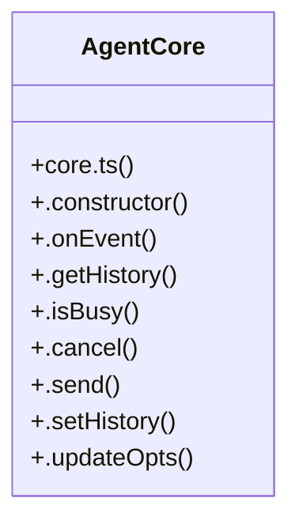

# Community 29

> 63 nodes · cohesion 0.03

## Key Concepts

- [core-usage-tick.test.tsx](file:///C:/Users/Bhavin/Videos/WEB%20dev/Opensource%20porjects/Atom/tests/core-usage-tick.test.tsx#L1) (32 connections)
- [core-transcript.test.tsx](file:///C:/Users/Bhavin/Videos/WEB%20dev/Opensource%20porjects/Atom/tests/core-transcript.test.tsx#L1) (26 connections)
- [core.ts](file:///C:/Users/Bhavin/Videos/WEB%20dev/Opensource%20porjects/Atom/src/agent/core.ts#L1) (14 connections)
- [events.ts](file:///C:/Users/Bhavin/Videos/WEB%20dev/Opensource%20porjects/Atom/src/agent/events.ts#L1) (9 connections)
- [agent-adapter.ts](file:///C:/Users/Bhavin/Videos/WEB%20dev/Opensource%20porjects/Atom/src/ui/agent-adapter.ts#L1) (9 connections)
- [AgentCore](file:///C:/Users/Bhavin/Videos/WEB%20dev/Opensource%20porjects/Atom/src/agent/core.ts#L50) (9 connections)
- [nextTurnId()](file:///C:/Users/Bhavin/Videos/WEB%20dev/Opensource%20porjects/Atom/src/agent/events.ts#L131) (3 connections)
- [cleanEnv()](file:///C:/Users/Bhavin/Videos/WEB%20dev/Opensource%20porjects/Atom/tests/core-transcript.test.tsx#L25) (2 connections)
- [waitForFrame()](file:///C:/Users/Bhavin/Videos/WEB%20dev/Opensource%20porjects/Atom/tests/core-transcript.test.tsx#L78) (2 connections)
- [cleanEnv()](file:///C:/Users/Bhavin/Videos/WEB%20dev/Opensource%20porjects/Atom/tests/core-usage-tick.test.tsx#L25) (2 connections)
- [send](file:///C:/Users/Bhavin/Videos/WEB%20dev/Opensource%20porjects/Atom/tests/core-usage-tick.test.tsx#L136) (2 connections)
- [waitForFrame()](file:///C:/Users/Bhavin/Videos/WEB%20dev/Opensource%20porjects/Atom/tests/core-usage-tick.test.tsx#L61) (2 connections)
- [useAgentAdapter()](file:///C:/Users/Bhavin/Videos/WEB%20dev/Opensource%20porjects/Atom/src/ui/agent-adapter.ts#L123) (1 connections)
- [.getHistory()](file:///C:/Users/Bhavin/Videos/WEB%20dev/Opensource%20porjects/Atom/src/agent/core.ts#L72) (1 connections)
- [.isBusy()](file:///C:/Users/Bhavin/Videos/WEB%20dev/Opensource%20porjects/Atom/src/agent/core.ts#L73) (1 connections)
- [.onEvent()](file:///C:/Users/Bhavin/Videos/WEB%20dev/Opensource%20porjects/Atom/src/agent/core.ts#L68) (1 connections)
- [.setHistory()](file:///C:/Users/Bhavin/Videos/WEB%20dev/Opensource%20porjects/Atom/src/agent/core.ts#L234) (1 connections)
- [.updateOpts()](file:///C:/Users/Bhavin/Videos/WEB%20dev/Opensource%20porjects/Atom/src/agent/core.ts#L235) (1 connections)
- [agent](file:///C:/Users/Bhavin/Videos/WEB%20dev/Opensource%20porjects/Atom/tests/core-transcript.test.tsx#L144) (1 connections)
- [app](file:///C:/Users/Bhavin/Videos/WEB%20dev/Opensource%20porjects/Atom/tests/core-transcript.test.tsx#L176) (1 connections)
- [asked](file:///C:/Users/Bhavin/Videos/WEB%20dev/Opensource%20porjects/Atom/tests/core-transcript.test.tsx#L142) (1 connections)
- [completed](file:///C:/Users/Bhavin/Videos/WEB%20dev/Opensource%20porjects/Atom/tests/core-transcript.test.tsx#L165) (1 connections)
- [dir](file:///C:/Users/Bhavin/Videos/WEB%20dev/Opensource%20porjects/Atom/tests/core-transcript.test.tsx#L97) (1 connections)
- [ENDPOINT](file:///C:/Users/Bhavin/Videos/WEB%20dev/Opensource%20porjects/Atom/tests/core-transcript.test.tsx#L19) (1 connections)
- [frame](file:///C:/Users/Bhavin/Videos/WEB%20dev/Opensource%20porjects/Atom/tests/core-transcript.test.tsx#L190) (1 connections)
- *... and 38 more nodes in this community*

## Class Diagram

## Relationships

- [[Batch Job Engine]] (5 shared connections)

## Source Files

- [C:\Users\Bhavin\Videos\WEB dev\Opensource porjects\Atom\src\agent\core.ts](file:///C:/Users/Bhavin/Videos/WEB%20dev/Opensource%20porjects/Atom/src/agent/core.ts)
- [C:\Users\Bhavin\Videos\WEB dev\Opensource porjects\Atom\src\agent\events.ts](file:///C:/Users/Bhavin/Videos/WEB%20dev/Opensource%20porjects/Atom/src/agent/events.ts)
- [C:\Users\Bhavin\Videos\WEB dev\Opensource porjects\Atom\src\ui\agent-adapter.ts](file:///C:/Users/Bhavin/Videos/WEB%20dev/Opensource%20porjects/Atom/src/ui/agent-adapter.ts)
- [C:\Users\Bhavin\Videos\WEB dev\Opensource porjects\Atom\tests\core-transcript.test.tsx](file:///C:/Users/Bhavin/Videos/WEB%20dev/Opensource%20porjects/Atom/tests/core-transcript.test.tsx)
- [C:\Users\Bhavin\Videos\WEB dev\Opensource porjects\Atom\tests\core-usage-tick.test.tsx](file:///C:/Users/Bhavin/Videos/WEB%20dev/Opensource%20porjects/Atom/tests/core-usage-tick.test.tsx)

## Audit Trail

- EXTRACTED: 156 (96%)
- INFERRED: 7 (4%)
- AMBIGUOUS: 0 (0%)

---

*Part of the graphify knowledge wiki. See [[index]] to navigate.*