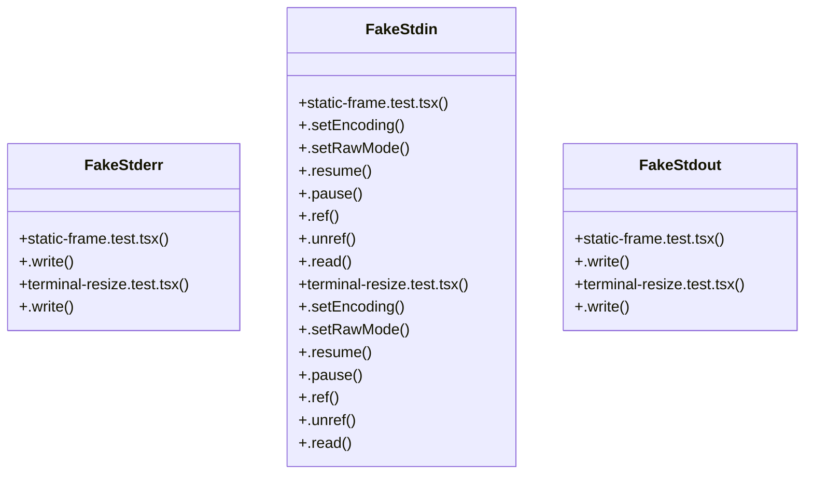

# Community 3

> 412 nodes · cohesion 0.01

## Key Concepts

- [theme.ts](file:///C:/Users/Bhavin/Videos/WEB%20dev/Opensource%20porjects/Atom/src/ui/theme.ts#L1) (47 connections)
- [ink](file:///C:/Users/Bhavin/Videos/WEB%20dev/Opensource%20porjects/Atom/package.json#L43) (39 connections)
- [layout.ts](file:///C:/Users/Bhavin/Videos/WEB%20dev/Opensource%20porjects/Atom/src/ui/layout.ts#L1) (30 connections)
- [side-by-side.test.tsx](file:///C:/Users/Bhavin/Videos/WEB%20dev/Opensource%20porjects/Atom/tests/side-by-side.test.tsx#L1) (29 connections)
- [diff-view.tsx](file:///C:/Users/Bhavin/Videos/WEB%20dev/Opensource%20porjects/Atom/src/ui/diff-view.tsx#L1) (26 connections)
- [side-by-side.tsx](file:///C:/Users/Bhavin/Videos/WEB%20dev/Opensource%20porjects/Atom/src/ui/side-by-side.tsx#L1) (26 connections)
- [tool-inspector.tsx](file:///C:/Users/Bhavin/Videos/WEB%20dev/Opensource%20porjects/Atom/src/ui/tool-inspector.tsx#L1) (22 connections)
- [transcript.tsx](file:///C:/Users/Bhavin/Videos/WEB%20dev/Opensource%20porjects/Atom/src/ui/transcript.tsx#L1) (19 connections)
- [step-tool-blocks.test.tsx](file:///C:/Users/Bhavin/Videos/WEB%20dev/Opensource%20porjects/Atom/tests/step-tool-blocks.test.tsx#L1) (19 connections)
- [highlight.ts](file:///C:/Users/Bhavin/Videos/WEB%20dev/Opensource%20porjects/Atom/src/ui/highlight.ts#L1) (18 connections)
- [ThinkingBlock.tsx](file:///C:/Users/Bhavin/Videos/WEB%20dev/Opensource%20porjects/Atom/src/ui/components/ThinkingBlock.tsx#L1) (17 connections)
- [diff-frame-width.test.tsx](file:///C:/Users/Bhavin/Videos/WEB%20dev/Opensource%20porjects/Atom/tests/diff-frame-width.test.tsx#L1) (17 connections)
- [CodeBlock.tsx](file:///C:/Users/Bhavin/Videos/WEB%20dev/Opensource%20porjects/Atom/src/ui/components/CodeBlock.tsx#L1) (16 connections)
- [input.tsx](file:///C:/Users/Bhavin/Videos/WEB%20dev/Opensource%20porjects/Atom/src/ui/input.tsx#L1) (16 connections)
- [narrow-terminal.test.tsx](file:///C:/Users/Bhavin/Videos/WEB%20dev/Opensource%20porjects/Atom/tests/narrow-terminal.test.tsx#L1) (16 connections)
- [modals.tsx](file:///C:/Users/Bhavin/Videos/WEB%20dev/Opensource%20porjects/Atom/src/ui/modals.tsx#L1) (15 connections)
- [ember.test.tsx](file:///C:/Users/Bhavin/Videos/WEB%20dev/Opensource%20porjects/Atom/tests/ember.test.tsx#L1) (15 connections)
- [goal-lifecycle-loop.test.ts](file:///C:/Users/Bhavin/Videos/WEB%20dev/Opensource%20porjects/Atom/tests/goal-lifecycle-loop.test.ts#L1) (14 connections)
- [diff.ts](file:///C:/Users/Bhavin/Videos/WEB%20dev/Opensource%20porjects/Atom/src/ui/diff.ts#L1) (13 connections)
- [live-tail.tsx](file:///C:/Users/Bhavin/Videos/WEB%20dev/Opensource%20porjects/Atom/src/ui/live-tail.tsx#L1) (13 connections)
- [layout-caps.test.tsx](file:///C:/Users/Bhavin/Videos/WEB%20dev/Opensource%20porjects/Atom/tests/layout-caps.test.tsx#L1) (13 connections)
- [tui-collapsible.test.tsx](file:///C:/Users/Bhavin/Videos/WEB%20dev/Opensource%20porjects/Atom/tests/tui-collapsible.test.tsx#L1) (13 connections)
- [activity.ts](file:///C:/Users/Bhavin/Videos/WEB%20dev/Opensource%20porjects/Atom/src/ui/activity.ts#L1) (12 connections)
- [terminal-resize.test.tsx](file:///C:/Users/Bhavin/Videos/WEB%20dev/Opensource%20porjects/Atom/tests/terminal-resize.test.tsx#L1) (12 connections)
- [tool-widget.test.tsx](file:///C:/Users/Bhavin/Videos/WEB%20dev/Opensource%20porjects/Atom/tests/tool-widget.test.tsx#L1) (12 connections)
- *... and 387 more nodes in this community*

## Class Diagram

## Relationships

- [[CLI Progress Feedback]] (71 shared connections)

## Source Files

- [C:\Users\Bhavin\Videos\WEB dev\Opensource porjects\Atom\src\ui\activity.ts](file:///C:/Users/Bhavin/Videos/WEB%20dev/Opensource%20porjects/Atom/src/ui/activity.ts)
- [C:\Users\Bhavin\Videos\WEB dev\Opensource porjects\Atom\src\ui\components\Activity.tsx](file:///C:/Users/Bhavin/Videos/WEB%20dev/Opensource%20porjects/Atom/src/ui/components/Activity.tsx)
- [C:\Users\Bhavin\Videos\WEB dev\Opensource porjects\Atom\src\ui\components\AppShell.tsx](file:///C:/Users/Bhavin/Videos/WEB%20dev/Opensource%20porjects/Atom/src/ui/components/AppShell.tsx)
- [C:\Users\Bhavin\Videos\WEB dev\Opensource porjects\Atom\src\ui\components\CodeBlock.tsx](file:///C:/Users/Bhavin/Videos/WEB%20dev/Opensource%20porjects/Atom/src/ui/components/CodeBlock.tsx)
- [C:\Users\Bhavin\Videos\WEB dev\Opensource porjects\Atom\src\ui\components\Composer.tsx](file:///C:/Users/Bhavin/Videos/WEB%20dev/Opensource%20porjects/Atom/src/ui/components/Composer.tsx)
- [C:\Users\Bhavin\Videos\WEB dev\Opensource porjects\Atom\src\ui\components\Dock.tsx](file:///C:/Users/Bhavin/Videos/WEB%20dev/Opensource%20porjects/Atom/src/ui/components/Dock.tsx)
- [C:\Users\Bhavin\Videos\WEB dev\Opensource porjects\Atom\src\ui\components\ErrorMessage.tsx](file:///C:/Users/Bhavin/Videos/WEB%20dev/Opensource%20porjects/Atom/src/ui/components/ErrorMessage.tsx)
- [C:\Users\Bhavin\Videos\WEB dev\Opensource porjects\Atom\src\ui\components\ThinkingBlock.tsx](file:///C:/Users/Bhavin/Videos/WEB%20dev/Opensource%20porjects/Atom/src/ui/components/ThinkingBlock.tsx)
- [C:\Users\Bhavin\Videos\WEB dev\Opensource porjects\Atom\src\ui\components\live-rows.tsx](file:///C:/Users/Bhavin/Videos/WEB%20dev/Opensource%20porjects/Atom/src/ui/components/live-rows.tsx)
- [C:\Users\Bhavin\Videos\WEB dev\Opensource porjects\Atom\src\ui\diff-panel.tsx](file:///C:/Users/Bhavin/Videos/WEB%20dev/Opensource%20porjects/Atom/src/ui/diff-panel.tsx)
- [C:\Users\Bhavin\Videos\WEB dev\Opensource porjects\Atom\src\ui\diff-view.tsx](file:///C:/Users/Bhavin/Videos/WEB%20dev/Opensource%20porjects/Atom/src/ui/diff-view.tsx)
- [C:\Users\Bhavin\Videos\WEB dev\Opensource porjects\Atom\src\ui\diff.ts](file:///C:/Users/Bhavin/Videos/WEB%20dev/Opensource%20porjects/Atom/src/ui/diff.ts)
- [C:\Users\Bhavin\Videos\WEB dev\Opensource porjects\Atom\src\ui\highlight.ts](file:///C:/Users/Bhavin/Videos/WEB%20dev/Opensource%20porjects/Atom/src/ui/highlight.ts)
- [C:\Users\Bhavin\Videos\WEB dev\Opensource porjects\Atom\src\ui\input.tsx](file:///C:/Users/Bhavin/Videos/WEB%20dev/Opensource%20porjects/Atom/src/ui/input.tsx)
- [C:\Users\Bhavin\Videos\WEB dev\Opensource porjects\Atom\src\ui\layout.ts](file:///C:/Users/Bhavin/Videos/WEB%20dev/Opensource%20porjects/Atom/src/ui/layout.ts)
- [C:\Users\Bhavin\Videos\WEB dev\Opensource porjects\Atom\src\ui\live-tail.tsx](file:///C:/Users/Bhavin/Videos/WEB%20dev/Opensource%20porjects/Atom/src/ui/live-tail.tsx)
- [C:\Users\Bhavin\Videos\WEB dev\Opensource porjects\Atom\src\ui\modals.tsx](file:///C:/Users/Bhavin/Videos/WEB%20dev/Opensource%20porjects/Atom/src/ui/modals.tsx)
- [C:\Users\Bhavin\Videos\WEB dev\Opensource porjects\Atom\src\ui\palette.tsx](file:///C:/Users/Bhavin/Videos/WEB%20dev/Opensource%20porjects/Atom/src/ui/palette.tsx)
- [C:\Users\Bhavin\Videos\WEB dev\Opensource porjects\Atom\src\ui\pickers.tsx](file:///C:/Users/Bhavin/Videos/WEB%20dev/Opensource%20porjects/Atom/src/ui/pickers.tsx)
- [C:\Users\Bhavin\Videos\WEB dev\Opensource porjects\Atom\src\ui\side-by-side.tsx](file:///C:/Users/Bhavin/Videos/WEB%20dev/Opensource%20porjects/Atom/src/ui/side-by-side.tsx)

## Audit Trail

- EXTRACTED: 1054 (97%)
- INFERRED: 35 (3%)
- AMBIGUOUS: 0 (0%)

---

*Part of the graphify knowledge wiki. See [[index]] to navigate.*