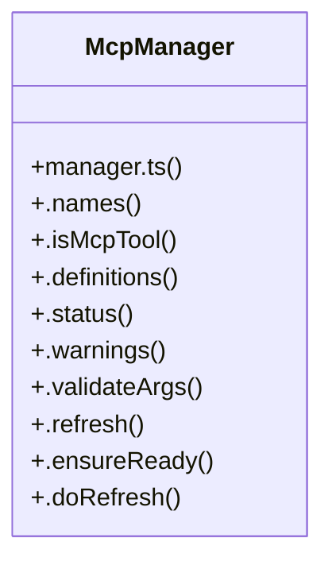

# Community 7

> 267 nodes · cohesion 0.01

## Key Concepts

- [mcp.test.ts](file:///C:/Users/Bhavin/Videos/WEB%20dev/Opensource%20porjects/Atom/tests/mcp.test.ts#L1) (77 connections)
- [manager.ts](file:///C:/Users/Bhavin/Videos/WEB%20dev/Opensource%20porjects/Atom/src/mcp/manager.ts#L1) (42 connections)
- [keys](file:///C:/Users/Bhavin/Videos/WEB%20dev/Opensource%20porjects/Atom/tests/dock-live.test.tsx#L171) (35 connections)
- [reload-mcp-instructions.test.tsx](file:///C:/Users/Bhavin/Videos/WEB%20dev/Opensource%20porjects/Atom/tests/reload-mcp-instructions.test.tsx#L1) (33 connections)
- [McpManager](file:///C:/Users/Bhavin/Videos/WEB%20dev/Opensource%20porjects/Atom/src/mcp/manager.ts#L156) (33 connections)
- [config.ts](file:///C:/Users/Bhavin/Videos/WEB%20dev/Opensource%20porjects/Atom/src/config.ts#L1) (28 connections)
- [tool-inspector.test.tsx](file:///C:/Users/Bhavin/Videos/WEB%20dev/Opensource%20porjects/Atom/tests/tool-inspector.test.tsx#L1) (24 connections)
- [cwd](file:///C:/Users/Bhavin/Videos/WEB%20dev/Opensource%20porjects/Atom/tests/tools.test.ts#L56) (24 connections)
- [oauth.ts](file:///C:/Users/Bhavin/Videos/WEB%20dev/Opensource%20porjects/Atom/src/mcp/oauth.ts#L1) (19 connections)
- [loadAtomConfig()](file:///C:/Users/Bhavin/Videos/WEB%20dev/Opensource%20porjects/Atom/src/config.ts#L313) (19 connections)
- [entries](file:///C:/Users/Bhavin/Videos/WEB%20dev/Opensource%20porjects/Atom/tests/session-picker.test.tsx#L204) (18 connections)
- [entries](file:///C:/Users/Bhavin/Videos/WEB%20dev/Opensource%20porjects/Atom/tests/slash-menu-module.test.ts#L49) (18 connections)
- [custom.ts](file:///C:/Users/Bhavin/Videos/WEB%20dev/Opensource%20porjects/Atom/src/tools/custom.ts#L1) (17 connections)
- [auth.ts](file:///C:/Users/Bhavin/Videos/WEB%20dev/Opensource%20porjects/Atom/src/mcp/auth.ts#L1) (16 connections)
- [.refresh()](file:///C:/Users/Bhavin/Videos/WEB%20dev/Opensource%20porjects/Atom/src/mcp/manager.ts#L197) (16 connections)
- [loadAuthFile()](file:///C:/Users/Bhavin/Videos/WEB%20dev/Opensource%20porjects/Atom/src/mcp/auth.ts#L72) (13 connections)
- [config.ts](file:///C:/Users/Bhavin/Videos/WEB%20dev/Opensource%20porjects/Atom/src/mcp/config.ts#L1) (13 connections)
- [.authenticate()](file:///C:/Users/Bhavin/Videos/WEB%20dev/Opensource%20porjects/Atom/src/mcp/manager.ts#L788) (12 connections)
- [.doRefresh()](file:///C:/Users/Bhavin/Videos/WEB%20dev/Opensource%20porjects/Atom/src/mcp/manager.ts#L219) (12 connections)
- [.executeResourceOp()](file:///C:/Users/Bhavin/Videos/WEB%20dev/Opensource%20porjects/Atom/src/mcp/manager.ts#L506) (12 connections)
- [next](file:///C:/Users/Bhavin/Videos/WEB%20dev/Opensource%20porjects/Atom/tests/thinking-gap.test.tsx#L92) (12 connections)
- [parseLevel()](file:///C:/Users/Bhavin/Videos/WEB%20dev/Opensource%20porjects/Atom/src/config.ts#L109) (11 connections)
- [saveAuthFile()](file:///C:/Users/Bhavin/Videos/WEB%20dev/Opensource%20porjects/Atom/src/mcp/auth.ts#L97) (10 connections)
- [.invokeSkill()](file:///C:/Users/Bhavin/Videos/WEB%20dev/Opensource%20porjects/Atom/src/web/runtime.ts#L782) (10 connections)
- [validateCustomToolArgs()](file:///C:/Users/Bhavin/Videos/WEB%20dev/Opensource%20porjects/Atom/src/tools/custom.ts#L158) (9 connections)
- *... and 242 more nodes in this community*

## Class Diagram

## Relationships

- [[CLI Progress Feedback]] (4 shared connections)

## Source Files

- [C:\Users\Bhavin\Videos\WEB dev\Opensource porjects\Atom\src\App.tsx](file:///C:/Users/Bhavin/Videos/WEB%20dev/Opensource%20porjects/Atom/src/App.tsx)
- [C:\Users\Bhavin\Videos\WEB dev\Opensource porjects\Atom\src\adapters.ts](file:///C:/Users/Bhavin/Videos/WEB%20dev/Opensource%20porjects/Atom/src/adapters.ts)
- [C:\Users\Bhavin\Videos\WEB dev\Opensource porjects\Atom\src\compact.ts](file:///C:/Users/Bhavin/Videos/WEB%20dev/Opensource%20porjects/Atom/src/compact.ts)
- [C:\Users\Bhavin\Videos\WEB dev\Opensource porjects\Atom\src\config.ts](file:///C:/Users/Bhavin/Videos/WEB%20dev/Opensource%20porjects/Atom/src/config.ts)
- [C:\Users\Bhavin\Videos\WEB dev\Opensource porjects\Atom\src\mcp\auth.ts](file:///C:/Users/Bhavin/Videos/WEB%20dev/Opensource%20porjects/Atom/src/mcp/auth.ts)
- [C:\Users\Bhavin\Videos\WEB dev\Opensource porjects\Atom\src\mcp\config.ts](file:///C:/Users/Bhavin/Videos/WEB%20dev/Opensource%20porjects/Atom/src/mcp/config.ts)
- [C:\Users\Bhavin\Videos\WEB dev\Opensource porjects\Atom\src\mcp\manager.ts](file:///C:/Users/Bhavin/Videos/WEB%20dev/Opensource%20porjects/Atom/src/mcp/manager.ts)
- [C:\Users\Bhavin\Videos\WEB dev\Opensource porjects\Atom\src\mcp\oauth.ts](file:///C:/Users/Bhavin/Videos/WEB%20dev/Opensource%20porjects/Atom/src/mcp/oauth.ts)
- [C:\Users\Bhavin\Videos\WEB dev\Opensource porjects\Atom\src\skills.ts](file:///C:/Users/Bhavin/Videos/WEB%20dev/Opensource%20porjects/Atom/src/skills.ts)
- [C:\Users\Bhavin\Videos\WEB dev\Opensource porjects\Atom\src\tools\custom.ts](file:///C:/Users/Bhavin/Videos/WEB%20dev/Opensource%20porjects/Atom/src/tools/custom.ts)
- [C:\Users\Bhavin\Videos\WEB dev\Opensource porjects\Atom\src\tools\dir-cache.ts](file:///C:/Users/Bhavin/Videos/WEB%20dev/Opensource%20porjects/Atom/src/tools/dir-cache.ts)
- [C:\Users\Bhavin\Videos\WEB dev\Opensource porjects\Atom\src\tools\provider-hooks.ts](file:///C:/Users/Bhavin/Videos/WEB%20dev/Opensource%20porjects/Atom/src/tools/provider-hooks.ts)
- [C:\Users\Bhavin\Videos\WEB dev\Opensource porjects\Atom\src\tools\registry.ts](file:///C:/Users/Bhavin/Videos/WEB%20dev/Opensource%20porjects/Atom/src/tools/registry.ts)
- [C:\Users\Bhavin\Videos\WEB dev\Opensource porjects\Atom\src\tools\search.ts](file:///C:/Users/Bhavin/Videos/WEB%20dev/Opensource%20porjects/Atom/src/tools/search.ts)
- [C:\Users\Bhavin\Videos\WEB dev\Opensource porjects\Atom\src\tools\shell.ts](file:///C:/Users/Bhavin/Videos/WEB%20dev/Opensource%20porjects/Atom/src/tools/shell.ts)
- [C:\Users\Bhavin\Videos\WEB dev\Opensource porjects\Atom\src\ui\highlight.ts](file:///C:/Users/Bhavin/Videos/WEB%20dev/Opensource%20porjects/Atom/src/ui/highlight.ts)
- [C:\Users\Bhavin\Videos\WEB dev\Opensource porjects\Atom\src\ui\markdown.tsx](file:///C:/Users/Bhavin/Videos/WEB%20dev/Opensource%20porjects/Atom/src/ui/markdown.tsx)
- [C:\Users\Bhavin\Videos\WEB dev\Opensource porjects\Atom\src\web\runtime.ts](file:///C:/Users/Bhavin/Videos/WEB%20dev/Opensource%20porjects/Atom/src/web/runtime.ts)
- [C:\Users\Bhavin\Videos\WEB dev\Opensource porjects\Atom\src\web\ui\app.js](file:///C:/Users/Bhavin/Videos/WEB%20dev/Opensource%20porjects/Atom/src/web/ui/app.js)
- [C:\Users\Bhavin\Videos\WEB dev\Opensource porjects\Atom\tests\build-output.test.ts](file:///C:/Users/Bhavin/Videos/WEB%20dev/Opensource%20porjects/Atom/tests/build-output.test.ts)

## Audit Trail

- EXTRACTED: 801 (70%)
- INFERRED: 340 (30%)
- AMBIGUOUS: 0 (0%)

---

*Part of the graphify knowledge wiki. See [[index]] to navigate.*