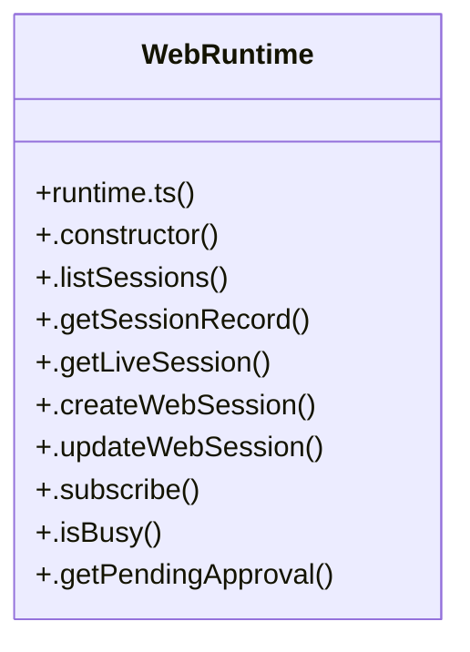

# LLM request logic

> 287 nodes · cohesion 0.01

## Key Concepts

- [sessions.ts](file:///C:/Users/Bhavin/Videos/WEB%20dev/Opensource%20porjects/Atom/src/sessions.ts#L1) (65 connections)
- [providers.ts](file:///C:/Users/Bhavin/Videos/WEB%20dev/Opensource%20porjects/Atom/src/providers.ts#L1) (42 connections)
- [adapters.test.ts](file:///C:/Users/Bhavin/Videos/WEB%20dev/Opensource%20porjects/Atom/tests/adapters.test.ts#L1) (33 connections)
- [goal-compaction.test.ts](file:///C:/Users/Bhavin/Videos/WEB%20dev/Opensource%20porjects/Atom/tests/goal-compaction.test.ts#L1) (31 connections)
- [WebRuntime](file:///C:/Users/Bhavin/Videos/WEB%20dev/Opensource%20porjects/Atom/src/web/runtime.ts#L314) (31 connections)
- [getSession()](file:///C:/Users/Bhavin/Videos/WEB%20dev/Opensource%20porjects/Atom/src/sessions.ts#L430) (30 connections)
- [auth.ts](file:///C:/Users/Bhavin/Videos/WEB%20dev/Opensource%20porjects/Atom/src/auth.ts#L1) (29 connections)
- [session.ts](file:///C:/Users/Bhavin/Videos/WEB%20dev/Opensource%20porjects/Atom/src/session.ts#L1) (29 connections)
- [prefs-restore.test.tsx](file:///C:/Users/Bhavin/Videos/WEB%20dev/Opensource%20porjects/Atom/tests/prefs-restore.test.tsx#L1) (20 connections)
- [skills-slash.test.tsx](file:///C:/Users/Bhavin/Videos/WEB%20dev/Opensource%20porjects/Atom/tests/skills-slash.test.tsx#L1) (19 connections)
- [getProvider()](file:///C:/Users/Bhavin/Videos/WEB%20dev/Opensource%20porjects/Atom/src/providers.ts#L469) (18 connections)
- [createSession()](file:///C:/Users/Bhavin/Videos/WEB%20dev/Opensource%20porjects/Atom/src/sessions.ts#L380) (18 connections)
- [theme-switch.test.tsx](file:///C:/Users/Bhavin/Videos/WEB%20dev/Opensource%20porjects/Atom/tests/theme-switch.test.tsx#L1) (16 connections)
- [model-picker-ui.test.tsx](file:///C:/Users/Bhavin/Videos/WEB%20dev/Opensource%20porjects/Atom/tests/model-picker-ui.test.tsx#L1) (14 connections)
- [updateSession()](file:///C:/Users/Bhavin/Videos/WEB%20dev/Opensource%20porjects/Atom/src/sessions.ts#L588) (14 connections)
- [project-trust.ts](file:///C:/Users/Bhavin/Videos/WEB%20dev/Opensource%20porjects/Atom/src/project-trust.ts#L1) (13 connections)
- [chatEndpointFor()](file:///C:/Users/Bhavin/Videos/WEB%20dev/Opensource%20porjects/Atom/src/providers.ts#L542) (13 connections)
- [.emit()](file:///C:/Users/Bhavin/Videos/WEB%20dev/Opensource%20porjects/Atom/src/web/runtime.ts#L851) (13 connections)
- [.sendMessage()](file:///C:/Users/Bhavin/Videos/WEB%20dev/Opensource%20porjects/Atom/src/web/runtime.ts#L529) (13 connections)
- [validateSession()](file:///C:/Users/Bhavin/Videos/WEB%20dev/Opensource%20porjects/Atom/src/session.ts#L328) (13 connections)
- [validateSessionRecord()](file:///C:/Users/Bhavin/Videos/WEB%20dev/Opensource%20porjects/Atom/src/sessions.ts#L311) (13 connections)
- [atomDir()](file:///C:/Users/Bhavin/Videos/WEB%20dev/Opensource%20porjects/Atom/src/auth.ts#L38) (12 connections)
- [providers.test.ts](file:///C:/Users/Bhavin/Videos/WEB%20dev/Opensource%20porjects/Atom/tests/providers.test.ts#L1) (12 connections)
- [serializeGoalForPersist()](file:///C:/Users/Bhavin/Videos/WEB%20dev/Opensource%20porjects/Atom/src/goal.ts#L318) (10 connections)
- [.invokeSkill()](file:///C:/Users/Bhavin/Videos/WEB%20dev/Opensource%20porjects/Atom/src/web/runtime.ts#L782) (10 connections)
- *... and 262 more nodes in this community*

## Class Diagram

## Relationships

- [[Batch Job Engine]] (8 shared connections)

## Source Files

- [C:\Users\Bhavin\Videos\WEB dev\Opensource porjects\Atom\src\App.tsx](file:///C:/Users/Bhavin/Videos/WEB%20dev/Opensource%20porjects/Atom/src/App.tsx)
- [C:\Users\Bhavin\Videos\WEB dev\Opensource porjects\Atom\src\adapters.ts](file:///C:/Users/Bhavin/Videos/WEB%20dev/Opensource%20porjects/Atom/src/adapters.ts)
- [C:\Users\Bhavin\Videos\WEB dev\Opensource porjects\Atom\src\agent\core.ts](file:///C:/Users/Bhavin/Videos/WEB%20dev/Opensource%20porjects/Atom/src/agent/core.ts)
- [C:\Users\Bhavin\Videos\WEB dev\Opensource porjects\Atom\src\agent\turn-events.ts](file:///C:/Users/Bhavin/Videos/WEB%20dev/Opensource%20porjects/Atom/src/agent/turn-events.ts)
- [C:\Users\Bhavin\Videos\WEB dev\Opensource porjects\Atom\src\auth.ts](file:///C:/Users/Bhavin/Videos/WEB%20dev/Opensource%20porjects/Atom/src/auth.ts)
- [C:\Users\Bhavin\Videos\WEB dev\Opensource porjects\Atom\src\goal.ts](file:///C:/Users/Bhavin/Videos/WEB%20dev/Opensource%20porjects/Atom/src/goal.ts)
- [C:\Users\Bhavin\Videos\WEB dev\Opensource porjects\Atom\src\project-trust.ts](file:///C:/Users/Bhavin/Videos/WEB%20dev/Opensource%20porjects/Atom/src/project-trust.ts)
- [C:\Users\Bhavin\Videos\WEB dev\Opensource porjects\Atom\src\providers.ts](file:///C:/Users/Bhavin/Videos/WEB%20dev/Opensource%20porjects/Atom/src/providers.ts)
- [C:\Users\Bhavin\Videos\WEB dev\Opensource porjects\Atom\src\session.ts](file:///C:/Users/Bhavin/Videos/WEB%20dev/Opensource%20porjects/Atom/src/session.ts)
- [C:\Users\Bhavin\Videos\WEB dev\Opensource porjects\Atom\src\sessions.ts](file:///C:/Users/Bhavin/Videos/WEB%20dev/Opensource%20porjects/Atom/src/sessions.ts)
- [C:\Users\Bhavin\Videos\WEB dev\Opensource porjects\Atom\src\todo-store.ts](file:///C:/Users/Bhavin/Videos/WEB%20dev/Opensource%20porjects/Atom/src/todo-store.ts)
- [C:\Users\Bhavin\Videos\WEB dev\Opensource porjects\Atom\src\web\events.ts](file:///C:/Users/Bhavin/Videos/WEB%20dev/Opensource%20porjects/Atom/src/web/events.ts)
- [C:\Users\Bhavin\Videos\WEB dev\Opensource porjects\Atom\src\web\runtime.ts](file:///C:/Users/Bhavin/Videos/WEB%20dev/Opensource%20porjects/Atom/src/web/runtime.ts)
- [C:\Users\Bhavin\Videos\WEB dev\Opensource porjects\Atom\src\zen.ts](file:///C:/Users/Bhavin/Videos/WEB%20dev/Opensource%20porjects/Atom/src/zen.ts)
- [C:\Users\Bhavin\Videos\WEB dev\Opensource porjects\Atom\tests\adapters.test.ts](file:///C:/Users/Bhavin/Videos/WEB%20dev/Opensource%20porjects/Atom/tests/adapters.test.ts)
- [C:\Users\Bhavin\Videos\WEB dev\Opensource porjects\Atom\tests\core-transcript.test.tsx](file:///C:/Users/Bhavin/Videos/WEB%20dev/Opensource%20porjects/Atom/tests/core-transcript.test.tsx)
- [C:\Users\Bhavin\Videos\WEB dev\Opensource porjects\Atom\tests\core-usage-tick.test.tsx](file:///C:/Users/Bhavin/Videos/WEB%20dev/Opensource%20porjects/Atom/tests/core-usage-tick.test.tsx)
- [C:\Users\Bhavin\Videos\WEB dev\Opensource porjects\Atom\tests\goal-compaction.test.ts](file:///C:/Users/Bhavin/Videos/WEB%20dev/Opensource%20porjects/Atom/tests/goal-compaction.test.ts)
- [C:\Users\Bhavin\Videos\WEB dev\Opensource porjects\Atom\tests\model-picker-ui.test.tsx](file:///C:/Users/Bhavin/Videos/WEB%20dev/Opensource%20porjects/Atom/tests/model-picker-ui.test.tsx)
- [C:\Users\Bhavin\Videos\WEB dev\Opensource porjects\Atom\tests\model-picker.test.ts](file:///C:/Users/Bhavin/Videos/WEB%20dev/Opensource%20porjects/Atom/tests/model-picker.test.ts)

## Audit Trail

- EXTRACTED: 933 (79%)
- INFERRED: 251 (21%)
- AMBIGUOUS: 0 (0%)

---

*Part of the graphify knowledge wiki. See [[index]] to navigate.*