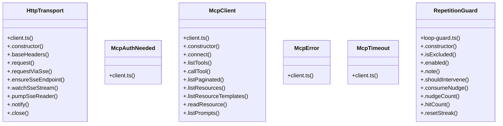

# Messaging System

> 182 nodes · cohesion 0.02

## Key Concepts

- [has](file:///C:/Users/Bhavin/Videos/WEB%20dev/Opensource%20porjects/Atom/src/App.tsx#L9529) (61 connections)
- [resolve](file:///C:/Users/Bhavin/Videos/WEB%20dev/Opensource%20porjects/Atom/tests/policy.test.ts#L221) (38 connections)
- [skills.test.ts](file:///C:/Users/Bhavin/Videos/WEB%20dev/Opensource%20porjects/Atom/tests/skills.test.ts#L1) (33 connections)
- [add](file:///C:/Users/Bhavin/Videos/WEB%20dev/Opensource%20porjects/Atom/tests/side-by-side.test.tsx#L88) (30 connections)
- [skills.ts](file:///C:/Users/Bhavin/Videos/WEB%20dev/Opensource%20porjects/Atom/src/skills.ts#L1) (24 connections)
- [instructions.test.ts](file:///C:/Users/Bhavin/Videos/WEB%20dev/Opensource%20porjects/Atom/tests/instructions.test.ts#L1) (24 connections)
- [skills-registry.test.ts](file:///C:/Users/Bhavin/Videos/WEB%20dev/Opensource%20porjects/Atom/tests/skills-registry.test.ts#L1) (21 connections)
- [instructions.ts](file:///C:/Users/Bhavin/Videos/WEB%20dev/Opensource%20porjects/Atom/src/instructions.ts#L1) (19 connections)
- [client.ts](file:///C:/Users/Bhavin/Videos/WEB%20dev/Opensource%20porjects/Atom/src/mcp/client.ts#L1) (18 connections)
- [.request()](file:///C:/Users/Bhavin/Videos/WEB%20dev/Opensource%20porjects/Atom/src/mcp/client.ts#L308) (13 connections)
- [McpClient](file:///C:/Users/Bhavin/Videos/WEB%20dev/Opensource%20porjects/Atom/src/mcp/client.ts#L760) (12 connections)
- [loop-todo-guard.test.ts](file:///C:/Users/Bhavin/Videos/WEB%20dev/Opensource%20porjects/Atom/tests/loop-todo-guard.test.ts#L1) (11 connections)
- [isRecord()](file:///C:/Users/Bhavin/Videos/WEB%20dev/Opensource%20porjects/Atom/src/mcp/client.ts#L30) (11 connections)
- [HttpTransport](file:///C:/Users/Bhavin/Videos/WEB%20dev/Opensource%20porjects/Atom/src/mcp/client.ts#L279) (10 connections)
- [RepetitionGuard](file:///C:/Users/Bhavin/Videos/WEB%20dev/Opensource%20porjects/Atom/src/agent/loop-guard.ts#L50) (10 connections)
- [activateSkill()](file:///C:/Users/Bhavin/Videos/WEB%20dev/Opensource%20porjects/Atom/src/App.tsx#L4006) (8 connections)
- [.watchSseStream()](file:///C:/Users/Bhavin/Videos/WEB%20dev/Opensource%20porjects/Atom/src/mcp/client.ts#L598) (8 connections)
- [.listPaginated()](file:///C:/Users/Bhavin/Videos/WEB%20dev/Opensource%20porjects/Atom/src/mcp/client.ts#L820) (8 connections)
- [homeDir](file:///C:/Users/Bhavin/Videos/WEB%20dev/Opensource%20porjects/Atom/tests/extension-trust-lockdown.test.ts#L374) (8 connections)
- [discoverSkills()](file:///C:/Users/Bhavin/Videos/WEB%20dev/Opensource%20porjects/Atom/src/skills.ts#L116) (8 connections)
- [discoverInstructionSources()](file:///C:/Users/Bhavin/Videos/WEB%20dev/Opensource%20porjects/Atom/src/instructions.ts#L138) (7 connections)
- [.refreshServerTools()](file:///C:/Users/Bhavin/Videos/WEB%20dev/Opensource%20porjects/Atom/src/mcp/manager.ts#L605) (7 connections)
- [loadSkillBody()](file:///C:/Users/Bhavin/Videos/WEB%20dev/Opensource%20porjects/Atom/src/skills.ts#L254) (7 connections)
- [parseSkillDir()](file:///C:/Users/Bhavin/Videos/WEB%20dev/Opensource%20porjects/Atom/src/skills.ts#L157) (7 connections)
- [.pumpSseReader()](file:///C:/Users/Bhavin/Videos/WEB%20dev/Opensource%20porjects/Atom/src/mcp/client.ts#L624) (6 connections)
- *... and 157 more nodes in this community*

## Class Diagram

## Relationships

- No strong cross-community connections detected

## Source Files

- [C:\Users\Bhavin\Videos\WEB dev\Opensource porjects\Atom\src\App.tsx](file:///C:/Users/Bhavin/Videos/WEB%20dev/Opensource%20porjects/Atom/src/App.tsx)
- [C:\Users\Bhavin\Videos\WEB dev\Opensource porjects\Atom\src\agent\loop-guard.ts](file:///C:/Users/Bhavin/Videos/WEB%20dev/Opensource%20porjects/Atom/src/agent/loop-guard.ts)
- [C:\Users\Bhavin\Videos\WEB dev\Opensource porjects\Atom\src\agent\normalize.ts](file:///C:/Users/Bhavin/Videos/WEB%20dev/Opensource%20porjects/Atom/src/agent/normalize.ts)
- [C:\Users\Bhavin\Videos\WEB dev\Opensource porjects\Atom\src\goal.ts](file:///C:/Users/Bhavin/Videos/WEB%20dev/Opensource%20porjects/Atom/src/goal.ts)
- [C:\Users\Bhavin\Videos\WEB dev\Opensource porjects\Atom\src\instructions.ts](file:///C:/Users/Bhavin/Videos/WEB%20dev/Opensource%20porjects/Atom/src/instructions.ts)
- [C:\Users\Bhavin\Videos\WEB dev\Opensource porjects\Atom\src\mcp\client.ts](file:///C:/Users/Bhavin/Videos/WEB%20dev/Opensource%20porjects/Atom/src/mcp/client.ts)
- [C:\Users\Bhavin\Videos\WEB dev\Opensource porjects\Atom\src\mcp\manager.ts](file:///C:/Users/Bhavin/Videos/WEB%20dev/Opensource%20porjects/Atom/src/mcp/manager.ts)
- [C:\Users\Bhavin\Videos\WEB dev\Opensource porjects\Atom\src\policy.ts](file:///C:/Users/Bhavin/Videos/WEB%20dev/Opensource%20porjects/Atom/src/policy.ts)
- [C:\Users\Bhavin\Videos\WEB dev\Opensource porjects\Atom\src\skills.ts](file:///C:/Users/Bhavin/Videos/WEB%20dev/Opensource%20porjects/Atom/src/skills.ts)
- [C:\Users\Bhavin\Videos\WEB dev\Opensource porjects\Atom\src\ui\mentions.ts](file:///C:/Users/Bhavin/Videos/WEB%20dev/Opensource%20porjects/Atom/src/ui/mentions.ts)
- [C:\Users\Bhavin\Videos\WEB dev\Opensource porjects\Atom\tests\compact.test.tsx](file:///C:/Users/Bhavin/Videos/WEB%20dev/Opensource%20porjects/Atom/tests/compact.test.tsx)
- [C:\Users\Bhavin\Videos\WEB dev\Opensource porjects\Atom\tests\extension-trust-lockdown.test.ts](file:///C:/Users/Bhavin/Videos/WEB%20dev/Opensource%20porjects/Atom/tests/extension-trust-lockdown.test.ts)
- [C:\Users\Bhavin\Videos\WEB dev\Opensource porjects\Atom\tests\instructions.test.ts](file:///C:/Users/Bhavin/Videos/WEB%20dev/Opensource%20porjects/Atom/tests/instructions.test.ts)
- [C:\Users\Bhavin\Videos\WEB dev\Opensource porjects\Atom\tests\loop-harness.test.ts](file:///C:/Users/Bhavin/Videos/WEB%20dev/Opensource%20porjects/Atom/tests/loop-harness.test.ts)
- [C:\Users\Bhavin\Videos\WEB dev\Opensource porjects\Atom\tests\loop-todo-guard.test.ts](file:///C:/Users/Bhavin/Videos/WEB%20dev/Opensource%20porjects/Atom/tests/loop-todo-guard.test.ts)
- [C:\Users\Bhavin\Videos\WEB dev\Opensource porjects\Atom\tests\policy.test.ts](file:///C:/Users/Bhavin/Videos/WEB%20dev/Opensource%20porjects/Atom/tests/policy.test.ts)
- [C:\Users\Bhavin\Videos\WEB dev\Opensource porjects\Atom\tests\session.test.tsx](file:///C:/Users/Bhavin/Videos/WEB%20dev/Opensource%20porjects/Atom/tests/session.test.tsx)
- [C:\Users\Bhavin\Videos\WEB dev\Opensource porjects\Atom\tests\side-by-side.test.tsx](file:///C:/Users/Bhavin/Videos/WEB%20dev/Opensource%20porjects/Atom/tests/side-by-side.test.tsx)
- [C:\Users\Bhavin\Videos\WEB dev\Opensource porjects\Atom\tests\skills-registry.test.ts](file:///C:/Users/Bhavin/Videos/WEB%20dev/Opensource%20porjects/Atom/tests/skills-registry.test.ts)
- [C:\Users\Bhavin\Videos\WEB dev\Opensource porjects\Atom\tests\skills.test.ts](file:///C:/Users/Bhavin/Videos/WEB%20dev/Opensource%20porjects/Atom/tests/skills.test.ts)

## Audit Trail

- EXTRACTED: 472 (69%)
- INFERRED: 213 (31%)
- AMBIGUOUS: 0 (0%)

---

*Part of the graphify knowledge wiki. See [[index]] to navigate.*