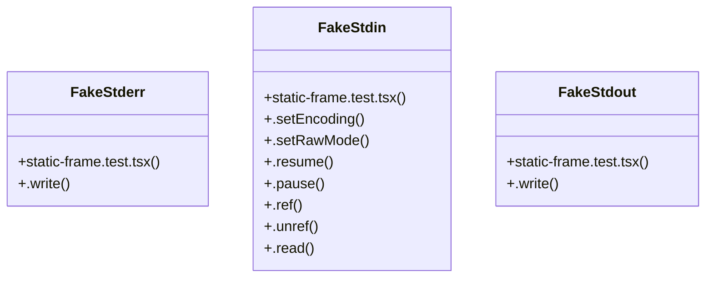

# Std stream mocking

> 18 nodes · cohesion 0.11

## Key Concepts

- [static-frame.test.tsx](file:///C:/Users/Bhavin/Videos/WEB%20dev/Opensource%20porjects/Atom/tests/static-frame.test.tsx#L1) (10 connections)
- [FakeStdin](file:///C:/Users/Bhavin/Videos/WEB%20dev/Opensource%20porjects/Atom/tests/static-frame.test.tsx#L33) (8 connections)
- [FakeStderr](file:///C:/Users/Bhavin/Videos/WEB%20dev/Opensource%20porjects/Atom/tests/static-frame.test.tsx#L46) (2 connections)
- [FakeStdout](file:///C:/Users/Bhavin/Videos/WEB%20dev/Opensource%20porjects/Atom/tests/static-frame.test.tsx#L19) (2 connections)
- [.write()](file:///C:/Users/Bhavin/Videos/WEB%20dev/Opensource%20porjects/Atom/tests/static-frame.test.tsx#L47) (1 connections)
- [.pause()](file:///C:/Users/Bhavin/Videos/WEB%20dev/Opensource%20porjects/Atom/tests/static-frame.test.tsx#L38) (1 connections)
- [.read()](file:///C:/Users/Bhavin/Videos/WEB%20dev/Opensource%20porjects/Atom/tests/static-frame.test.tsx#L41) (1 connections)
- [.ref()](file:///C:/Users/Bhavin/Videos/WEB%20dev/Opensource%20porjects/Atom/tests/static-frame.test.tsx#L39) (1 connections)
- [.resume()](file:///C:/Users/Bhavin/Videos/WEB%20dev/Opensource%20porjects/Atom/tests/static-frame.test.tsx#L37) (1 connections)
- [.setEncoding()](file:///C:/Users/Bhavin/Videos/WEB%20dev/Opensource%20porjects/Atom/tests/static-frame.test.tsx#L35) (1 connections)
- [.setRawMode()](file:///C:/Users/Bhavin/Videos/WEB%20dev/Opensource%20porjects/Atom/tests/static-frame.test.tsx#L36) (1 connections)
- [.unref()](file:///C:/Users/Bhavin/Videos/WEB%20dev/Opensource%20porjects/Atom/tests/static-frame.test.tsx#L40) (1 connections)
- [.write()](file:///C:/Users/Bhavin/Videos/WEB%20dev/Opensource%20porjects/Atom/tests/static-frame.test.tsx#L25) (1 connections)
- [Frame()](file:///C:/Users/Bhavin/Videos/WEB%20dev/Opensource%20porjects/Atom/tests/static-frame.test.tsx#L66) (1 connections)
- [makeTurns()](file:///C:/Users/Bhavin/Videos/WEB%20dev/Opensource%20porjects/Atom/tests/static-frame.test.tsx#L54) (1 connections)
- [sleep()](file:///C:/Users/Bhavin/Videos/WEB%20dev/Opensource%20porjects/Atom/tests/static-frame.test.tsx#L52) (1 connections)
- [stdout](file:///C:/Users/Bhavin/Videos/WEB%20dev/Opensource%20porjects/Atom/tests/static-frame.test.tsx#L81) (1 connections)
- [turns](file:///C:/Users/Bhavin/Videos/WEB%20dev/Opensource%20porjects/Atom/tests/static-frame.test.tsx#L80) (1 connections)

## Class Diagram

## Relationships

- [[Batch Job Engine]] (2 shared connections)

## Source Files

- [C:\Users\Bhavin\Videos\WEB dev\Opensource porjects\Atom\tests\static-frame.test.tsx](file:///C:/Users/Bhavin/Videos/WEB%20dev/Opensource%20porjects/Atom/tests/static-frame.test.tsx)

## Audit Trail

- EXTRACTED: 36 (100%)
- INFERRED: 0 (0%)
- AMBIGUOUS: 0 (0%)

---

*Part of the graphify knowledge wiki. See [[index]] to navigate.*