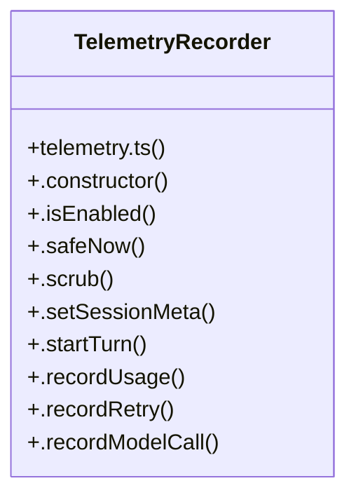

# Telemetry Dashboard

> 215 nodes · cohesion 0.02

## Key Concepts

- [telemetry.ts](file:///C:/Users/Bhavin/Videos/WEB%20dev/Opensource%20porjects/Atom/src/telemetry.ts#L1) (55 connections)
- [telemetry.test.ts](file:///C:/Users/Bhavin/Videos/WEB%20dev/Opensource%20porjects/Atom/tests/telemetry.test.ts#L1) (44 connections)
- [telemetry-dashboard.ts](file:///C:/Users/Bhavin/Videos/WEB%20dev/Opensource%20porjects/Atom/src/telemetry-dashboard.ts#L1) (29 connections)
- [telemetry-server.test.ts](file:///C:/Users/Bhavin/Videos/WEB%20dev/Opensource%20porjects/Atom/tests/telemetry-server.test.ts#L1) (25 connections)
- [goal-surface.test.ts](file:///C:/Users/Bhavin/Videos/WEB%20dev/Opensource%20porjects/Atom/tests/goal-surface.test.ts#L1) (23 connections)
- [TelemetryRecorder](file:///C:/Users/Bhavin/Videos/WEB%20dev/Opensource%20porjects/Atom/src/telemetry.ts#L942) (22 connections)
- [goal-tool-visibility.test.ts](file:///C:/Users/Bhavin/Videos/WEB%20dev/Opensource%20porjects/Atom/tests/goal-tool-visibility.test.ts#L1) (19 connections)
- [loop-telemetry.test.ts](file:///C:/Users/Bhavin/Videos/WEB%20dev/Opensource%20porjects/Atom/tests/loop-telemetry.test.ts#L1) (19 connections)
- [telemetry-server.ts](file:///C:/Users/Bhavin/Videos/WEB%20dev/Opensource%20porjects/Atom/src/telemetry-server.ts#L1) (16 connections)
- [buildDashboardHtml()](file:///C:/Users/Bhavin/Videos/WEB%20dev/Opensource%20porjects/Atom/src/telemetry-dashboard.ts#L424) (12 connections)
- [.safeNow()](file:///C:/Users/Bhavin/Videos/WEB%20dev/Opensource%20porjects/Atom/src/telemetry.ts#L985) (12 connections)
- [.endTurn()](file:///C:/Users/Bhavin/Videos/WEB%20dev/Opensource%20porjects/Atom/src/telemetry.ts#L1391) (11 connections)
- [.startTurn()](file:///C:/Users/Bhavin/Videos/WEB%20dev/Opensource%20porjects/Atom/src/telemetry.ts#L1024) (11 connections)
- [toIso()](file:///C:/Users/Bhavin/Videos/WEB%20dev/Opensource%20porjects/Atom/src/telemetry.ts#L329) (11 connections)
- [turnBlock()](file:///C:/Users/Bhavin/Videos/WEB%20dev/Opensource%20porjects/Atom/src/telemetry-dashboard.ts#L304) (10 connections)
- [.recordEvent()](file:///C:/Users/Bhavin/Videos/WEB%20dev/Opensource%20porjects/Atom/src/telemetry.ts#L1376) (10 connections)
- [escapeHtml()](file:///C:/Users/Bhavin/Videos/WEB%20dev/Opensource%20porjects/Atom/src/telemetry-dashboard.ts#L45) (9 connections)
- [.flush()](file:///C:/Users/Bhavin/Videos/WEB%20dev/Opensource%20porjects/Atom/src/telemetry.ts#L1480) (9 connections)
- [.recordModelCall()](file:///C:/Users/Bhavin/Videos/WEB%20dev/Opensource%20porjects/Atom/src/telemetry.ts#L1103) (9 connections)
- [.recordToolCall()](file:///C:/Users/Bhavin/Videos/WEB%20dev/Opensource%20porjects/Atom/src/telemetry.ts#L1149) (9 connections)
- [sessionBlock()](file:///C:/Users/Bhavin/Videos/WEB%20dev/Opensource%20porjects/Atom/src/telemetry-dashboard.ts#L346) (8 connections)
- [sessionWithTrace()](file:///C:/Users/Bhavin/Videos/WEB%20dev/Opensource%20porjects/Atom/tests/telemetry.test.ts#L411) (8 connections)
- [telemetrySummaryText()](file:///C:/Users/Bhavin/Videos/WEB%20dev/Opensource%20porjects/Atom/src/App.tsx#L4805) (7 connections)
- [fmtCount()](file:///C:/Users/Bhavin/Videos/WEB%20dev/Opensource%20porjects/Atom/src/telemetry-dashboard.ts#L55) (7 connections)
- [handleRequest()](file:///C:/Users/Bhavin/Videos/WEB%20dev/Opensource%20porjects/Atom/src/telemetry-server.ts#L205) (7 connections)
- *... and 190 more nodes in this community*

## Class Diagram

## Relationships

- [[Batch Job Engine]] (2 shared connections)

## Source Files

- [C:\Users\Bhavin\Videos\WEB dev\Opensource porjects\Atom\src\App.tsx](file:///C:/Users/Bhavin/Videos/WEB%20dev/Opensource%20porjects/Atom/src/App.tsx)
- [C:\Users\Bhavin\Videos\WEB dev\Opensource porjects\Atom\src\telemetry-dashboard.ts](file:///C:/Users/Bhavin/Videos/WEB%20dev/Opensource%20porjects/Atom/src/telemetry-dashboard.ts)
- [C:\Users\Bhavin\Videos\WEB dev\Opensource porjects\Atom\src\telemetry-server.ts](file:///C:/Users/Bhavin/Videos/WEB%20dev/Opensource%20porjects/Atom/src/telemetry-server.ts)
- [C:\Users\Bhavin\Videos\WEB dev\Opensource porjects\Atom\src\telemetry.ts](file:///C:/Users/Bhavin/Videos/WEB%20dev/Opensource%20porjects/Atom/src/telemetry.ts)
- [C:\Users\Bhavin\Videos\WEB dev\Opensource porjects\Atom\src\web\server.ts](file:///C:/Users/Bhavin/Videos/WEB%20dev/Opensource%20porjects/Atom/src/web/server.ts)
- [C:\Users\Bhavin\Videos\WEB dev\Opensource porjects\Atom\tests\goal-surface.test.ts](file:///C:/Users/Bhavin/Videos/WEB%20dev/Opensource%20porjects/Atom/tests/goal-surface.test.ts)
- [C:\Users\Bhavin\Videos\WEB dev\Opensource porjects\Atom\tests\goal-tool-visibility.test.ts](file:///C:/Users/Bhavin/Videos/WEB%20dev/Opensource%20porjects/Atom/tests/goal-tool-visibility.test.ts)
- [C:\Users\Bhavin\Videos\WEB dev\Opensource porjects\Atom\tests\loop-telemetry.test.ts](file:///C:/Users/Bhavin/Videos/WEB%20dev/Opensource%20porjects/Atom/tests/loop-telemetry.test.ts)
- [C:\Users\Bhavin\Videos\WEB dev\Opensource porjects\Atom\tests\telemetry-server.test.ts](file:///C:/Users/Bhavin/Videos/WEB%20dev/Opensource%20porjects/Atom/tests/telemetry-server.test.ts)
- [C:\Users\Bhavin\Videos\WEB dev\Opensource porjects\Atom\tests\telemetry.test.ts](file:///C:/Users/Bhavin/Videos/WEB%20dev/Opensource%20porjects/Atom/tests/telemetry.test.ts)
- [C:\Users\Bhavin\Videos\WEB dev\Opensource porjects\Atom\tests\tool-inspector.test.tsx](file:///C:/Users/Bhavin/Videos/WEB%20dev/Opensource%20porjects/Atom/tests/tool-inspector.test.tsx)

## Audit Trail

- EXTRACTED: 668 (88%)
- INFERRED: 94 (12%)
- AMBIGUOUS: 0 (0%)

---

*Part of the graphify knowledge wiki. See [[index]] to navigate.*