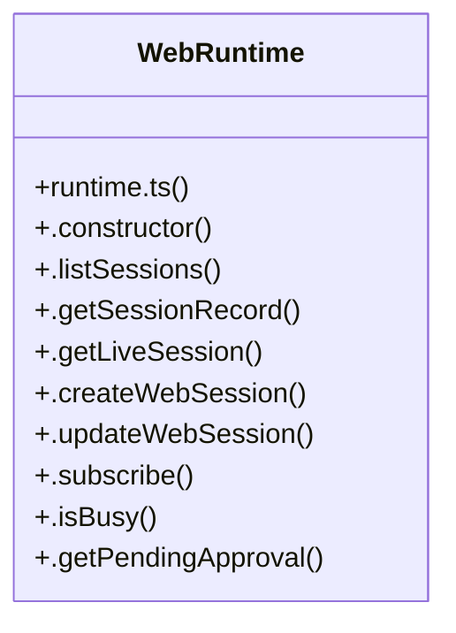

# Telemetry Dashboard

> 192 nodes · cohesion 0.02

## Key Concepts

- [sessions.ts](file:///C:/Users/Bhavin/Videos/WEB%20dev/Opensource%20porjects/Atom/src/sessions.ts#L1) (65 connections)
- [runtime.ts](file:///C:/Users/Bhavin/Videos/WEB%20dev/Opensource%20porjects/Atom/src/web/runtime.ts#L1) (35 connections)
- [WebRuntime](file:///C:/Users/Bhavin/Videos/WEB%20dev/Opensource%20porjects/Atom/src/web/runtime.ts#L314) (31 connections)
- [getSession()](file:///C:/Users/Bhavin/Videos/WEB%20dev/Opensource%20porjects/Atom/src/sessions.ts#L430) (30 connections)
- [auth.ts](file:///C:/Users/Bhavin/Videos/WEB%20dev/Opensource%20porjects/Atom/src/auth.ts#L1) (29 connections)
- [session.ts](file:///C:/Users/Bhavin/Videos/WEB%20dev/Opensource%20porjects/Atom/src/session.ts#L1) (29 connections)
- [diff-engine.ts](file:///C:/Users/Bhavin/Videos/WEB%20dev/Opensource%20porjects/Atom/src/diff-engine.ts#L1) (21 connections)
- [prefs-restore.test.tsx](file:///C:/Users/Bhavin/Videos/WEB%20dev/Opensource%20porjects/Atom/tests/prefs-restore.test.tsx#L1) (19 connections)
- [createSession()](file:///C:/Users/Bhavin/Videos/WEB%20dev/Opensource%20porjects/Atom/src/sessions.ts#L380) (18 connections)
- [web-runtime.test.ts](file:///C:/Users/Bhavin/Videos/WEB%20dev/Opensource%20porjects/Atom/tests/web-runtime.test.ts#L1) (14 connections)
- [updateSession()](file:///C:/Users/Bhavin/Videos/WEB%20dev/Opensource%20porjects/Atom/src/sessions.ts#L588) (14 connections)
- [.emit()](file:///C:/Users/Bhavin/Videos/WEB%20dev/Opensource%20porjects/Atom/src/web/runtime.ts#L851) (13 connections)
- [.sendMessage()](file:///C:/Users/Bhavin/Videos/WEB%20dev/Opensource%20porjects/Atom/src/web/runtime.ts#L529) (13 connections)
- [validateSession()](file:///C:/Users/Bhavin/Videos/WEB%20dev/Opensource%20porjects/Atom/src/session.ts#L328) (13 connections)
- [validateSessionRecord()](file:///C:/Users/Bhavin/Videos/WEB%20dev/Opensource%20porjects/Atom/src/sessions.ts#L311) (13 connections)
- [atomDir()](file:///C:/Users/Bhavin/Videos/WEB%20dev/Opensource%20porjects/Atom/src/auth.ts#L38) (12 connections)
- [.approve()](file:///C:/Users/Bhavin/Videos/WEB%20dev/Opensource%20porjects/Atom/src/web/runtime.ts#L974) (11 connections)
- [loadAuth()](file:///C:/Users/Bhavin/Videos/WEB%20dev/Opensource%20porjects/Atom/src/auth.ts#L51) (10 connections)
- [serializeGoalForPersist()](file:///C:/Users/Bhavin/Videos/WEB%20dev/Opensource%20porjects/Atom/src/goal.ts#L318) (10 connections)
- [resolveApiKey()](file:///C:/Users/Bhavin/Videos/WEB%20dev/Opensource%20porjects/Atom/src/auth.ts#L118) (9 connections)
- [events.ts](file:///C:/Users/Bhavin/Videos/WEB%20dev/Opensource%20porjects/Atom/src/web/events.ts#L1) (9 connections)
- [restoreGoalFromPersist()](file:///C:/Users/Bhavin/Videos/WEB%20dev/Opensource%20porjects/Atom/src/goal.ts#L345) (9 connections)
- [.emitFileDiff()](file:///C:/Users/Bhavin/Videos/WEB%20dev/Opensource%20porjects/Atom/src/web/runtime.ts#L881) (9 connections)
- [.validateTurnStart()](file:///C:/Users/Bhavin/Videos/WEB%20dev/Opensource%20porjects/Atom/src/web/runtime.ts#L491) (9 connections)
- [forkSession()](file:///C:/Users/Bhavin/Videos/WEB%20dev/Opensource%20porjects/Atom/src/sessions.ts#L508) (9 connections)
- *... and 167 more nodes in this community*

## Class Diagram

```mermaid
classDiagram
    class WebRuntime {
        +runtime.ts()
        +.constructor()
        +.listSessions()
        +.getSessionRecord()
        +.getLiveSession()
        +.createWebSession()
        +.updateWebSession()
        +.subscribe()
        +.isBusy()
        +.getPendingApproval()
    }
```

## Relationships

- [[CLI Progress Feedback]] (2 shared connections)

## Source Files

- [C:\Users\Bhavin\Videos\WEB dev\Opensource porjects\Atom\src\App.tsx](file:///C:/Users/Bhavin/Videos/WEB%20dev/Opensource%20porjects/Atom/src/App.tsx)
- [C:\Users\Bhavin\Videos\WEB dev\Opensource porjects\Atom\src\agent\core.ts](file:///C:/Users/Bhavin/Videos/WEB%20dev/Opensource%20porjects/Atom/src/agent/core.ts)
- [C:\Users\Bhavin\Videos\WEB dev\Opensource porjects\Atom\src\agent\events.ts](file:///C:/Users/Bhavin/Videos/WEB%20dev/Opensource%20porjects/Atom/src/agent/events.ts)
- [C:\Users\Bhavin\Videos\WEB dev\Opensource porjects\Atom\src\auth.ts](file:///C:/Users/Bhavin/Videos/WEB%20dev/Opensource%20porjects/Atom/src/auth.ts)
- [C:\Users\Bhavin\Videos\WEB dev\Opensource porjects\Atom\src\diff-engine.ts](file:///C:/Users/Bhavin/Videos/WEB%20dev/Opensource%20porjects/Atom/src/diff-engine.ts)
- [C:\Users\Bhavin\Videos\WEB dev\Opensource porjects\Atom\src\goal.ts](file:///C:/Users/Bhavin/Videos/WEB%20dev/Opensource%20porjects/Atom/src/goal.ts)
- [C:\Users\Bhavin\Videos\WEB dev\Opensource porjects\Atom\src\project-trust.ts](file:///C:/Users/Bhavin/Videos/WEB%20dev/Opensource%20porjects/Atom/src/project-trust.ts)
- [C:\Users\Bhavin\Videos\WEB dev\Opensource porjects\Atom\src\session.ts](file:///C:/Users/Bhavin/Videos/WEB%20dev/Opensource%20porjects/Atom/src/session.ts)
- [C:\Users\Bhavin\Videos\WEB dev\Opensource porjects\Atom\src\sessions.ts](file:///C:/Users/Bhavin/Videos/WEB%20dev/Opensource%20porjects/Atom/src/sessions.ts)
- [C:\Users\Bhavin\Videos\WEB dev\Opensource porjects\Atom\src\todo-store.ts](file:///C:/Users/Bhavin/Videos/WEB%20dev/Opensource%20porjects/Atom/src/todo-store.ts)
- [C:\Users\Bhavin\Videos\WEB dev\Opensource porjects\Atom\src\tools\registry.ts](file:///C:/Users/Bhavin/Videos/WEB%20dev/Opensource%20porjects/Atom/src/tools/registry.ts)
- [C:\Users\Bhavin\Videos\WEB dev\Opensource porjects\Atom\src\web\events.ts](file:///C:/Users/Bhavin/Videos/WEB%20dev/Opensource%20porjects/Atom/src/web/events.ts)
- [C:\Users\Bhavin\Videos\WEB dev\Opensource porjects\Atom\src\web\runtime.ts](file:///C:/Users/Bhavin/Videos/WEB%20dev/Opensource%20porjects/Atom/src/web/runtime.ts)
- [C:\Users\Bhavin\Videos\WEB dev\Opensource porjects\Atom\src\zen.ts](file:///C:/Users/Bhavin/Videos/WEB%20dev/Opensource%20porjects/Atom/src/zen.ts)
- [C:\Users\Bhavin\Videos\WEB dev\Opensource porjects\Atom\tests\core-transcript.test.tsx](file:///C:/Users/Bhavin/Videos/WEB%20dev/Opensource%20porjects/Atom/tests/core-transcript.test.tsx)
- [C:\Users\Bhavin\Videos\WEB dev\Opensource porjects\Atom\tests\core-usage-tick.test.tsx](file:///C:/Users/Bhavin/Videos/WEB%20dev/Opensource%20porjects/Atom/tests/core-usage-tick.test.tsx)
- [C:\Users\Bhavin\Videos\WEB dev\Opensource porjects\Atom\tests\model-picker-ui.test.tsx](file:///C:/Users/Bhavin/Videos/WEB%20dev/Opensource%20porjects/Atom/tests/model-picker-ui.test.tsx)
- [C:\Users\Bhavin\Videos\WEB dev\Opensource porjects\Atom\tests\observability.test.tsx](file:///C:/Users/Bhavin/Videos/WEB%20dev/Opensource%20porjects/Atom/tests/observability.test.tsx)
- [C:\Users\Bhavin\Videos\WEB dev\Opensource porjects\Atom\tests\prefs-restore.test.tsx](file:///C:/Users/Bhavin/Videos/WEB%20dev/Opensource%20porjects/Atom/tests/prefs-restore.test.tsx)
- [C:\Users\Bhavin\Videos\WEB dev\Opensource porjects\Atom\tests\session-revert.test.ts](file:///C:/Users/Bhavin/Videos/WEB%20dev/Opensource%20porjects/Atom/tests/session-revert.test.ts)

## Audit Trail

- EXTRACTED: 712 (76%)
- INFERRED: 223 (24%)
- AMBIGUOUS: 0 (0%)

---

*Part of the graphify knowledge wiki. See [[index]] to navigate.*