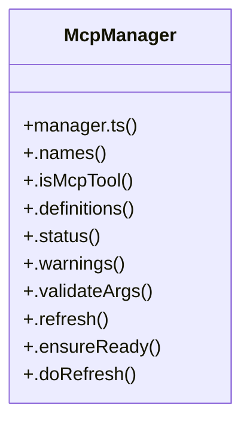

# Token Management

> 213 nodes · cohesion 0.02

## Key Concepts

- [manager.ts](file:///C:/Users/Bhavin/Videos/WEB%20dev/Opensource%20porjects/Atom/src/mcp/manager.ts#L1) (42 connections)
- [tools.test.ts](file:///C:/Users/Bhavin/Videos/WEB%20dev/Opensource%20porjects/Atom/tests/tools.test.ts#L1) (42 connections)
- [provider-correctness.test.tsx](file:///C:/Users/Bhavin/Videos/WEB%20dev/Opensource%20porjects/Atom/tests/provider-correctness.test.tsx#L1) (34 connections)
- [McpManager](file:///C:/Users/Bhavin/Videos/WEB%20dev/Opensource%20porjects/Atom/src/mcp/manager.ts#L156) (33 connections)
- [cwd](file:///C:/Users/Bhavin/Videos/WEB%20dev/Opensource%20porjects/Atom/tests/tools.test.ts#L56) (24 connections)
- [env-block.test.ts](file:///C:/Users/Bhavin/Videos/WEB%20dev/Opensource%20porjects/Atom/tests/env-block.test.ts#L1) (23 connections)
- [runReloadCommand()](file:///C:/Users/Bhavin/Videos/WEB%20dev/Opensource%20porjects/Atom/src/App.tsx#L2248) (20 connections)
- [oauth.ts](file:///C:/Users/Bhavin/Videos/WEB%20dev/Opensource%20porjects/Atom/src/mcp/oauth.ts#L1) (19 connections)
- [entries](file:///C:/Users/Bhavin/Videos/WEB%20dev/Opensource%20porjects/Atom/tests/session-picker.test.tsx#L204) (18 connections)
- [auth.ts](file:///C:/Users/Bhavin/Videos/WEB%20dev/Opensource%20porjects/Atom/src/mcp/auth.ts#L1) (16 connections)
- [.refresh()](file:///C:/Users/Bhavin/Videos/WEB%20dev/Opensource%20porjects/Atom/src/mcp/manager.ts#L197) (16 connections)
- [env-block.ts](file:///C:/Users/Bhavin/Videos/WEB%20dev/Opensource%20porjects/Atom/src/env-block.ts#L1) (15 connections)
- [loadAuthFile()](file:///C:/Users/Bhavin/Videos/WEB%20dev/Opensource%20porjects/Atom/src/mcp/auth.ts#L72) (12 connections)
- [withEnvBlock()](file:///C:/Users/Bhavin/Videos/WEB%20dev/Opensource%20porjects/Atom/src/env-block.ts#L193) (12 connections)
- [.authenticate()](file:///C:/Users/Bhavin/Videos/WEB%20dev/Opensource%20porjects/Atom/src/mcp/manager.ts#L788) (12 connections)
- [.doRefresh()](file:///C:/Users/Bhavin/Videos/WEB%20dev/Opensource%20porjects/Atom/src/mcp/manager.ts#L219) (11 connections)
- [.executeResourceOp()](file:///C:/Users/Bhavin/Videos/WEB%20dev/Opensource%20porjects/Atom/src/mcp/manager.ts#L506) (11 connections)
- [saveAuthFile()](file:///C:/Users/Bhavin/Videos/WEB%20dev/Opensource%20porjects/Atom/src/mcp/auth.ts#L97) (9 connections)
- [runFlowWithCallback()](file:///C:/Users/Bhavin/Videos/WEB%20dev/Opensource%20porjects/Atom/src/mcp/oauth.ts#L422) (9 connections)
- [.execute()](file:///C:/Users/Bhavin/Videos/WEB%20dev/Opensource%20porjects/Atom/src/mcp/manager.ts#L646) (8 connections)
- [.setServerEnabled()](file:///C:/Users/Bhavin/Videos/WEB%20dev/Opensource%20porjects/Atom/src/mcp/manager.ts#L849) (8 connections)
- [resolveSkills()](file:///C:/Users/Bhavin/Videos/WEB%20dev/Opensource%20porjects/Atom/src/skills.ts#L353) (8 connections)
- [authFilePath()](file:///C:/Users/Bhavin/Videos/WEB%20dev/Opensource%20porjects/Atom/src/mcp/auth.ts#L41) (7 connections)
- [isRecord()](file:///C:/Users/Bhavin/Videos/WEB%20dev/Opensource%20porjects/Atom/src/mcp/manager.ts#L79) (7 connections)
- [.getAuthStatus()](file:///C:/Users/Bhavin/Videos/WEB%20dev/Opensource%20porjects/Atom/src/mcp/manager.ts#L770) (7 connections)
- *... and 188 more nodes in this community*

## Class Diagram

## Relationships

- [[Batch Job Engine]] (4 shared connections)

## Source Files

- [C:\Users\Bhavin\Videos\WEB dev\Opensource porjects\Atom\src\App.tsx](file:///C:/Users/Bhavin/Videos/WEB%20dev/Opensource%20porjects/Atom/src/App.tsx)
- [C:\Users\Bhavin\Videos\WEB dev\Opensource porjects\Atom\src\agent\core.ts](file:///C:/Users/Bhavin/Videos/WEB%20dev/Opensource%20porjects/Atom/src/agent/core.ts)
- [C:\Users\Bhavin\Videos\WEB dev\Opensource porjects\Atom\src\agent\events.ts](file:///C:/Users/Bhavin/Videos/WEB%20dev/Opensource%20porjects/Atom/src/agent/events.ts)
- [C:\Users\Bhavin\Videos\WEB dev\Opensource porjects\Atom\src\env-block.ts](file:///C:/Users/Bhavin/Videos/WEB%20dev/Opensource%20porjects/Atom/src/env-block.ts)
- [C:\Users\Bhavin\Videos\WEB dev\Opensource porjects\Atom\src\extensions.ts](file:///C:/Users/Bhavin/Videos/WEB%20dev/Opensource%20porjects/Atom/src/extensions.ts)
- [C:\Users\Bhavin\Videos\WEB dev\Opensource porjects\Atom\src\mcp\auth.ts](file:///C:/Users/Bhavin/Videos/WEB%20dev/Opensource%20porjects/Atom/src/mcp/auth.ts)
- [C:\Users\Bhavin\Videos\WEB dev\Opensource porjects\Atom\src\mcp\manager.ts](file:///C:/Users/Bhavin/Videos/WEB%20dev/Opensource%20porjects/Atom/src/mcp/manager.ts)
- [C:\Users\Bhavin\Videos\WEB dev\Opensource porjects\Atom\src\mcp\oauth.ts](file:///C:/Users/Bhavin/Videos/WEB%20dev/Opensource%20porjects/Atom/src/mcp/oauth.ts)
- [C:\Users\Bhavin\Videos\WEB dev\Opensource porjects\Atom\src\skills.ts](file:///C:/Users/Bhavin/Videos/WEB%20dev/Opensource%20porjects/Atom/src/skills.ts)
- [C:\Users\Bhavin\Videos\WEB dev\Opensource porjects\Atom\src\tools\overrides.ts](file:///C:/Users/Bhavin/Videos/WEB%20dev/Opensource%20porjects/Atom/src/tools/overrides.ts)
- [C:\Users\Bhavin\Videos\WEB dev\Opensource porjects\Atom\src\web\runtime.ts](file:///C:/Users/Bhavin/Videos/WEB%20dev/Opensource%20porjects/Atom/src/web/runtime.ts)
- [C:\Users\Bhavin\Videos\WEB dev\Opensource porjects\Atom\src\zen.ts](file:///C:/Users/Bhavin/Videos/WEB%20dev/Opensource%20porjects/Atom/src/zen.ts)
- [C:\Users\Bhavin\Videos\WEB dev\Opensource porjects\Atom\tests\build-output.test.ts](file:///C:/Users/Bhavin/Videos/WEB%20dev/Opensource%20porjects/Atom/tests/build-output.test.ts)
- [C:\Users\Bhavin\Videos\WEB dev\Opensource porjects\Atom\tests\env-block.test.ts](file:///C:/Users/Bhavin/Videos/WEB%20dev/Opensource%20porjects/Atom/tests/env-block.test.ts)
- [C:\Users\Bhavin\Videos\WEB dev\Opensource porjects\Atom\tests\mcp.test.ts](file:///C:/Users/Bhavin/Videos/WEB%20dev/Opensource%20porjects/Atom/tests/mcp.test.ts)
- [C:\Users\Bhavin\Videos\WEB dev\Opensource porjects\Atom\tests\provider-correctness.test.tsx](file:///C:/Users/Bhavin/Videos/WEB%20dev/Opensource%20porjects/Atom/tests/provider-correctness.test.tsx)
- [C:\Users\Bhavin\Videos\WEB dev\Opensource porjects\Atom\tests\session-picker.test.tsx](file:///C:/Users/Bhavin/Videos/WEB%20dev/Opensource%20porjects/Atom/tests/session-picker.test.tsx)
- [C:\Users\Bhavin\Videos\WEB dev\Opensource porjects\Atom\tests\tools.test.ts](file:///C:/Users/Bhavin/Videos/WEB%20dev/Opensource%20porjects/Atom/tests/tools.test.ts)
- [C:\Users\Bhavin\Videos\WEB dev\Opensource porjects\Atom\tests\zen-responses.test.ts](file:///C:/Users/Bhavin/Videos/WEB%20dev/Opensource%20porjects/Atom/tests/zen-responses.test.ts)

## Audit Trail

- EXTRACTED: 624 (74%)
- INFERRED: 218 (26%)
- AMBIGUOUS: 0 (0%)

---

*Part of the graphify knowledge wiki. See [[index]] to navigate.*