# Knowledge Graph Index

> Auto-generated by graphify. Start here — read community articles for context, then drill into god nodes for detail.

**6722 nodes · 10440 edges · 86 communities**

---

## System Architecture Flowchart

```mermaid
flowchart TD
    C0["Chat Session Manager (737 nodes)"]
    C1["CLI Progress Feedback (683 nodes)"]
    C2["Batch Job Engine (378 nodes)"]
    C3["Community 3 (342 nodes)"]
    C4["Static Blog Pipeline (295 nodes)"]
    C5["LLM request logic (287 nodes)"]
    C6["Code Submission Review (267 nodes)"]
    C7["Community 7 (250 nodes)"]
    C8["Goal Engine (239 nodes)"]
    C9["LLM Integration (236 nodes)"]
    C10["API request layer (236 nodes)"]
    C11["Telemetry Dashboard (215 nodes)"]
    C12["Token Management (213 nodes)"]
    C13["Messaging System (206 nodes)"]
    C14["Community 14 (186 nodes)"]
    C15["API Client (146 nodes)"]
    C16["Auth Configuration (135 nodes)"]
    C17["Paint Scheduler (124 nodes)"]
    C18["Community 18 (118 nodes)"]
    C19["Fake server (110 nodes)"]
    C20["UI Docking (105 nodes)"]
    C21["Diff Engine (98 nodes)"]
    C22["Command Palette (98 nodes)"]
    C23["API Mocking (95 nodes)"]
    C24["Text Input Editing (81 nodes)"]
    C25["Community 25 (76 nodes)"]
    C26["Community 26 (73 nodes)"]
    C27["Web Server (64 nodes)"]
    C28["Community 28 (63 nodes)"]
    C29["Community 29 (63 nodes)"]
    C30["Code Diff Renderer (58 nodes)"]
    C31["LLM Provider Discovery (55 nodes)"]
    C32["Tool Orchestration (45 nodes)"]
    C33["Community 33 (33 nodes)"]
    C34["Project File Management (33 nodes)"]
    C35["API Client (31 nodes)"]
    C36["Data Retrieval (29 nodes)"]
    C37["Chat Assistant (27 nodes)"]
    C38["Community 38 (24 nodes)"]
    C39["Test Automation (21 nodes)"]
    C40["Std stream mocking (18 nodes)"]
    C41["Community 41 (16 nodes)"]
    C42["Community 42 (15 nodes)"]
    C43["Conversation Engine (14 nodes)"]
    C44["Streaming Chat (14 nodes)"]
    C45["Community 45 (9 nodes)"]
    C46["Transcript API (9 nodes)"]
    C47["Project Layout (6 nodes)"]
    C48["Community 48 (4 nodes)"]
    C49["Destructive Commands (3 nodes)"]
    C50["unknown (3 nodes)"]
    C51["Note Management (2 nodes)"]
    C52["unknown (1 nodes)"]
    C53["unknown (1 nodes)"]
    C54["UI Rendering (1 nodes)"]
    C55["Test framework (1 nodes)"]
    C56["Release Notes (1 nodes)"]
    C57["Build Distribution (1 nodes)"]
    C58["License Management (1 nodes)"]
    C59["Project Documentation (1 nodes)"]
    C60["React UI (1 nodes)"]
    C61["Node Runtime (1 nodes)"]
    C62["React Type Definitions (1 nodes)"]
    C63["TypeScript Compiler (1 nodes)"]
    C64["Tree Node (1 nodes)"]
    C65["Quality Assurance (1 nodes)"]
    C66["Source Code (1 nodes)"]
    C67["Unknown Domain (1 nodes)"]
    C68["Unknown Domain (1 nodes)"]
    C69["Unknown Domain (1 nodes)"]
    C70["Unknown Domain (1 nodes)"]
    C71["Chatbot Greeting (1 nodes)"]
    C72["unknown domain (1 nodes)"]
    C73["Community 73 (1 nodes)"]
    C74["Community 74 (1 nodes)"]
    C75["Community 75 (1 nodes)"]
    C76["Auth Tokens (1 nodes)"]
    C77["unknown domain (1 nodes)"]
    C78["TypeScript Configuration (1 nodes)"]
    C79["Source Code (1 nodes)"]
    C80["Skill Activation (1 nodes)"]
    C81["AI Agent (1 nodes)"]
    C82["Conversational AI (1 nodes)"]
    C83["Code Generation (1 nodes)"]
    C84["Community 84 (1 nodes)"]
    C85["Text User Interface (1 nodes)"]
    C0 -->|46 edges| C5
    C0 -->|32 edges| C4
    C7 -->|31 edges| C2
    C3 -->|31 edges| C1
    C0 -->|29 edges| C7
    C2 -->|25 edges| C7
    C0 -->|21 edges| C8
    C8 -->|20 edges| C2
    C8 -->|20 edges| C6
    C0 -->|18 edges| C2
    C0 -->|18 edges| C12
    C9 -->|18 edges| C6
    C0 -->|17 edges| C3
    C7 -->|17 edges| C1
    C12 -->|15 edges| C2
    C4 -->|15 edges| C12
    C6 -->|14 edges| C8
    C18 -->|14 edges| C1
    C9 -->|13 edges| C0
    C0 -->|13 edges| C11
    C16 -->|13 edges| C2
    C2 -->|13 edges| C3
    C15 -->|13 edges| C3
    C5 -->|12 edges| C14
    C9 -->|11 edges| C8
    C9 -->|11 edges| C3
    C5 -->|11 edges| C9
    C6 -->|11 edges| C2
    C5 -->|11 edges| C3
    C1 -->|11 edges| C7
    C1 -->|11 edges| C3
    C15 -->|11 edges| C1
    C9 -->|10 edges| C13
    C9 -->|10 edges| C5
    C5 -->|10 edges| C12
    C5 -->|10 edges| C2
    C9 -->|9 edges| C12
    C0 -->|9 edges| C9
    C12 -->|9 edges| C5
    C5 -->|9 edges| C21
    C16 -->|9 edges| C9
    C5 -->|9 edges| C1
    C13 -->|9 edges| C6
    C0 -->|8 edges| C24
    C8 -->|8 edges| C0
    C4 -->|8 edges| C0
    C7 -->|8 edges| C8
    C12 -->|8 edges| C3
    C10 -->|8 edges| C14
    C8 -->|8 edges| C5
    C2 -->|8 edges| C14
    C4 -->|7 edges| C9
    C7 -->|7 edges| C9
    C4 -->|7 edges| C7
    C10 -->|7 edges| C2
    C9 -->|7 edges| C4
    C3 -->|7 edges| C14
    C12 -->|7 edges| C8
    C29 -->|7 edges| C1
    C0 -->|6 edges| C1
    C12 -->|6 edges| C0
    C5 -->|6 edges| C0
    C7 -->|6 edges| C0
    C12 -->|6 edges| C7
    C8 -->|6 edges| C7
    C6 -->|6 edges| C7
    C16 -->|6 edges| C7
    C30 -->|6 edges| C1
    C20 -->|6 edges| C1
    C23 -->|6 edges| C1
    C17 -->|6 edges| C1
    C0 -->|5 edges| C10
    C0 -->|5 edges| C17
    C4 -->|5 edges| C2
    C7 -->|5 edges| C12
    C4 -->|5 edges| C5
    C4 -->|5 edges| C14
    C10 -->|5 edges| C8
    C25 -->|5 edges| C2
    C11 -->|5 edges| C6
    C2 -->|5 edges| C8
    C13 -->|5 edges| C3
    C13 -->|5 edges| C1
    C9 -->|5 edges| C2
    C2 -->|5 edges| C16
    C26 -->|5 edges| C1
    C23 -->|5 edges| C3
    C9 -->|4 edges| C20
    C9 -->|4 edges| C16
    C9 -->|4 edges| C11
    C0 -->|4 edges| C20
    C7 -->|4 edges| C16
    C5 -->|4 edges| C10
    C4 -->|4 edges| C6
    C21 -->|4 edges| C7
    C21 -->|4 edges| C1
    C10 -->|4 edges| C9
    C28 -->|4 edges| C0
    C6 -->|4 edges| C10
    C3 -->|4 edges| C5
    C3 -->|4 edges| C0
    C5 -->|4 edges| C15
    C3 -->|4 edges| C2
    C11 -->|4 edges| C3
    C2 -->|4 edges| C5
    C13 -->|4 edges| C8
    C0 -->|4 edges| C16
    C12 -->|4 edges| C19
    C16 -->|4 edges| C12
    C8 -->|4 edges| C21
    C24 -->|4 edges| C1
    C21 -->|4 edges| C2
    C4 -->|4 edges| C1
    C12 -->|4 edges| C1
    C15 -->|4 edges| C14
    C32 -->|3 edges| C3
    C0 -->|3 edges| C19
    C0 -->|3 edges| C22
    C0 -->|3 edges| C29
    C0 -->|3 edges| C14
    C7 -->|3 edges| C10
    C7 -->|3 edges| C6
    C5 -->|3 edges| C29
    C4 -->|3 edges| C20
    C4 -->|3 edges| C16
    C4 -->|3 edges| C19
    C20 -->|3 edges| C4
    C12 -->|3 edges| C9
    C10 -->|3 edges| C12
    C10 -->|3 edges| C22
    C28 -->|3 edges| C9
    C28 -->|3 edges| C3
    C31 -->|3 edges| C5
    C16 -->|3 edges| C3
    C7 -->|3 edges| C21
    C7 -->|3 edges| C19
    C5 -->|3 edges| C8
    C5 -->|3 edges| C27
    C2 -->|3 edges| C1
    C2 -->|3 edges| C0
    C13 -->|3 edges| C10
    C13 -->|3 edges| C15
    C41 -->|3 edges| C1
    C9 -->|3 edges| C23
    C9 -->|3 edges| C10
    C29 -->|3 edges| C6
    C29 -->|3 edges| C5
    C29 -->|3 edges| C3
    C8 -->|3 edges| C10
    C8 -->|3 edges| C12
    C2 -->|3 edges| C12
    C7 -->|3 edges| C3
    C1 -->|3 edges| C30
    C24 -->|3 edges| C7
    C5 -->|3 edges| C7
    C21 -->|3 edges| C12
    C4 -->|3 edges| C3
    C18 -->|3 edges| C3
    C3 -->|3 edges| C15
    C1 -->|3 edges| C2
    C9 -->|2 edges| C7
    C0 -->|2 edges| C28
    C0 -->|2 edges| C21
    C0 -->|2 edges| C41
    C0 -->|2 edges| C26
    C41 -->|2 edges| C0
    C12 -->|2 edges| C4
    C12 -->|2 edges| C6
    C7 -->|2 edges| C25
    C5 -->|2 edges| C4
    C5 -->|2 edges| C25
    C5 -->|2 edges| C16
    C5 -->|2 edges| C11
    C12 -->|2 edges| C25
    C4 -->|2 edges| C25
    C20 -->|2 edges| C9
    C12 -->|2 edges| C21
    C22 -->|2 edges| C0
    C10 -->|2 edges| C6
    C8 -->|2 edges| C15
    C31 -->|2 edges| C0
    C31 -->|2 edges| C9
    C19 -->|2 edges| C7
    C21 -->|2 edges| C5
    C6 -->|2 edges| C13
    C6 -->|2 edges| C9
    C3 -->|2 edges| C9
    C3 -->|2 edges| C13
    C11 -->|2 edges| C12
    C13 -->|2 edges| C21
    C13 -->|2 edges| C2
    C13 -->|2 edges| C14
    C13 -->|2 edges| C11
    C13 -->|2 edges| C19
    C13 -->|2 edges| C12
    C9 -->|2 edges| C14
    C9 -->|2 edges| C15
    C29 -->|2 edges| C12
    C6 -->|2 edges| C5
    C16 -->|2 edges| C0
    C29 -->|2 edges| C7
    C30 -->|2 edges| C2
    C1 -->|2 edges| C13
    C18 -->|2 edges| C17
    C21 -->|2 edges| C27
    C10 -->|2 edges| C1
    C20 -->|2 edges| C3
    C29 -->|2 edges| C14
    C3 -->|2 edges| C7
    C22 -->|2 edges| C14
    C28 -->|2 edges| C1
    C31 -->|2 edges| C1
    C14 -->|2 edges| C1
    C22 -->|2 edges| C1
    C36 -->|2 edges| C1
    C23 -->|2 edges| C14
    C39 -->|2 edges| C1
    C26 -->|2 edges| C3
    C40 -->|2 edges| C1
    C11 -->|2 edges| C14
    C11 -->|2 edges| C1
    C44 -->|2 edges| C1
    C32 -->|1 edges| C6
    C32 -->|1 edges| C8
    C33 -->|1 edges| C1
    C33 -->|1 edges| C3
    C0 -->|1 edges| C13
    C0 -->|1 edges| C31
    C0 -->|1 edges| C18
    C24 -->|1 edges| C0
    C12 -->|1 edges| C10
    C11 -->|1 edges| C0
    C7 -->|1 edges| C22
    C7 -->|1 edges| C30
    C4 -->|1 edges| C21
    C20 -->|1 edges| C0
    C21 -->|1 edges| C11
    C12 -->|1 edges| C29
    C22 -->|1 edges| C10
    C22 -->|1 edges| C4
    C22 -->|1 edges| C12
    C10 -->|1 edges| C5
    C10 -->|1 edges| C19
    C10 -->|1 edges| C25
    C10 -->|1 edges| C7
    C8 -->|1 edges| C9
    C8 -->|1 edges| C3
    C25 -->|1 edges| C7
    C16 -->|1 edges| C4
    C19 -->|1 edges| C8
    C7 -->|1 edges| C11
    C7 -->|1 edges| C29
    C2 -->|1 edges| C11
    C5 -->|1 edges| C22
    C5 -->|1 edges| C28
    C5 -->|1 edges| C31
    C8 -->|1 edges| C11
    C5 -->|1 edges| C20
    C5 -->|1 edges| C23
    C7 -->|1 edges| C34
    C7 -->|1 edges| C5
    C3 -->|1 edges| C21
    C23 -->|1 edges| C9
    C11 -->|1 edges| C41
    C3 -->|1 edges| C11
    C2 -->|1 edges| C21
    C0 -->|1 edges| C6
    C13 -->|1 edges| C9
    C13 -->|1 edges| C29
    C13 -->|1 edges| C30
    C13 -->|1 edges| C25
    C13 -->|1 edges| C38
    C13 -->|1 edges| C37
    C13 -->|1 edges| C22
    C13 -->|1 edges| C4
    C9 -->|1 edges| C29
    C9 -->|1 edges| C1
    C9 -->|1 edges| C21
    C9 -->|1 edges| C27
    C9 -->|1 edges| C22
    C9 -->|1 edges| C43
    C9 -->|1 edges| C28
    C9 -->|1 edges| C31
    C9 -->|1 edges| C35
    C9 -->|1 edges| C38
    C9 -->|1 edges| C37
    C9 -->|1 edges| C26
    C5 -->|1 edges| C6
    C29 -->|1 edges| C0
    C6 -->|1 edges| C0
    C6 -->|1 edges| C4
    C6 -->|1 edges| C21
    C6 -->|1 edges| C3
    C6 -->|1 edges| C43
    C16 -->|1 edges| C27
    C16 -->|1 edges| C15
    C27 -->|1 edges| C2
    C12 -->|1 edges| C27
    C10 -->|1 edges| C20
    C8 -->|1 edges| C1
    C2 -->|1 edges| C13
    C2 -->|1 edges| C9
    C1 -->|1 edges| C43
    C43 -->|1 edges| C1
    C24 -->|1 edges| C18
    C1 -->|1 edges| C21
    C7 -->|1 edges| C14
    C1 -->|1 edges| C20
    C1 -->|1 edges| C26
    C1 -->|1 edges| C36
    C1 -->|1 edges| C0
    C5 -->|1 edges| C32
    C21 -->|1 edges| C8
    C27 -->|1 edges| C11
    C27 -->|1 edges| C12
    C0 -->|1 edges| C27
    C20 -->|1 edges| C7
    C20 -->|1 edges| C14
    C30 -->|1 edges| C8
    C30 -->|1 edges| C3
    C20 -->|1 edges| C2
    C25 -->|1 edges| C14
    C31 -->|1 edges| C14
    C31 -->|1 edges| C3
    C38 -->|1 edges| C7
    C13 -->|1 edges| C7
    C19 -->|1 edges| C4
    C19 -->|1 edges| C12
    C19 -->|1 edges| C15
    C19 -->|1 edges| C3
    C15 -->|1 edges| C5
    C14 -->|1 edges| C3
    C19 -->|1 edges| C2
    C19 -->|1 edges| C16
    C22 -->|1 edges| C3
    C21 -->|1 edges| C24
    C36 -->|1 edges| C3
    C3 -->|1 edges| C12
    C23 -->|1 edges| C7
    C39 -->|1 edges| C3
    C26 -->|1 edges| C15
    C18 -->|1 edges| C15
    C11 -->|1 edges| C9
    C1 -->|1 edges| C15
    C1 -->|1 edges| C4
    C1 -->|1 edges| C11
    C3 -->|1 edges| C17
    C3 -->|1 edges| C44
    C3 -->|1 edges| C41
    C3 -->|1 edges| C27
    C17 -->|1 edges| C9
    C27 -->|1 edges| C8
    C27 -->|1 edges| C0
```

## Communities
(sorted by size, largest first)

- [[Chat Session Manager]] — 737 nodes
- [[CLI Progress Feedback]] — 683 nodes
- [[Batch Job Engine]] — 378 nodes
- [[Community 3]] — 342 nodes
- [[Static Blog Pipeline]] — 295 nodes
- [[LLM request logic]] — 287 nodes
- [[Code Submission Review]] — 267 nodes
- [[Community 7]] — 250 nodes
- [[Goal Engine]] — 239 nodes
- [[LLM Integration]] — 236 nodes
- [[API request layer]] — 236 nodes
- [[Telemetry Dashboard]] — 215 nodes
- [[Token Management]] — 213 nodes
- [[Messaging System]] — 206 nodes
- [[Community 14]] — 186 nodes
- [[API Client]] — 146 nodes
- [[Auth Configuration]] — 135 nodes
- [[Paint Scheduler]] — 124 nodes
- [[Community 18]] — 118 nodes
- [[Fake server]] — 110 nodes
- [[UI Docking]] — 105 nodes
- [[Diff Engine]] — 98 nodes
- [[Command Palette]] — 98 nodes
- [[API Mocking]] — 95 nodes
- [[Text Input Editing]] — 81 nodes
- [[Community 25]] — 76 nodes
- [[Community 26]] — 73 nodes
- [[Web Server]] — 64 nodes
- [[Community 28]] — 63 nodes
- [[Community 29]] — 63 nodes
- [[Code Diff Renderer]] — 58 nodes
- [[LLM Provider Discovery]] — 55 nodes
- [[Tool Orchestration]] — 45 nodes
- [[Community 33]] — 33 nodes
- [[Project File Management]] — 33 nodes
- [[API Client]] — 31 nodes
- [[Data Retrieval]] — 29 nodes
- [[Chat Assistant]] — 27 nodes
- [[Community 38]] — 24 nodes
- [[Test Automation]] — 21 nodes
- [[Std stream mocking]] — 18 nodes
- [[Community 41]] — 16 nodes
- [[Community 42]] — 15 nodes
- [[Conversation Engine]] — 14 nodes
- [[Streaming Chat]] — 14 nodes
- [[Community 45]] — 9 nodes
- [[Transcript API]] — 9 nodes
- [[Project Layout]] — 6 nodes
- [[Community 48]] — 4 nodes
- [[Destructive Commands]] — 3 nodes
- [[unknown]] — 3 nodes
- [[Note Management]] — 2 nodes
- [[unknown]] — 1 nodes
- [[unknown]] — 1 nodes
- [[UI Rendering]] — 1 nodes
- [[Test framework]] — 1 nodes
- [[Release Notes]] — 1 nodes
- [[Build Distribution]] — 1 nodes
- [[License Management]] — 1 nodes
- [[Project Documentation]] — 1 nodes
- [[React UI]] — 1 nodes
- [[Node Runtime]] — 1 nodes
- [[React Type Definitions]] — 1 nodes
- [[TypeScript Compiler]] — 1 nodes
- [[Tree Node]] — 1 nodes
- [[Quality Assurance]] — 1 nodes
- [[Source Code]] — 1 nodes
- [[Unknown Domain]] — 1 nodes
- [[Unknown Domain]] — 1 nodes
- [[Unknown Domain]] — 1 nodes
- [[Unknown Domain]] — 1 nodes
- [[Chatbot Greeting]] — 1 nodes
- [[unknown domain]] — 1 nodes
- [[Community 73]] — 1 nodes
- [[Community 74]] — 1 nodes
- [[Community 75]] — 1 nodes
- [[Auth Tokens]] — 1 nodes
- [[unknown domain]] — 1 nodes
- [[TypeScript Configuration]] — 1 nodes
- [[Source Code]] — 1 nodes
- [[Skill Activation]] — 1 nodes
- [[AI Agent]] — 1 nodes
- [[Conversational AI]] — 1 nodes
- [[Code Generation]] — 1 nodes
- [[Community 84]] — 1 nodes
- [[Text User Interface]] — 1 nodes

## God Nodes
(most connected concepts — the load-bearing abstractions)

- [[now]] — 138 connections
- [[ink-testing-library]] — 97 connections
- [[runSlashCommand()]] — 78 connections
- [[split]] — 75 connections
- [[submit()]] — 73 connections
- [[has]] — 61 connections
- [[tmpDir()]] — 48 connections
- [[resolve]] — 38 connections
- [[doCompact()]] — 37 connections
- [[ink]] — 37 connections

---

*Generated by [graphify](https://github.com/safishamsi/graphify)*