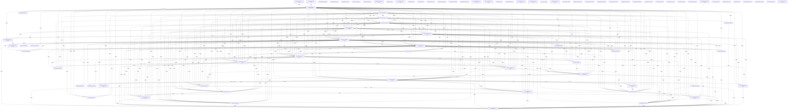

# Knowledge Graph Index

> Auto-generated by graphify. Start here — read community articles for context, then drill into god nodes for detail.

**6811 nodes · 10588 edges · 86 communities**

---

## System Architecture Flowchart

```mermaid
flowchart TD
    C0["Chat Session Manager (628 nodes)"]
    C1["CLI Progress Feedback (620 nodes)"]
    C2["Batch Job Engine (490 nodes)"]
    C3["Community 3 (412 nodes)"]
    C4["Static Blog Pipeline (377 nodes)"]
    C5["LLM request logic (286 nodes)"]
    C6["Code Submission Review (278 nodes)"]
    C7["Community 7 (267 nodes)"]
    C8["Goal Engine (232 nodes)"]
    C9["LLM Integration (225 nodes)"]
    C10["API request layer (204 nodes)"]
    C11["Telemetry Dashboard (192 nodes)"]
    C12["Token Management (185 nodes)"]
    C13["Messaging System (182 nodes)"]
    C14["Community 14 (176 nodes)"]
    C15["API Client (162 nodes)"]
    C16["Auth Configuration (154 nodes)"]
    C17["Paint Scheduler (140 nodes)"]
    C18["Community 18 (127 nodes)"]
    C19["Fake server (123 nodes)"]
    C20["UI Docking (117 nodes)"]
    C21["Diff Engine (116 nodes)"]
    C22["Command Palette (97 nodes)"]
    C23["API Mocking (95 nodes)"]
    C24["Text Input Editing (91 nodes)"]
    C25["Community 25 (90 nodes)"]
    C26["Community 26 (65 nodes)"]
    C27["Web Server (63 nodes)"]
    C28["Community 28 (56 nodes)"]
    C29["Community 29 (52 nodes)"]
    C30["Code Diff Renderer (51 nodes)"]
    C31["LLM Provider Discovery (45 nodes)"]
    C32["Tool Orchestration (34 nodes)"]
    C33["Community 33 (33 nodes)"]
    C34["Project File Management (31 nodes)"]
    C35["API Client (31 nodes)"]
    C36["Data Retrieval (29 nodes)"]
    C37["Chat Assistant (29 nodes)"]
    C38["Community 38 (27 nodes)"]
    C39["Test Automation (24 nodes)"]
    C40["Std stream mocking (24 nodes)"]
    C41["Community 41 (23 nodes)"]
    C42["Community 42 (22 nodes)"]
    C43["Conversation Engine (21 nodes)"]
    C44["Streaming Chat (15 nodes)"]
    C45["Community 45 (9 nodes)"]
    C46["Transcript API (9 nodes)"]
    C47["Project Layout (6 nodes)"]
    C48["Community 48 (4 nodes)"]
    C49["Destructive Commands (3 nodes)"]
    C50["unknown (3 nodes)"]
    C51["Note Management (2 nodes)"]
    C52["unknown (1 nodes)"]
    C53["unknown (1 nodes)"]
    C54["UI Rendering (1 nodes)"]
    C55["Test framework (1 nodes)"]
    C56["Release Notes (1 nodes)"]
    C57["Build Distribution (1 nodes)"]
    C58["License Management (1 nodes)"]
    C59["Project Documentation (1 nodes)"]
    C60["React UI (1 nodes)"]
    C61["Node Runtime (1 nodes)"]
    C62["React Type Definitions (1 nodes)"]
    C63["TypeScript Compiler (1 nodes)"]
    C64["Tree Node (1 nodes)"]
    C65["Quality Assurance (1 nodes)"]
    C66["Source Code (1 nodes)"]
    C67["Unknown Domain (1 nodes)"]
    C68["Unknown Domain (1 nodes)"]
    C69["Unknown Domain (1 nodes)"]
    C70["Unknown Domain (1 nodes)"]
    C71["Chatbot Greeting (1 nodes)"]
    C72["unknown domain (1 nodes)"]
    C73["Community 73 (1 nodes)"]
    C74["Community 74 (1 nodes)"]
    C75["Community 75 (1 nodes)"]
    C76["Auth Tokens (1 nodes)"]
    C77["unknown domain (1 nodes)"]
    C78["TypeScript Configuration (1 nodes)"]
    C79["Source Code (1 nodes)"]
    C80["Skill Activation (1 nodes)"]
    C81["AI Agent (1 nodes)"]
    C82["Conversational AI (1 nodes)"]
    C83["Code Generation (1 nodes)"]
    C84["Community 84 (1 nodes)"]
    C85["Text User Interface (1 nodes)"]
    C3 -->|52 edges| C0
    C1 -->|39 edges| C11
    C1 -->|33 edges| C19
    C1 -->|30 edges| C5
    C5 -->|27 edges| C2
    C1 -->|27 edges| C6
    C1 -->|21 edges| C2
    C1 -->|21 edges| C7
    C7 -->|20 edges| C2
    C19 -->|19 edges| C1
    C14 -->|19 edges| C0
    C18 -->|19 edges| C0
    C5 -->|18 edges| C1
    C16 -->|18 edges| C0
    C4 -->|17 edges| C7
    C4 -->|16 edges| C15
    C1 -->|15 edges| C13
    C11 -->|15 edges| C7
    C5 -->|15 edges| C11
    C1 -->|14 edges| C0
    C1 -->|14 edges| C10
    C9 -->|14 edges| C2
    C7 -->|14 edges| C0
    C5 -->|13 edges| C9
    C5 -->|13 edges| C4
    C2 -->|13 edges| C11
    C5 -->|12 edges| C6
    C13 -->|12 edges| C7
    C13 -->|12 edges| C2
    C2 -->|12 edges| C4
    C3 -->|12 edges| C15
    C13 -->|11 edges| C15
    C7 -->|11 edges| C4
    C23 -->|11 edges| C0
    C1 -->|10 edges| C22
    C13 -->|10 edges| C4
    C7 -->|10 edges| C6
    C11 -->|10 edges| C0
    C9 -->|10 edges| C0
    C4 -->|10 edges| C0
    C5 -->|9 edges| C0
    C6 -->|9 edges| C1
    C2 -->|9 edges| C13
    C25 -->|9 edges| C2
    C0 -->|9 edges| C3
    C5 -->|8 edges| C7
    C13 -->|8 edges| C5
    C11 -->|8 edges| C5
    C11 -->|8 edges| C13
    C11 -->|8 edges| C12
    C8 -->|8 edges| C12
    C0 -->|8 edges| C12
    C15 -->|8 edges| C3
    C7 -->|7 edges| C13
    C1 -->|7 edges| C25
    C1 -->|7 edges| C8
    C1 -->|7 edges| C14
    C6 -->|7 edges| C5
    C6 -->|7 edges| C7
    C21 -->|7 edges| C0
    C8 -->|7 edges| C2
    C2 -->|7 edges| C5
    C10 -->|7 edges| C0
    C4 -->|7 edges| C2
    C1 -->|6 edges| C3
    C1 -->|6 edges| C24
    C1 -->|6 edges| C4
    C11 -->|6 edges| C8
    C7 -->|6 edges| C11
    C7 -->|6 edges| C5
    C2 -->|6 edges| C0
    C11 -->|6 edges| C25
    C0 -->|6 edges| C4
    C4 -->|6 edges| C13
    C14 -->|6 edges| C15
    C5 -->|5 edges| C21
    C1 -->|5 edges| C29
    C1 -->|5 edges| C17
    C13 -->|5 edges| C25
    C6 -->|5 edges| C12
    C7 -->|5 edges| C24
    C11 -->|5 edges| C15
    C26 -->|5 edges| C0
    C28 -->|5 edges| C5
    C24 -->|5 edges| C13
    C2 -->|5 edges| C8
    C10 -->|5 edges| C2
    C25 -->|5 edges| C11
    C4 -->|5 edges| C12
    C33 -->|5 edges| C0
    C20 -->|5 edges| C0
    C1 -->|4 edges| C21
    C1 -->|4 edges| C15
    C1 -->|4 edges| C26
    C13 -->|4 edges| C1
    C36 -->|4 edges| C0
    C8 -->|4 edges| C5
    C8 -->|4 edges| C17
    C8 -->|4 edges| C7
    C2 -->|4 edges| C15
    C24 -->|4 edges| C5
    C24 -->|4 edges| C4
    C5 -->|4 edges| C12
    C2 -->|4 edges| C7
    C0 -->|4 edges| C11
    C11 -->|4 edges| C27
    C9 -->|4 edges| C4
    C11 -->|4 edges| C2
    C14 -->|4 edges| C11
    C14 -->|4 edges| C3
    C15 -->|4 edges| C0
    C29 -->|4 edges| C13
    C19 -->|4 edges| C0
    C30 -->|4 edges| C0
    C31 -->|3 edges| C0
    C5 -->|3 edges| C34
    C1 -->|3 edges| C20
    C7 -->|3 edges| C1
    C2 -->|3 edges| C1
    C13 -->|3 edges| C8
    C13 -->|3 edges| C19
    C11 -->|3 edges| C17
    C11 -->|3 edges| C10
    C6 -->|3 edges| C21
    C8 -->|3 edges| C13
    C26 -->|3 edges| C5
    C24 -->|3 edges| C7
    C24 -->|3 edges| C15
    C5 -->|3 edges| C14
    C0 -->|3 edges| C1
    C11 -->|3 edges| C18
    C10 -->|3 edges| C7
    C25 -->|3 edges| C4
    C25 -->|3 edges| C12
    C9 -->|3 edges| C12
    C9 -->|3 edges| C7
    C5 -->|3 edges| C23
    C14 -->|3 edges| C2
    C29 -->|3 edges| C4
    C4 -->|3 edges| C24
    C3 -->|3 edges| C7
    C22 -->|3 edges| C15
    C15 -->|3 edges| C7
    C29 -->|3 edges| C15
    C21 -->|3 edges| C3
    C0 -->|3 edges| C7
    C19 -->|3 edges| C15
    C19 -->|3 edges| C13
    C40 -->|3 edges| C0
    C24 -->|3 edges| C0
    C0 -->|3 edges| C15
    C17 -->|3 edges| C12
    C18 -->|3 edges| C12
    C16 -->|3 edges| C3
    C28 -->|3 edges| C0
    C29 -->|3 edges| C0
    C41 -->|3 edges| C0
    C22 -->|3 edges| C0
    C17 -->|3 edges| C0
    C37 -->|3 edges| C0
    C43 -->|3 edges| C0
    C31 -->|2 edges| C2
    C32 -->|2 edges| C0
    C5 -->|2 edges| C19
    C1 -->|2 edges| C28
    C1 -->|2 edges| C36
    C1 -->|2 edges| C16
    C10 -->|2 edges| C1
    C1 -->|2 edges| C12
    C13 -->|2 edges| C24
    C21 -->|2 edges| C5
    C21 -->|2 edges| C6
    C11 -->|2 edges| C3
    C36 -->|2 edges| C5
    C36 -->|2 edges| C1
    C17 -->|2 edges| C1
    C17 -->|2 edges| C7
    C2 -->|2 edges| C12
    C2 -->|2 edges| C18
    C26 -->|2 edges| C1
    C24 -->|2 edges| C11
    C17 -->|2 edges| C13
    C5 -->|2 edges| C27
    C5 -->|2 edges| C26
    C5 -->|2 edges| C28
    C22 -->|2 edges| C11
    C2 -->|2 edges| C9
    C0 -->|2 edges| C5
    C0 -->|2 edges| C30
    C11 -->|2 edges| C33
    C11 -->|2 edges| C30
    C25 -->|2 edges| C1
    C9 -->|2 edges| C8
    C9 -->|2 edges| C17
    C9 -->|2 edges| C18
    C9 -->|2 edges| C10
    C9 -->|2 edges| C3
    C5 -->|2 edges| C8
    C5 -->|2 edges| C3
    C5 -->|2 edges| C18
    C5 -->|2 edges| C10
    C5 -->|2 edges| C13
    C5 -->|2 edges| C30
    C14 -->|2 edges| C1
    C2 -->|2 edges| C42
    C2 -->|2 edges| C3
    C13 -->|2 edges| C18
    C7 -->|2 edges| C15
    C4 -->|2 edges| C29
    C2 -->|2 edges| C24
    C4 -->|2 edges| C3
    C15 -->|2 edges| C4
    C3 -->|2 edges| C2
    C3 -->|2 edges| C25
    C29 -->|2 edges| C1
    C14 -->|2 edges| C16
    C14 -->|2 edges| C20
    C3 -->|2 edges| C14
    C19 -->|2 edges| C7
    C8 -->|2 edges| C0
    C14 -->|2 edges| C12
    C16 -->|2 edges| C18
    C23 -->|2 edges| C12
    C0 -->|2 edges| C18
    C10 -->|2 edges| C12
    C5 -->|1 edges| C15
    C1 -->|1 edges| C9
    C22 -->|1 edges| C1
    C19 -->|1 edges| C14
    C13 -->|1 edges| C17
    C13 -->|1 edges| C3
    C11 -->|1 edges| C14
    C6 -->|1 edges| C4
    C6 -->|1 edges| C25
    C7 -->|1 edges| C17
    C6 -->|1 edges| C13
    C6 -->|1 edges| C2
    C21 -->|1 edges| C1
    C36 -->|1 edges| C14
    C36 -->|1 edges| C11
    C36 -->|1 edges| C15
    C36 -->|1 edges| C7
    C17 -->|1 edges| C8
    C8 -->|1 edges| C11
    C8 -->|1 edges| C24
    C8 -->|1 edges| C4
    C8 -->|1 edges| C15
    C2 -->|1 edges| C25
    C28 -->|1 edges| C1
    C6 -->|1 edges| C0
    C24 -->|1 edges| C2
    C24 -->|1 edges| C3
    C24 -->|1 edges| C10
    C24 -->|1 edges| C14
    C4 -->|1 edges| C10
    C17 -->|1 edges| C11
    C2 -->|1 edges| C10
    C11 -->|1 edges| C21
    C11 -->|1 edges| C23
    C11 -->|1 edges| C6
    C13 -->|1 edges| C11
    C0 -->|1 edges| C9
    C0 -->|1 edges| C22
    C23 -->|1 edges| C5
    C10 -->|1 edges| C9
    C25 -->|1 edges| C13
    C9 -->|1 edges| C5
    C9 -->|1 edges| C14
    C9 -->|1 edges| C11
    C9 -->|1 edges| C40
    C9 -->|1 edges| C39
    C9 -->|1 edges| C13
    C9 -->|1 edges| C38
    C9 -->|1 edges| C24
    C9 -->|1 edges| C22
    C9 -->|1 edges| C33
    C9 -->|1 edges| C30
    C5 -->|1 edges| C40
    C5 -->|1 edges| C36
    C5 -->|1 edges| C17
    C5 -->|1 edges| C35
    C5 -->|1 edges| C39
    C5 -->|1 edges| C38
    C5 -->|1 edges| C42
    C5 -->|1 edges| C33
    C5 -->|1 edges| C25
    C5 -->|1 edges| C16
    C15 -->|1 edges| C2
    C13 -->|1 edges| C27
    C18 -->|1 edges| C13
    C13 -->|1 edges| C0
    C27 -->|1 edges| C13
    C7 -->|1 edges| C27
    C7 -->|1 edges| C3
    C8 -->|1 edges| C21
    C7 -->|1 edges| C8
    C4 -->|1 edges| C6
    C15 -->|1 edges| C24
    C5 -->|1 edges| C24
    C3 -->|1 edges| C24
    C22 -->|1 edges| C3
    C22 -->|1 edges| C14
    C29 -->|1 edges| C3
    C15 -->|1 edges| C1
    C15 -->|1 edges| C41
    C15 -->|1 edges| C13
    C3 -->|1 edges| C21
    C25 -->|1 edges| C0
    C25 -->|1 edges| C3
    C0 -->|1 edges| C21
    C0 -->|1 edges| C37
    C0 -->|1 edges| C14
    C3 -->|1 edges| C1
    C11 -->|1 edges| C31
    C27 -->|1 edges| C10
    C27 -->|1 edges| C7
    C19 -->|1 edges| C4
    C7 -->|1 edges| C19
    C4 -->|1 edges| C19
    C21 -->|1 edges| C13
    C21 -->|1 edges| C10
    C21 -->|1 edges| C12
    C21 -->|1 edges| C7
    C28 -->|1 edges| C12
    C39 -->|1 edges| C13
    C7 -->|1 edges| C18
    C16 -->|1 edges| C11
    C16 -->|1 edges| C10
    C16 -->|1 edges| C12
    C41 -->|1 edges| C12
    C33 -->|1 edges| C12
    C33 -->|1 edges| C18
    C30 -->|1 edges| C4
    C30 -->|1 edges| C11
    C23 -->|1 edges| C13
    C30 -->|1 edges| C12
    C3 -->|1 edges| C13
    C29 -->|1 edges| C7
    C14 -->|1 edges| C18
    C6 -->|1 edges| C15
    C10 -->|1 edges| C5
    C3 -->|1 edges| C4
    C3 -->|1 edges| C18
    C7 -->|1 edges| C10
    C0 -->|1 edges| C20
    C0 -->|1 edges| C27
    C20 -->|1 edges| C3
    C20 -->|1 edges| C5
    C27 -->|1 edges| C19
    C27 -->|1 edges| C2
    C27 -->|1 edges| C1
```

## Communities
(sorted by size, largest first)

- [[Chat Session Manager]] — 628 nodes
- [[CLI Progress Feedback]] — 620 nodes
- [[Batch Job Engine]] — 490 nodes
- [[Community 3]] — 412 nodes
- [[Static Blog Pipeline]] — 377 nodes
- [[LLM request logic]] — 286 nodes
- [[Code Submission Review]] — 278 nodes
- [[Community 7]] — 267 nodes
- [[Goal Engine]] — 232 nodes
- [[LLM Integration]] — 225 nodes
- [[API request layer]] — 204 nodes
- [[Telemetry Dashboard]] — 192 nodes
- [[Token Management]] — 185 nodes
- [[Messaging System]] — 182 nodes
- [[Community 14]] — 176 nodes
- [[API Client]] — 162 nodes
- [[Auth Configuration]] — 154 nodes
- [[Paint Scheduler]] — 140 nodes
- [[Community 18]] — 127 nodes
- [[Fake server]] — 123 nodes
- [[UI Docking]] — 117 nodes
- [[Diff Engine]] — 116 nodes
- [[Command Palette]] — 97 nodes
- [[API Mocking]] — 95 nodes
- [[Text Input Editing]] — 91 nodes
- [[Community 25]] — 90 nodes
- [[Community 26]] — 65 nodes
- [[Web Server]] — 63 nodes
- [[Community 28]] — 56 nodes
- [[Community 29]] — 52 nodes
- [[Code Diff Renderer]] — 51 nodes
- [[LLM Provider Discovery]] — 45 nodes
- [[Tool Orchestration]] — 34 nodes
- [[Community 33]] — 33 nodes
- [[Project File Management]] — 31 nodes
- [[API Client]] — 31 nodes
- [[Data Retrieval]] — 29 nodes
- [[Chat Assistant]] — 29 nodes
- [[Community 38]] — 27 nodes
- [[Test Automation]] — 24 nodes
- [[Std stream mocking]] — 24 nodes
- [[Community 41]] — 23 nodes
- [[Community 42]] — 22 nodes
- [[Conversation Engine]] — 21 nodes
- [[Streaming Chat]] — 15 nodes
- [[Community 45]] — 9 nodes
- [[Transcript API]] — 9 nodes
- [[Project Layout]] — 6 nodes
- [[Community 48]] — 4 nodes
- [[Destructive Commands]] — 3 nodes
- [[unknown]] — 3 nodes
- [[Note Management]] — 2 nodes
- [[unknown]] — 1 nodes
- [[unknown]] — 1 nodes
- [[UI Rendering]] — 1 nodes
- [[Test framework]] — 1 nodes
- [[Release Notes]] — 1 nodes
- [[Build Distribution]] — 1 nodes
- [[License Management]] — 1 nodes
- [[Project Documentation]] — 1 nodes
- [[React UI]] — 1 nodes
- [[Node Runtime]] — 1 nodes
- [[React Type Definitions]] — 1 nodes
- [[TypeScript Compiler]] — 1 nodes
- [[Tree Node]] — 1 nodes
- [[Quality Assurance]] — 1 nodes
- [[Source Code]] — 1 nodes
- [[Unknown Domain]] — 1 nodes
- [[Unknown Domain]] — 1 nodes
- [[Unknown Domain]] — 1 nodes
- [[Unknown Domain]] — 1 nodes
- [[Chatbot Greeting]] — 1 nodes
- [[unknown domain]] — 1 nodes
- [[Community 73]] — 1 nodes
- [[Community 74]] — 1 nodes
- [[Community 75]] — 1 nodes
- [[Auth Tokens]] — 1 nodes
- [[unknown domain]] — 1 nodes
- [[TypeScript Configuration]] — 1 nodes
- [[Source Code]] — 1 nodes
- [[Skill Activation]] — 1 nodes
- [[AI Agent]] — 1 nodes
- [[Conversational AI]] — 1 nodes
- [[Code Generation]] — 1 nodes
- [[Community 84]] — 1 nodes
- [[Text User Interface]] — 1 nodes

## God Nodes
(most connected concepts — the load-bearing abstractions)

- [[now]] — 138 connections
- [[ink-testing-library]] — 99 connections
- [[runSlashCommand()]] — 78 connections
- [[split]] — 78 connections
- [[submit()]] — 74 connections
- [[has]] — 61 connections
- [[tmpDir()]] — 48 connections
- [[ink]] — 39 connections
- [[resolve]] — 38 connections
- [[doCompact()]] — 37 connections

---

*Generated by [graphify](https://github.com/safishamsi/graphify)*