# resolve

> God node · 38 connections · [C:\Users\Bhavin\Videos\WEB dev\Opensource porjects\Atom\tests\policy.test.ts](file:///C:/Users/Bhavin/Videos/WEB%20dev/Opensource%20porjects/Atom/tests/policy.test.ts#L221)

## Call Trace Diagram

```mermaid
sequenceDiagram
    participant P0 as resolve
    participant P1 as approve()
    participant P2 as showError()
    participant P3 as runSlashCommand()
    participant P4 as onEvent()
    participant P5 as selectSession()
    participant P6 as setBusy()
    participant P7 as announce()
    participant P8 as applySlashSetting()
    participant P9 as invokeSkill()
    participant P10 as answer()
    participant P11 as applySettings()
    participant P12 as needsApproval()
    participant P13 as has
    participant P14 as .approve()
    participant P15 as runRulesCommand()
    participant P16 as resolveApproval()
    participant P17 as .guardedExecute()
    participant P18 as isBuiltinToolName()
    participant P19 as getCustomTool()
    participant P20 as isMcpToolName()
    participant P21 as guardedExecute()
    participant P22 as cwd
    participant P23 as previewDiffForApproval()
    participant P24 as describeToolCall()
    participant P25 as postJSON()
    participant P26 as readFileForDiff()
    participant P27 as decideApproval()
    participant P28 as discoverExtensionEntries()
    participant P29 as .emitFileDiff()
    participant P30 as discoverSkills()
    participant P31 as loadSkillBody()
    participant P32 as sleepOrCancel()
    participant P33 as resolveSandbox()
    participant P34 as chainPathsUp()
    participant P35 as projectChainPaths()
    participant P36 as normalizeDir()
    participant P37 as .pumpSseReader()
    participant P38 as invalidateListingsForFile()
    participant P39 as checkUrlAgainstPolicy()
    participant P40 as invalidatePath()
    participant P41 as bashTool()
    participant P42 as expandMentionsForSubmit()
    participant P43 as findExistingPastedPaths()
    participant P44 as consumePendingSlots()
    participant P45 as resolveAsk()
    participant P46 as readAtomManifest()
    participant P47 as classifyExtensionScope()
    participant P48 as combineInstructionSources()
    participant P49 as .onLine()
    participant P50 as listMentionFiles()
    participant P51 as listMentionFilesSync()
    participant P52 as .resolveApproval()
    participant P53 as resolveApproval()
    participant P54 as resolveTrustAll()
    participant P55 as tryReadSource()
    participant P56 as nestedAgentsForTarget()
    participant P57 as canonicalFileKey()
    participant P58 as resolveLocalCwd()
    participant P59 as .answerQuestion()
    P0->>+ P1: calls
    P1-->>- P0: return
    P1->>+ P0: calls
    P0-->>- P1: return
    P1->>+ P2: calls
    P2-->>- P1: return
    P2->>+ P3: calls
    P3-->>- P2: return
    P2->>+ P4: calls
    P4-->>- P2: return
    P2->>+ P5: calls
    P5-->>- P2: return
    P2->>+ P1: calls
    P1-->>- P2: return
    P2->>+ P6: calls
    P6-->>- P2: return
    P2->>+ P7: calls
    P7-->>- P2: return
    P2->>+ P8: calls
    P8-->>- P2: return
    P2->>+ P9: calls
    P9-->>- P2: return
    P2->>+ P10: calls
    P10-->>- P2: return
    P2->>+ P11: calls
    P11-->>- P2: return
    P1->>+ P12: calls
    P12-->>- P1: return
    P12->>+ P13: calls
    P13-->>- P12: return
    P12->>+ P1: calls
    P1-->>- P12: return
    P12->>+ P14: calls
    P14-->>- P12: return
    P12->>+ P15: calls
    P15-->>- P12: return
    P12->>+ P16: calls
    P16-->>- P12: return
    P12->>+ P17: calls
    P17-->>- P12: return
    P12->>+ P18: calls
    P18-->>- P12: return
    P12->>+ P19: calls
    P19-->>- P12: return
    P12->>+ P20: calls
    P20-->>- P12: return
    P12->>+ P21: calls
    P21-->>- P12: return
    P1->>+ P22: calls
    P22-->>- P1: return
    P1->>+ P23: calls
    P23-->>- P1: return
    P1->>+ P24: calls
    P24-->>- P1: return
    P1->>+ P25: calls
    P25-->>- P1: return
    P1->>+ P26: calls
    P26-->>- P1: return
    P1->>+ P27: calls
    P27-->>- P1: return
    P0->>+ P14: calls
    P14-->>- P0: return
    P0->>+ P28: calls
    P28-->>- P0: return
    P0->>+ P29: calls
    P29-->>- P0: return
    P0->>+ P30: calls
    P30-->>- P0: return
    P0->>+ P31: calls
    P31-->>- P0: return
    P0->>+ P32: calls
    P32-->>- P0: return
    P0->>+ P33: calls
    P33-->>- P0: return
    P0->>+ P34: calls
    P34-->>- P0: return
    P0->>+ P35: calls
    P35-->>- P0: return
    P0->>+ P36: calls
    P36-->>- P0: return
    P0->>+ P37: calls
    P37-->>- P0: return
    P0->>+ P38: calls
    P38-->>- P0: return
    P0->>+ P39: calls
    P39-->>- P0: return
    P0->>+ P17: calls
    P17-->>- P0: return
    P0->>+ P40: calls
    P40-->>- P0: return
    P0->>+ P23: calls
    P23-->>- P0: return
    P0->>+ P41: calls
    P41-->>- P0: return
    P0->>+ P42: calls
    P42-->>- P0: return
    P0->>+ P43: calls
    P43-->>- P0: return
    P0->>+ P44: calls
    P44-->>- P0: return
    P0->>+ P21: calls
    P21-->>- P0: return
    P0->>+ P45: calls
    P45-->>- P0: return
    P0->>+ P46: calls
    P46-->>- P0: return
    P0->>+ P47: calls
    P47-->>- P0: return
    P0->>+ P48: calls
    P48-->>- P0: return
    P0->>+ P49: calls
    P49-->>- P0: return
    P0->>+ P50: calls
    P50-->>- P0: return
    P0->>+ P51: calls
    P51-->>- P0: return
    P0->>+ P52: calls
    P52-->>- P0: return
    P0->>+ P53: calls
    P53-->>- P0: return
    P0->>+ P54: calls
    P54-->>- P0: return
    P0->>+ P55: calls
    P55-->>- P0: return
    P0->>+ P56: calls
    P56-->>- P0: return
    P0->>+ P57: calls
    P57-->>- P0: return
    P0->>+ P58: calls
    P58-->>- P0: return
    P0->>+ P59: calls
    P59-->>- P0: return
```

## Connections by Relation

### calls
- [[approve()]] `INFERRED`
- [[.approve()]] `INFERRED`
- [[discoverExtensionEntries()]] `INFERRED`
- [[.emitFileDiff()]] `INFERRED`
- [[discoverSkills()]] `INFERRED`
- [[loadSkillBody()]] `INFERRED`
- [[sleepOrCancel()]] `INFERRED`
- [[resolveSandbox()]] `INFERRED`
- [[chainPathsUp()]] `INFERRED`
- [[projectChainPaths()]] `INFERRED`
- [[normalizeDir()]] `INFERRED`
- [[.pumpSseReader()]] `INFERRED`
- [[invalidateListingsForFile()]] `INFERRED`
- [[checkUrlAgainstPolicy()]] `INFERRED`
- [[.guardedExecute()]] `INFERRED`
- [[invalidatePath()]] `INFERRED`
- [[previewDiffForApproval()]] `INFERRED`
- [[bashTool()]] `INFERRED`
- [[expandMentionsForSubmit()]] `INFERRED`
- [[findExistingPastedPaths()]] `INFERRED`

### contains
- [[policy.test.ts]] `EXTRACTED`

---

*Part of the graphify knowledge wiki. See [[index]] to navigate.*