# split

> God node · 75 connections · [C:\Users\Bhavin\Videos\WEB dev\Opensource porjects\Atom\tests\structured-chained-summary.test.ts](file:///C:/Users/Bhavin/Videos/WEB%20dev/Opensource%20porjects/Atom/tests/structured-chained-summary.test.ts#L233)

## Call Trace Diagram

```mermaid
sequenceDiagram
    participant P0 as split
    participant P1 as grepTool()
    participant P2 as has
    participant P3 as submit()
    participant P4 as chatCompletion()
    participant P5 as chatCompletionGemini()
    participant P6 as chatCompletionAnthropic()
    participant P7 as chatCompletionResponses()
    participant P8 as validateToolArgs()
    participant P9 as executeTool()
    participant P10 as webfetchTool()
    participant P11 as .doRefresh()
    participant P12 as gitListFiles()
    participant P13 as needsApproval()
    participant P14 as fetchModelsWithStatus()
    participant P15 as toolNames()
    participant P16 as rgContentHits()
    participant P17 as planBatches()
    participant P18 as todoUpdateTool()
    participant P19 as trackHistory()
    participant P20 as readFileDiffs()
    participant P21 as discoverSkills()
    participant P22 as .listPaginated()
    participant P23 as loadSkillBody()
    participant P24 as .refreshServerTools()
    participant P25 as rgFileCounts()
    participant P26 as chainPathsUp()
    participant P27 as renderAgent()
    participant P28 as decidePolicy()
    participant P29 as matchSkills()
    participant P30 as .listTools()
    participant P31 as registerCustomTool()
    participant P32 as isCustomTool()
    participant P33 as filterMentionCandidates()
    participant P34 as highlight()
    participant P35 as noteGoalProgress()
    participant P36 as contentWords()
    participant P37 as todoRecordDetail()
    participant P38 as setActiveTodoSession()
    participant P39 as normalizeChatResult()
    participant P40 as walkFiles()
    participant P41 as registerToolOverride()
    participant P42 as isMessages()
    participant P43 as newBgId()
    participant P44 as highlightCode()
    participant P45 as stripGeminiSchemaKeys()
    participant P46 as registerExtensionCommand()
    participant P47 as isEntryFile()
    participant P48 as loadMedia()
    participant P49 as isCodePath()
    participant P50 as .isExcluded()
    participant P51 as .isMcpTool()
    participant P52 as isReadOnlyCommand()
    participant P53 as isImagePathLike()
    participant P54 as assertPairingIntact()
    participant P55 as assertPairingIntact()
    participant P56 as expectPairingValid()
    participant P57 as assertPairingIntact()
    participant P58 as isTodoStatus()
    participant P59 as isTodoPriority()
    participant P60 as isToolOverridden()
    participant P61 as visit()
    participant P62 as executeBuiltinTool()
    participant P63 as invalidCall()
    participant P64 as err
    participant P65 as stat
    participant P66 as grepSingleFile()
    participant P67 as scanWithWalker()
    participant P68 as compileGlobPattern()
    participant P69 as resolveSandbox()
    participant P70 as capSearchOutput()
    participant P71 as resultCacheKey()
    participant P72 as mapLimit()
    participant P73 as fastListEnabled()
    participant P74 as listFiles()
    participant P75 as resultCacheGet()
    participant P76 as scanWithRipgrep()
    participant P77 as rgAvailable()
    participant P78 as parseGrepPattern()
    participant P79 as literalOf()
    participant P80 as rgMinFiles()
    participant P81 as noteRgFallback()
    participant P82 as globTool()
    participant P83 as editTool()
    participant P84 as collectSSEText()
    participant P85 as truncateHead()
    participant P86 as deriveSummary()
    participant P87 as discoverExtensionEntries()
    participant P88 as parseMarkdown()
    participant P89 as reduceAgentEvent()
    participant P90 as renderMarkdown()
    participant P91 as .pumpSseReader()
    participant P92 as parseDdgResults()
    participant P93 as classifyIpv4()
    participant P94 as classifyToolError()
    participant P95 as splitInputLines()
    participant P96 as findExistingPastedPaths()
    participant P97 as updateSlashMenu()
    participant P98 as trySlashSubmit()
    participant P99 as splitLines()
    participant P100 as getGitInfo()
    participant P101 as hasGoalCreateIntent()
    participant P102 as scrubSecrets()
    participant P103 as splitFrontmatter()
    participant P104 as frontField()
    participant P105 as parseAllowedTools()
    participant P106 as toCwdRel()
    participant P107 as windowLines()
    participant P108 as previewLangFromPath()
    participant P109 as parseInline()
    participant P110 as deriveDirectoryCandidates()
    participant P111 as pasteLineCount()
    participant P112 as createToolRecord()
    participant P113 as keyOf()
    participant P114 as runtimeDeps()
    participant P115 as scan()
    participant P116 as tokenize()
    participant P117 as expandIpv6()
    participant P118 as firstParagraph()
    participant P119 as parseSsePayloads()
    participant P120 as extractSseEndpoint()
    participant P121 as parseJsonEvents()
    participant P122 as summarizeDetail()
    participant P123 as walkFallback()
    participant P124 as walkFallbackSync()
    participant P125 as summarizeTerminal()
    participant P126 as summarizeFile()
    participant P127 as summarizeSearch()
    participant P128 as summarizeWeb()
    participant P129 as stripAnsiLines()
    participant P130 as keyOf()
    participant P131 as runtimeDeps()
    participant P132 as jsonLines()
    participant P133 as shouldCollapseToMarker()
    participant P134 as pasteMarkerFor()
    participant P135 as extractPastedPathCandidates()
    participant P136 as extractInlinePathCandidates()
    participant P137 as wrapWithPrefix()
    participant P138 as WidgetPreview()
    participant P139 as parseSSEFrame()
    participant P140 as countOccurrences()
    participant P141 as maxLineLen()
    participant P142 as countOccurrences()
    participant P143 as countOccurrences()
    P0->>+ P1: calls
    P1-->>- P0: return
    P1->>+ P0: calls
    P0-->>- P1: return
    P1->>+ P2: calls
    P2-->>- P1: return
    P2->>+ P3: calls
    P3-->>- P2: return
    P2->>+ P4: calls
    P4-->>- P2: return
    P2->>+ P5: calls
    P5-->>- P2: return
    P2->>+ P6: calls
    P6-->>- P2: return
    P2->>+ P7: calls
    P7-->>- P2: return
    P2->>+ P1: calls
    P1-->>- P2: return
    P2->>+ P8: calls
    P8-->>- P2: return
    P2->>+ P9: calls
    P9-->>- P2: return
    P2->>+ P10: calls
    P10-->>- P2: return
    P2->>+ P11: calls
    P11-->>- P2: return
    P2->>+ P12: calls
    P12-->>- P2: return
    P2->>+ P13: calls
    P13-->>- P2: return
    P2->>+ P14: calls
    P14-->>- P2: return
    P2->>+ P15: calls
    P15-->>- P2: return
    P2->>+ P16: calls
    P16-->>- P2: return
    P2->>+ P17: calls
    P17-->>- P2: return
    P2->>+ P18: calls
    P18-->>- P2: return
    P2->>+ P19: calls
    P19-->>- P2: return
    P2->>+ P20: calls
    P20-->>- P2: return
    P2->>+ P21: calls
    P21-->>- P2: return
    P2->>+ P22: calls
    P22-->>- P2: return
    P2->>+ P23: calls
    P23-->>- P2: return
    P2->>+ P24: calls
    P24-->>- P2: return
    P2->>+ P25: calls
    P25-->>- P2: return
    P2->>+ P26: calls
    P26-->>- P2: return
    P2->>+ P27: calls
    P27-->>- P2: return
    P2->>+ P28: calls
    P28-->>- P2: return
    P2->>+ P29: calls
    P29-->>- P2: return
    P2->>+ P30: calls
    P30-->>- P2: return
    P2->>+ P31: calls
    P31-->>- P2: return
    P2->>+ P32: calls
    P32-->>- P2: return
    P2->>+ P33: calls
    P33-->>- P2: return
    P2->>+ P34: calls
    P34-->>- P2: return
    P2->>+ P35: calls
    P35-->>- P2: return
    P2->>+ P36: calls
    P36-->>- P2: return
    P2->>+ P37: calls
    P37-->>- P2: return
    P2->>+ P38: calls
    P38-->>- P2: return
    P2->>+ P39: calls
    P39-->>- P2: return
    P2->>+ P40: calls
    P40-->>- P2: return
    P2->>+ P41: calls
    P41-->>- P2: return
    P2->>+ P42: calls
    P42-->>- P2: return
    P2->>+ P43: calls
    P43-->>- P2: return
    P2->>+ P44: calls
    P44-->>- P2: return
    P2->>+ P45: calls
    P45-->>- P2: return
    P2->>+ P46: calls
    P46-->>- P2: return
    P2->>+ P47: calls
    P47-->>- P2: return
    P2->>+ P48: calls
    P48-->>- P2: return
    P2->>+ P49: calls
    P49-->>- P2: return
    P2->>+ P50: calls
    P50-->>- P2: return
    P2->>+ P51: calls
    P51-->>- P2: return
    P2->>+ P52: calls
    P52-->>- P2: return
    P2->>+ P53: calls
    P53-->>- P2: return
    P2->>+ P54: calls
    P54-->>- P2: return
    P2->>+ P55: calls
    P55-->>- P2: return
    P2->>+ P56: calls
    P56-->>- P2: return
    P2->>+ P57: calls
    P57-->>- P2: return
    P2->>+ P58: calls
    P58-->>- P2: return
    P2->>+ P59: calls
    P59-->>- P2: return
    P2->>+ P60: calls
    P60-->>- P2: return
    P2->>+ P61: calls
    P61-->>- P2: return
    P1->>+ P62: calls
    P62-->>- P1: return
    P1->>+ P63: calls
    P63-->>- P1: return
    P1->>+ P64: calls
    P64-->>- P1: return
    P1->>+ P65: calls
    P65-->>- P1: return
    P1->>+ P66: calls
    P66-->>- P1: return
    P1->>+ P67: calls
    P67-->>- P1: return
    P1->>+ P68: calls
    P68-->>- P1: return
    P1->>+ P69: calls
    P69-->>- P1: return
    P1->>+ P70: calls
    P70-->>- P1: return
    P1->>+ P71: calls
    P71-->>- P1: return
    P1->>+ P72: calls
    P72-->>- P1: return
    P1->>+ P73: calls
    P73-->>- P1: return
    P1->>+ P74: calls
    P74-->>- P1: return
    P1->>+ P75: calls
    P75-->>- P1: return
    P1->>+ P76: calls
    P76-->>- P1: return
    P1->>+ P77: calls
    P77-->>- P1: return
    P1->>+ P78: calls
    P78-->>- P1: return
    P1->>+ P79: calls
    P79-->>- P1: return
    P1->>+ P80: calls
    P80-->>- P1: return
    P1->>+ P81: calls
    P81-->>- P1: return
    P0->>+ P82: calls
    P82-->>- P0: return
    P0->>+ P83: calls
    P83-->>- P0: return
    P0->>+ P12: calls
    P12-->>- P0: return
    P0->>+ P84: calls
    P84-->>- P0: return
    P0->>+ P66: calls
    P66-->>- P0: return
    P0->>+ P85: calls
    P85-->>- P0: return
    P0->>+ P86: calls
    P86-->>- P0: return
    P0->>+ P87: calls
    P87-->>- P0: return
    P0->>+ P88: calls
    P88-->>- P0: return
    P0->>+ P67: calls
    P67-->>- P0: return
    P0->>+ P25: calls
    P25-->>- P0: return
    P0->>+ P89: calls
    P89-->>- P0: return
    P0->>+ P90: calls
    P90-->>- P0: return
    P0->>+ P91: calls
    P91-->>- P0: return
    P0->>+ P92: calls
    P92-->>- P0: return
    P0->>+ P27: calls
    P27-->>- P0: return
    P0->>+ P93: calls
    P93-->>- P0: return
    P0->>+ P29: calls
    P29-->>- P0: return
    P0->>+ P31: calls
    P31-->>- P0: return
    P0->>+ P94: calls
    P94-->>- P0: return
    P0->>+ P95: calls
    P95-->>- P0: return
    P0->>+ P96: calls
    P96-->>- P0: return
    P0->>+ P97: calls
    P97-->>- P0: return
    P0->>+ P98: calls
    P98-->>- P0: return
    P0->>+ P99: calls
    P99-->>- P0: return
    P0->>+ P100: calls
    P100-->>- P0: return
    P0->>+ P101: calls
    P101-->>- P0: return
    P0->>+ P102: calls
    P102-->>- P0: return
    P0->>+ P103: calls
    P103-->>- P0: return
    P0->>+ P104: calls
    P104-->>- P0: return
    P0->>+ P105: calls
    P105-->>- P0: return
    P0->>+ P36: calls
    P36-->>- P0: return
    P0->>+ P40: calls
    P40-->>- P0: return
    P0->>+ P106: calls
    P106-->>- P0: return
    P0->>+ P107: calls
    P107-->>- P0: return
    P0->>+ P108: calls
    P108-->>- P0: return
    P0->>+ P109: calls
    P109-->>- P0: return
    P0->>+ P110: calls
    P110-->>- P0: return
    P0->>+ P111: calls
    P111-->>- P0: return
    P0->>+ P112: calls
    P112-->>- P0: return
    P0->>+ P113: calls
    P113-->>- P0: return
    P0->>+ P114: calls
    P114-->>- P0: return
    P0->>+ P115: calls
    P115-->>- P0: return
    P0->>+ P116: calls
    P116-->>- P0: return
    P0->>+ P117: calls
    P117-->>- P0: return
    P0->>+ P118: calls
    P118-->>- P0: return
    P0->>+ P49: calls
    P49-->>- P0: return
    P0->>+ P119: calls
    P119-->>- P0: return
    P0->>+ P120: calls
    P120-->>- P0: return
    P0->>+ P121: calls
    P121-->>- P0: return
    P0->>+ P52: calls
    P52-->>- P0: return
    P0->>+ P122: calls
    P122-->>- P0: return
    P0->>+ P123: calls
    P123-->>- P0: return
    P0->>+ P124: calls
    P124-->>- P0: return
    P0->>+ P125: calls
    P125-->>- P0: return
    P0->>+ P126: calls
    P126-->>- P0: return
    P0->>+ P127: calls
    P127-->>- P0: return
    P0->>+ P128: calls
    P128-->>- P0: return
    P0->>+ P129: calls
    P129-->>- P0: return
    P0->>+ P130: calls
    P130-->>- P0: return
    P0->>+ P131: calls
    P131-->>- P0: return
    P0->>+ P132: calls
    P132-->>- P0: return
    P0->>+ P133: calls
    P133-->>- P0: return
    P0->>+ P134: calls
    P134-->>- P0: return
    P0->>+ P135: calls
    P135-->>- P0: return
    P0->>+ P136: calls
    P136-->>- P0: return
    P0->>+ P137: calls
    P137-->>- P0: return
    P0->>+ P138: calls
    P138-->>- P0: return
    P0->>+ P139: calls
    P139-->>- P0: return
    P0->>+ P140: calls
    P140-->>- P0: return
    P0->>+ P141: calls
    P141-->>- P0: return
    P0->>+ P142: calls
    P142-->>- P0: return
    P0->>+ P143: calls
    P143-->>- P0: return
```

## Connections by Relation

### calls
- [[grepTool()]] `INFERRED`
- [[globTool()]] `INFERRED`
- [[editTool()]] `INFERRED`
- [[gitListFiles()]] `INFERRED`
- [[collectSSEText()]] `INFERRED`
- [[grepSingleFile()]] `INFERRED`
- [[truncateHead()]] `INFERRED`
- [[deriveSummary()]] `INFERRED`
- [[discoverExtensionEntries()]] `INFERRED`
- [[parseMarkdown()]] `INFERRED`
- [[scanWithWalker()]] `INFERRED`
- [[rgFileCounts()]] `INFERRED`
- [[reduceAgentEvent()]] `INFERRED`
- [[renderMarkdown()]] `INFERRED`
- [[.pumpSseReader()]] `INFERRED`
- [[parseDdgResults()]] `INFERRED`
- [[renderAgent()]] `INFERRED`
- [[classifyIpv4()]] `INFERRED`
- [[matchSkills()]] `INFERRED`
- [[registerCustomTool()]] `INFERRED`

### contains
- [[structured-chained-summary.test.ts]] `EXTRACTED`

---

*Part of the graphify knowledge wiki. See [[index]] to navigate.*