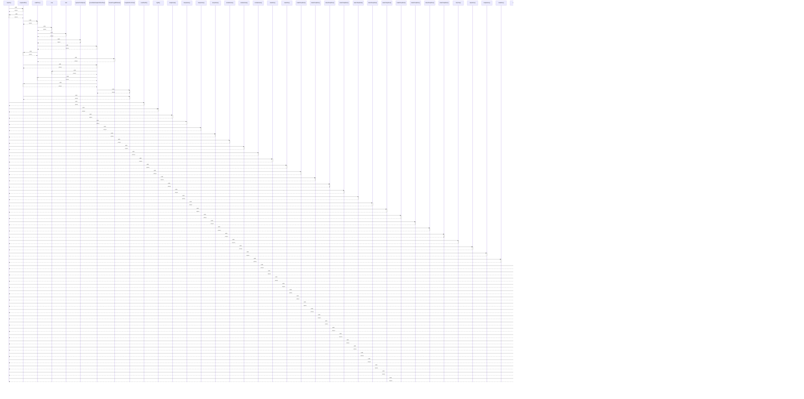

# tmpDir()

> God node · 48 connections · [C:\Users\Bhavin\Videos\WEB dev\Opensource porjects\Atom\tests\turn-boundary-drain.test.tsx](file:///C:/Users/Bhavin/Videos/WEB%20dev/Opensource%20porjects/Atom/tests/turn-boundary-drain.test.tsx#L23)

## Call Trace Diagram

## Connections by Relation

### calls
- [[snapshotDir()]] `INFERRED`
- [[overflowDir()]] `INFERRED`
- [[bgDir()]] `INFERRED`
- [[tempHome()]] `INFERRED`
- [[tempHome()]] `INFERRED`
- [[tempHome()]] `INFERRED`
- [[tempHome()]] `INFERRED`
- [[isolateHome()]] `INFERRED`
- [[isolateHome()]] `INFERRED`
- [[isolateHome()]] `INFERRED`
- [[cleanEnv()]] `INFERRED`
- [[cleanEnv()]] `INFERRED`
- [[makeTempRoot()]] `INFERRED`
- [[makeTempRoot()]] `INFERRED`
- [[makeTempRoot()]] `INFERRED`
- [[makeTempRoot()]] `INFERRED`
- [[makeTempRoot()]] `INFERRED`
- [[makeTempRoot()]] `INFERRED`
- [[makeTempRoot()]] `INFERRED`
- [[makeTempRoot()]] `INFERRED`

### contains
- [[turn-boundary-drain.test.tsx]] `EXTRACTED`

---

*Part of the graphify knowledge wiki. See [[index]] to navigate.*